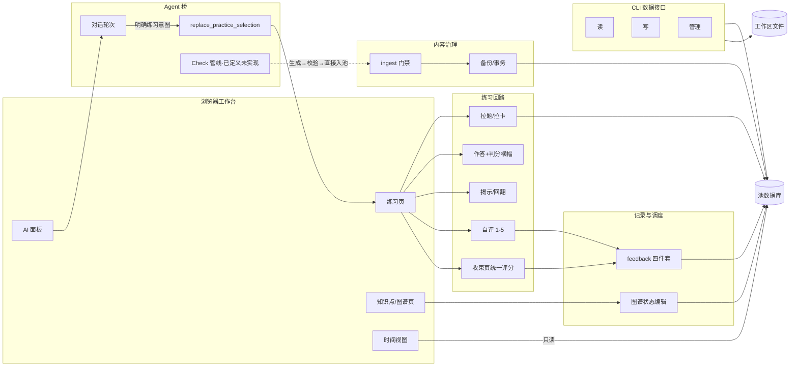

# ACTION-GRAPH — 动作图谱（入口）

> **定位**（2026-08-29 所有者定）：借鉴 Archify（代码库→图谱）与 Vivado 分层
> 设计视图的思想，把系统从数据层到工作流层完整登记。**分层明细在
> `docs/action-graph/` 目录**（五层六文件），本页只留总图、铁律与索引。
> 名词归 `GLOSSARY.md` / `PENDING-DEFINITIONS.md`；动作与工作流归本图谱。
> 维护规则见 [action-graph/README.md](action-graph/README.md)——功能变更
> 交付时同步对应层（AGENTS.md 开发纪律 2）。

## 铁律（所有者钦定）

1. **严禁显式命令面板**——动作触发只走对话内自然语言→结构化动作；CLI 是
   外部 Agent 通道，不主动扩张界面。
2. **动作结果呈现分型**：独立于现有功能的（报告/视图）→ 对话框内；融入现有
   功能的（Agent 填目标/计划字段）→ 版面原位直接变化。
3. **Agent 池权限**：知识点池与全部题目池 Agent 可经 CLI 增删改查；门禁是
   决断辅助，不是权限闸门。
4. **标签一律完整显示**，不截断、不省略号。

## 分层索引

| 层 | 文件 | 内容 |
|---|---|---|
| 总纲 | [action-graph/README.md](action-graph/README.md) | 分层模型、铁律、状态标记、队列 |
| L0 数据层 | [action-graph/L0-data.md](action-graph/L0-data.md) | 表/文件/会话键：谁读谁写 |
| L1 服务层 | [action-graph/L1-services.md](action-graph/L1-services.md) | 域逻辑模块与依赖 |
| L2 接口层 | [action-graph/L2-interfaces.md](action-graph/L2-interfaces.md) | API 33 路由 + CLI 22 命令 |
| L3 动作层 | [action-graph/L3-actions.md](action-graph/L3-actions.md) | 动作登记（入口/权限/读写/状态）+ 留痕 |
| L4 工作流层 | [action-graph/L4-workflows.md](action-graph/L4-workflows.md) | 四条主流程 + 15 条意外分支清单 |

## 总图

## 队列（2026-08-29 问卷后所有者确认）

① 本图谱 v2（本提交）→ ② 讲解/诊断彻底移除（含 explain 文件）→
③ 目标补齐（UI 编辑/删除 + 自然语言接 Agent + goals CLI）→
④ Check 管线立项（定义升级：生成→校验→直接入正式池、无候选中间态、
Agent 可直跑 ingest、候选组织并入校验环节；名字 generate→Check 待立项定）。

## 变更留痕

- 2026-08-29 建图（v1：总图+六域登记表）；同日讲解/诊断标待退役。
- 2026-08-29 v2 分层重构：明细迁入 `docs/action-graph/` 五层六文件；新增权限列
  （问卷 B1）、意外分支层（L4，回应所有者"不许想当然"要求）、铁律四条、队列四项。
