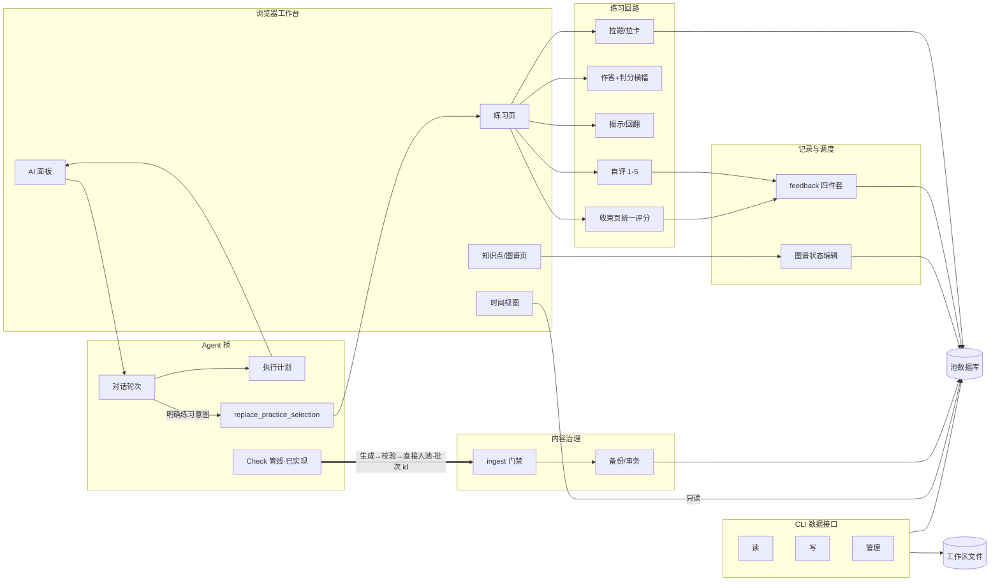

# ACTION-GRAPH — 动作图谱（入口）

> **定位**（2026-08-29 所有者定）：借鉴 Archify（代码库→图谱）与 Vivado 分层
> 设计视图的思想，把系统从数据层到工作流层完整登记。**分层明细在
> `docs/action-graph/` 目录**（五层六文件），本页只留总图、铁律与索引。
> 名词归 `GLOSSARY.md` / `PENDING-DEFINITIONS.md`；动作与工作流归本图谱。
> 维护规则见 [action-graph/README.md](action-graph/README.md)——功能变更
> 交付时同步对应层（AGENTS.md 开发纪律 2）。

2026-09-01：图谱关系加入有限确定性消交叉，以及由既有 attraction 驱动的
阴影/管体/高光三层绘制；全部属于浏览器内纯视图。

## 铁律（所有者钦定）

1. **严禁显式命令面板**——动作触发只走对话内自然语言→结构化动作；CLI 是
   外部 Agent 通道，不主动扩张界面。
2. **动作结果呈现分型**：独立于现有功能的（报告/视图）→ 对话框内；融入现有
   功能的（Agent 填目标/计划字段）→ 版面原位直接变化。
3. **Agent 池权限**：知识点池与全部题目池 Agent 可经 CLI 增删改查；门禁是
   决断辅助，不是权限闸门。
4. **标签一律完整显示**，不截断、不省略号。

## 分层索引

| 层 | 文件 | 内容 |
|---|---|---|
| 总纲 | [action-graph/README.md](action-graph/README.md) | 分层模型、铁律、状态标记、队列 |
| L0 数据层 | [action-graph/L0-data.md](action-graph/L0-data.md) | 表/文件/会话键：谁读谁写 |
| L1 服务层 | [action-graph/L1-services.md](action-graph/L1-services.md) | 域逻辑模块与依赖 |
| L2 接口层 | [action-graph/L2-interfaces.md](action-graph/L2-interfaces.md) | API 33 路由 + CLI 22 命令 |
| L3 动作层 | [action-graph/L3-actions.md](action-graph/L3-actions.md) | 动作登记（入口/权限/读写/状态）+ 留痕 |
| L4 工作流层 | [action-graph/L4-workflows.md](action-graph/L4-workflows.md) | 四条主流程 + 15 条意外分支清单 |

## 总图

## 队列（2026-08-29 问卷后所有者确认）

① 本图谱 v2（完成）→ ② 讲解/诊断彻底移除（完成，remove-explain-diagnose）→
③ 目标补齐（完成，complete-goals-loop）→
④ Check 管线（完成，introduce-check-pipeline）：定名 Check、批次 id+
整批回滚、桥 check_ingest 动作、candidate_problems 退役。

## 变更留痕

- 2026-08-29 建图（v1：总图+六域登记表）；同日讲解/诊断标待退役。
- 2026-08-29 v2 分层重构：明细迁入 `docs/action-graph/` 五层六文件；新增权限列
  （问卷 B1）、意外分支层（L4，回应所有者"不许想当然"要求）、铁律四条、队列四项。
- 2026-08-29 目标生命周期与助填动作落地（complete-goals-loop，队列③）：goals CLI 上线。
- 2026-08-29 讲解/诊断移除落地（队列②）：任务机退役，对话桥保留，各层同步。
- 2026-08-29 Check 管线落地（introduce-check-pipeline，队列④）：定名 Check（专题 22）；
  三配方 apply 记批次 id+行戳记+manifest 快照+ingest_batches 登记；
  `ingest rollback --batch`、桥 `check_ingest` 动作、结果卡回滚按钮、
  `POST /ingest/rollback` 上线；candidate_problems 读路径退役（pull/mastery/hub
  停读，表与 data candidate 子命令标**待退役**）；L1/L2/L3/L4 同步。
- 2026-08-31 目标时间跑道落地（goal-calendar-lanes）：目标可带开始日期，月历按周续接并为重叠目标分轨；时间视图继续只读。
- 2026-08-31 Agent 执行计划上线（render-agent-execution-plan）：Bridge 将提供方
  活动归一为可读步骤，对话流同行更新并恢复成功轮次记录；L3 同步。
- 2026-09-01 图谱指标投影动画落地：切换指标保留节点身份，以内存目标位置与半径连续过渡；不写学习数据。
- 2026-09-01 图谱多状态筛选分群落地：按状态并集收束可见子图并分团聚拢；只读、内存态。
- 2026-09-01 任务量趋势线落地（add-workload-trend-curve）：时间安排在准确的
  14 日柱值上叠加只读平滑趋势，重日红点提示；无新写动作与接口。
- 2026-09-01 闪卡方向能力落地（enable-flash-card-directions）：Check 可声明单向/
  双向，拉取按内容能力展开并复用既有方向调度键；旧卡与旧调用默认 forward。
- 2026-09-01 闪卡方向 UI 落地（render-directional-flash-cards）：显式闪卡模式内可选
  混合/正向/反向并以 ⇄ 交换；单向下展、双向扇形揭示，评分写最终使用方向。
