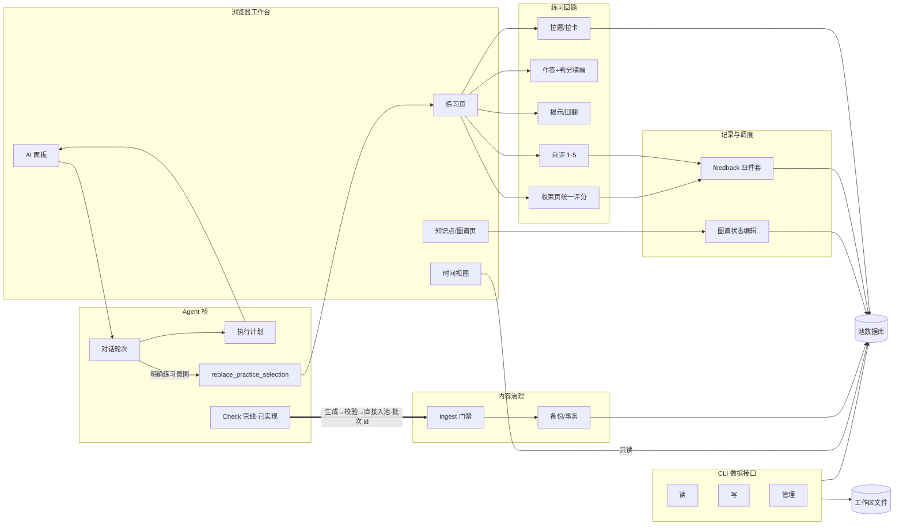

# ACTION-GRAPH — 动作图谱（入口）

> **定位**（2026-08-29 所有者定）：借鉴 Archify（代码库→图谱）与 Vivado 分层
> 设计视图的思想，把系统从数据层到工作流层完整登记。**分层明细在
> `docs/action-graph/` 目录**（五层六文件），本页只留总图、铁律与索引。
> 名词归 `GLOSSARY.md` / `PENDING-DEFINITIONS.md`；动作与工作流归本图谱。
> 维护规则见 [action-graph/README.md](action-graph/README.md)——功能变更
> 交付时同步对应层（AGENTS.md 开发纪律 2）。

2026-09-01：图谱关系加入有限确定性消交叉，以及由既有 attraction 驱动的
阴影/管体/高光三层绘制；全部属于浏览器内纯视图。

## 铁律（所有者钦定）

1. **严禁显式命令面板**——动作触发只走对话内自然语言→结构化动作；CLI 是
   外部 Agent 通道，不主动扩张界面。
2. **动作结果呈现分型**：独立于现有功能的（报告/视图）→ 对话框内；融入现有
   功能的（Agent 填目标/计划字段）→ 版面原位直接变化。
3. **Agent 池权限**：知识点池与全部题目池 Agent 可经 CLI 增删改查；门禁是
   决断辅助，不是权限闸门。
4. **标签一律完整显示**，不截断、不省略号。

## 分层索引

| 层 | 文件 | 内容 |
|---|---|---|
| 总纲 | [action-graph/README.md](action-graph/README.md) | 分层模型、铁律、状态标记、队列 |
| L0 数据层 | [action-graph/L0-data.md](action-graph/L0-data.md) | 表/文件/会话键：谁读谁写 |
| L1 服务层 | [action-graph/L1-services.md](action-graph/L1-services.md) | 域逻辑模块与依赖 |
| L2 接口层 | [action-graph/L2-interfaces.md](action-graph/L2-interfaces.md) | API 30 路由 + CLI 20 命令 |
| L3 动作层 | [action-graph/L3-actions.md](action-graph/L3-actions.md) | 动作登记（入口/权限/读写/状态）+ 留痕 |
| L4 工作流层 | [action-graph/L4-workflows.md](action-graph/L4-workflows.md) | 四条主流程 + 15 条意外分支清单 |

## 总图

## 队列（2026-08-29 问卷后所有者确认）

① 本图谱 v2（完成）→ ② 讲解/诊断彻底移除（完成，remove-explain-diagnose）→
③ 目标补齐（完成，complete-goals-loop）→
④ Check 管线（完成，introduce-check-pipeline）：定名 Check、批次 id+
整批回滚、桥 check_ingest 动作、candidate_problems 退役。

## 变更留痕

- 2026-08-29 建图（v1：总图+六域登记表）；同日讲解/诊断标待退役。
- 2026-08-29 v2 分层重构：明细迁入 `docs/action-graph/` 五层六文件；新增权限列
  （问卷 B1）、意外分支层（L4，回应所有者"不许想当然"要求）、铁律四条、队列四项。
- 2026-08-29 目标生命周期与助填动作落地（complete-goals-loop，队列③）：goals CLI 上线。
- 2026-08-29 讲解/诊断移除落地（队列②）：任务机退役，对话桥保留，各层同步。
- 2026-08-29 Check 管线落地（introduce-check-pipeline，队列④）：定名 Check（专题 22）；
  三配方 apply 记批次 id+行戳记+manifest 快照+ingest_batches 登记；
  `ingest rollback --batch`、桥 `check_ingest` 动作、结果卡回滚按钮、
  `POST /ingest/rollback` 上线；candidate_problems 读路径退役（pull/mastery/hub
  停读，表与 data candidate 子命令标**待退役**）；L1/L2/L3/L4 同步。
- 2026-08-31 目标时间跑道落地（goal-calendar-lanes）：目标可带开始日期，月历按周续接并为重叠目标分轨；时间视图继续只读。
- 2026-08-31 Agent 执行计划上线（render-agent-execution-plan）：Bridge 将提供方
  活动归一为可读步骤，对话流同行更新并恢复成功轮次记录；L3 同步。
- 2026-09-01 图谱指标投影动画落地：切换指标保留节点身份，以内存目标位置与半径连续过渡；不写学习数据。
- 2026-09-01 图谱多状态筛选分群落地：按状态并集收束可见子图并分团聚拢；只读、内存态。
- 2026-09-01 任务量趋势线落地（add-workload-trend-curve）：时间安排在准确的
  14 日柱值上叠加只读平滑趋势，重日红点提示；无新写动作与接口。
- 2026-09-02 时间安排 A 方案落地（refine-time-view-a）：月历改为轻网格、细轨道
  与单次标题；14 日视图改为准确柱值、总量 / 峰值 / 逾期摘要与固定日期轴，
  并移除容易误读的平滑线；重日预填动作和数据接口不变。
- 2026-09-01 闪卡方向能力落地（enable-flash-card-directions）：Check 可声明单向/
  双向，拉取按内容能力展开并复用既有方向调度键；旧卡与旧调用默认 forward。
- 2026-09-01 闪卡方向 UI 落地（render-directional-flash-cards）：显式闪卡模式内可选
  混合/正向/反向并以 ⇄ 交换；单向下展、双向扇形揭示，评分写最终使用方向。
- 2026-09-20 init 简化与中文名路由修复（init-ergonomics-and-cjk-names）：
  `init` 的 `path` 可省（默认当前目录），course 按「显式 `--course` › 已有池名 ›
  ASCII 文件夹名」推导；四条带名路径
  （页面 / API / 附图 / 图谱工件）统一对 URL 编码段解码，API 分派把未知名收成
  404；`registry._find_pool` 提为公开 `find_pool`。L2 同步。
- 2026-09-21 课程标识符与人名的分离（course-identifier-and-name）：文件夹名
  无法给出 ASCII 缩写时不再报错——自动分配顺序短码 `c01`/`c02`…（扫注册表与
  本文件夹 `pool/*.db` 取最大号 +1），显式 `--course`/`use` 一律校验为小写
  ASCII 标识（拒绝理由写进报错）；顶栏只显示工作区名与章，机器标识不再露面。
  L2、PRODUCT-MANUAL、GLOSSARY 同步。
- 2026-09-21 单一命令名（single-cli-name）：`wb` 入口退役，本项目只留
  `lesson-kit`（模块形式 `python -m workbench.cli.main` 等价，prog 同名）；live
  文档与三条规格同步改名，历史档案不动；`Scripts/wb.exe` 归还 Weights & Biases
  （重装用 `"wandb==0.25.1"` 钉版本，裸 `--force-reinstall --no-deps` 会升版本且缺依赖）。
- 2026-09-21 工作区文件隔离（workspace-file-isolation）：把"一个工作区只碰自己
  文件夹、一个工作区只装一门课"落成硬校验——会话/轮次 id 必须是 `conv-NNN`/
  `turn-NNN`（原先 `%2F` 段可穿越到别的工作区并 `rmtree`）；不带名命令在多个
  工作区注册时拒绝猜（报错给出位置名可粘贴命令）；注册校验池在工作区内、路径与
  池不重复、同名冲突不静默覆盖；池候选排除 ingest 备份，同一文件夹多份池且无
  `--course` 匹配时拒绝并列出（本仓库 `pool/` 的 pre-readiness 副本因此不再被
  当成主库）；章与课程同规则校验；入池门禁把 id 钉在本工作区课程前缀上、
  figure-patch 的课程/章与最终路径必须落在本工作区 `.lessonkit/figures/` 内；
  会话提示词示例改用上下文里的真实课程/章（原先硬编码 `dmath-ch06`）。
  L1/L2/L3、GLOSSARY、PRODUCT-MANUAL 同步。
- 2026-09-21 dashboard 章透镜（dashboard-chapter-filter）：顶栏工作区名旁新增
  「章」单选开关（关 = 全课程），与 `lesson-kit use` 写同一个注册表值；章名单
  从池内容 id 派生（`Pool.chapters()`，不建表）；前缀计算收敛到
  `Pool.scope_prefix()`（空章 = 课程前缀 = 全课程，从巧合升为契约）；hub 卡片
  四项统计统一为整课程口径（原 kps 按章、题数/待复习全池）；服务端新增写当前章
  端点 `POST /api/w/{name}/chapter`；页头/标题按透镜显示「当前章节」或
  「全课程」；透镜只作用于"看"，选区跨章且切换不丢。L2/L3、GLOSSARY、
  PRODUCT-MANUAL 同步。
- 2026-09-21 难度可选门控（optional-problem-difficulty-gate）：`problems` 增列
  `difficulty`（可空 1-5；`knowledge_points.difficulty` 原样），三条入池通道
  （微测 patch / 正式题 apply / KP content-patch）改为**可选**语义——填了必须
  int 1-5 且同 item 带非空 `difficulty_basis`，缺依据拒收整批、不填放行、依据
  不落盘；KP 门禁的必填集合移出 difficulty（legacy 提取路径的默认 2 按分层
  铁律不动）。Un-migrated 旧池：不声明难度照常可用，声明了则拒收并给出
  `pool/scripts/migrate-progress.py` 命令。生成侧提示词要求逐项给出难度 + 依据、
  不确定可弃权；`difficulty_mix` 误名改为 `problem_type_mix`（题型直方图）。
  无消费者、不回填旧题、学习者可见面零变更。L1/L3、GLOSSARY、
  PENDING-DEFINITIONS（真题拟合数据前奏）同步。
- 2026-09-22 题目来源与惰性四维难度（problem-difficulty-and-provenance）：上一条
  单值门控被本条取代。题目新增 `origin_kind`，与材料 `source_kind` 正交；派生
  `ai_generated/exam/textbook/other` 互斥组供 CLI/API 筛选。正式题与微题的客观难度
  改为知识跨度、推理深度、迁移距离、构造开放性四维 1–5，`cognitive-v1-equal-mean`
  生成一位小数总分；全组可空，创建和入池不触发评级。公开动作是
  `lesson-kit difficulty <workspace> check|apply --input <file|->`；check 零写入，apply
  整批原子覆盖。题干、解析、知识点关联或题型变化清空评级。pull 可显式按来源、总分、
  分维与 balanced 策略筛选；未传新参数保持旧顺序，学生 UI 不展示难度。
- 2026-09-22 Pi 活动消息流（pi-activity-message-stream）：复用既有 350ms polling 与
  normalized activity。Pi 的读/写/搜索/命令/Lesson Kit 操作显示为独立消息并按 id
  原位更新，具体活动切开前后文本气泡；输出默认折叠且落事件前遮盖/截断。通用阶段、
  hidden reasoning 和原始协议不显示；Codex/Claude 的执行计划不变。
- 2026-09-23 首次真实使用修缮（first-use-conversation-content-fidelity）：新增  `content-bundle` 原子内容批次（知识点/正式题/微题/闪卡/必需原图，key 互引、服务端分配 id、
  大清单暂存本对话 jobs、整批预检与单备份、缺图零写入、回滚只删无引用图片）；删除浏览器
  关键词意图门，合法纯新增自动执行；题目新增来源证据/来源答案/解析来源三列并在两个渲染面
  显示；浏览器与服务端富文本统一支持 GFM 表格；Pi 改为每对话一个隐藏 `--mode rpc` 常驻
  进程（空闲 30 分钟回收、abort 优先、接受后崩溃不重放），全部 provider 子进程 Windows
  无窗口。L1/L3 同步。
- 2026-09-24 Agent 代录与更正尝试（agent-assisted-practice-records）：新增 `lesson-kit
  attempts`（`list`/`get` 只读、`check` 零写入预检、`apply` 一份清单多题单事务、`correct`
  按 attempt-id 整体替换）与 `attempts sources` 答卷目录登记；池新增 `attempt_operations`
  留痕表与 `feedback_events.attempt_id` 列（增量迁移、旧行不动）；带评分的尝试复用既有
  1–5 四件套并只结算一次，无评分的尝试只留文本、不碰任何投影；同 `request_id` 同内容重发
  回放首次结果，异内容零写入拒绝；更正先比投影快照、有更晚活动或更晚尝试即零写入拒绝，
  否则恢复前快照→替换尝试→按新评分重算→更新快照；练习页发消息改为附带**聚焦草稿**
  （未提交作答/选项/备注/当前可见图片，服务端限长、零写入），普通对话与只读图片不产生
  任何学习记录；图片只按目录被 Agent 读取，不入池、不建索引。L0/L1/L2/L3/L4、GLOSSARY、
  PRODUCT-MANUAL 同步。
- 2026-09-25 组练习与接口归属（practice-set-export-and-cli-audit）：`lesson-kit pull` 升级为
  **组一次练习的唯一入口**——范围/单题/条件筛选（新增 `--exam-year`）/薄弱·到期·错题三种
  驱动可组合，每题回报入卷理由；默认输出**完整题目行**（与 `/pull` 对齐，`--ids` 保留旧形状），
  补上规格早已要求却无 CLI 入口的 `--include`；`--plan` 落练习清单（输入清单，不是学习记录）、
  `--print` 出学生卷+解答卷（题号对齐、缺解「待补」、无答案与内部标识）、`--check` 零写入预检。
  池新增可空 `problems.exam_year`（纯增量、不回填、前缀匹配筛选；未迁移池只在用到时报
  migrate 命令）。新增 `workbench/surface.py` 接口归属表 + 对账测试，把「谁该有 CLI」变成
  机器事实（修正 L2 的 31/20 → 32/22）。同批修四道既有裂缝：`practice` CLI 与页面同事务同
  校验、`feedback` CLI 补闪卡与方向、`goals` CLI 写入后失效计划缓存、`weak`/`due`/`ls`
  提供 `--json`；删除两处死面（`ingest render` 的无用 target、`ingest gate/apply` 收了又拒的
  entity 取值）。L0/L1/L2/L3/L4、GLOSSARY、PRODUCT-MANUAL、REQUIREMENTS 同步。
- 2026-09-25 跨章内容批次（cross-chapter-content-bundles）：**一份清单可以跨章**——每个知识点/
  题目/闪卡可写自己的 `chapter`（缺省顶层再缺省当前章，推不出即点名拒收），发号、图片目录、
  微题 id、重复检查全部跟随该项的章，显式 id 必须与该项章同名（原先 ch14 的 id 塞进 ch12 清单
  会把图落错目录）；一次预检、一份备份、一个事务不变，但**按章各记一个批次**，因此
  `ingest rollback`/结果卡可**只撤其中一章**（回滚本就按批次删行+删无引用图片，无章的假设）；
  结果带 `batches`（单章时仍保留旧的 `batch_id`/`counts`），结果卡每章一行、各带回滚按钮。
  一轮回复里的**每个** content-bundle 区块都会被依次应用（原先只应用第一个、其余静默丢弃），
  所以「12–14 章都导进来」一次回答即可；提示词写明清单可跨章、按章成批、遇多区块继续。
  顺手修：回滚改写 `related_kp_ids` 前先查列（老池缺列不再报错）。L0/L1/L2/L3/L4、GLOSSARY、
  PRODUCT-MANUAL、REQUIREMENTS 同步。
