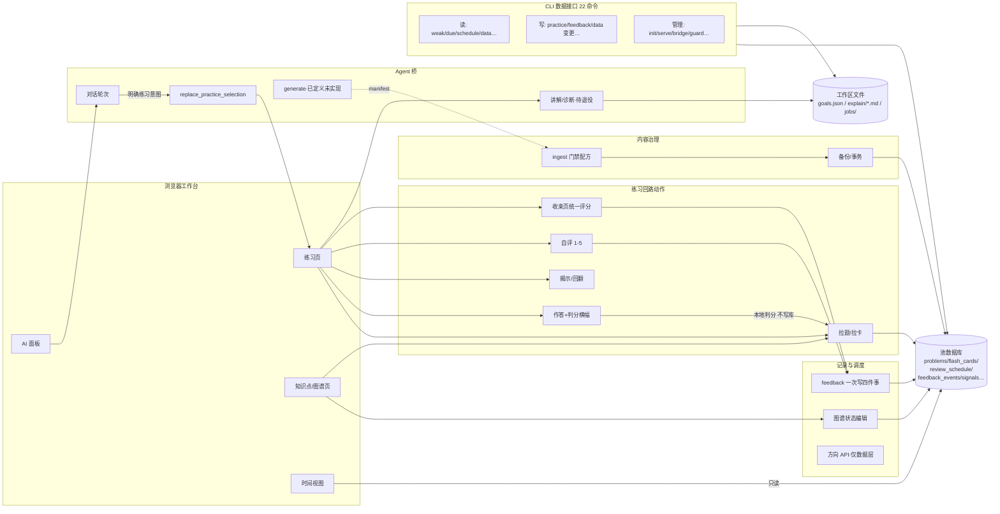

# ACTION-GRAPH — 动作图谱（功能全景登记）

> **定位**（2026-08-29 所有者定）：借鉴 Archify「把代码库结构做成可导航图谱」
> 的思想，落到 lesson-kit 的**功能动作层**——系统里每一个「能做的事」
> （用户操作、CLI 命令、API 动作、桥操作、门禁配方）都登记在册，并勾连到
> 它的入口、读写面与权威出处。名词归 `GLOSSARY.md` / `PENDING-DEFINITIONS.md`
> 管；**本图管动作**。加功能不登记 = 违纪（见 AGENTS.md 开发纪律 2）。
>
> **动作状态标记**：`已实现` / `已定义未实现` / `未定义挂名` / `冻结` /
> `待退役`。状态变更必须在本图留痕（何时、为什么）。
>
> **维护规则**：功能变更交付时同步本图对应行；文档漂移审计时复查全图。

## 总图

## 一、练习回路动作（域：练习页）

| 动作 | 入口 | 读 | 写 | 状态 | 权威出处 |
|---|---|---|---|---|---|
| 选定练习范围（KP 选择） | UI 知识点页/图谱勾选 | kps | sessionStorage 选区 | 已实现 | workbench-ui |
| 加入今日要练（建议） | UI 建议区 | plan/due | 选区 | 已实现 | daily-learning-plan |
| 开始本轮练习 | UI（模式+自评时机必选） | 选区 | session 牌组 | 已实现 | workbench-ui |
| 拉题 / 拉卡 | API `POST /pull`、`/pull-cards` | problems/flash_cards/schedule | 牌组(session) | 已实现 | review-workbench、flash-card |
| 作答+本地判分 | UI 点选/文本 | problem | 牌组（不写库） | 已实现 | micro-quiz-content |
| batch 判分横幅（2s 停留+高亮正确项） | UI | — | 牌组 | 已实现 | micro-quiz-content |
| 揭示（闪卡背面/题目解析） | UI | problem | 牌组 | 已实现 | flash-card |
| 闪卡回翻（上一张/下一张） | UI | 牌组 | 牌组游标 | 已实现 | flash-card |
| 即时自评（1–5+备注） | UI 反馈区 | — | feedback 四件套 | 已实现 | review-workbench |
| 跳到下一道 | UI | — | 牌组 state | 已实现 | workbench-ui |
| 提前结束→收束页统一评分 | UI session-end | 牌组 | feedback 四件套×未评条 | 已实现 | workbench-ui |
| 再练同类 | UI 收束页 | 选区 | 新 session | 已实现 | workbench-ui |
| 刷新恢复（游标+视图状态） | 被动 | sessionStorage | — | 已实现 | workbench-ui |
| 讲解/诊断一键任务 | UI 练习页按钮→`POST /ai/{op}` | problem | jobs+explain/*.md | **待退役**（所有者 2026-08-29 倾向，待问卷 A 组定论） | ai-teacher-bridge |

## 二、记录与调度（域：写路径收敛）

| 动作 | 入口 | 写 | 状态 | 权威出处 |
|---|---|---|---|---|
| feedback（自评原子写四件事：事件/信号/状态/调度） | API `POST /feedback`、CLI `feedback` | feedback_events、signals、kp 状态、review_schedule | 已实现 | review-workbench |
| practice（记录一次尝试） | CLI `practice`、API `POST /practice` | problem_attempts | 已实现 | review-workbench |
| 图谱状态显式编辑 | UI 图谱→`POST /graph/state` | 状态+调度（不记反馈） | 已实现 | review-workbench |
| 方向写入口（direction 键） | API `POST /feedback` 带 direction | review_schedule 方向行 | 已实现（仅数据层，UI 无入口） | review-workbench |

## 三、内容治理（域：唯一合法写池方式）

| 动作 | 入口 | 写 | 状态 | 权威出处 |
|---|---|---|---|---|
| ingest 门禁配方（micro-quiz-patch / flash-card-patch） | CLI `ingest … recipe … --apply --backup` | problems/flash_cards（单事务） | 已实现（2 配方） | workbench-content-governance、micro-quiz-content、flash-card |
| ingest 链其余环节 | CLI `prepare/run/gate/apply/render/recipe` | 中间产物 | 已实现 | 同上 |
| 全池备份 | ingest --backup 自动 | pool/backups/*.db | 已实现 | workbench-content-governance |
| 抽取管线入池（教材→KP→题） | 管线脚本 + pool-insert-manifest | 全部内容表 | 已实现（一次性，非日常动作） | 管线文档 |

## 四、Agent 桥动作（域：外部 AI 通道）

| 动作 | 入口 | 读 | 写 | 状态 | 权威出处 |
|---|---|---|---|---|---|
| 对话轮次（页面上下文自动附带） | UI AI 面板 / CLI `ai` | 页面上下文+池(经 wb data) | jobs/conv-###（最小镜像） | 已实现 | ai-teacher-bridge |
| 新建会话/选 provider（锁定） | UI | providers | conversations | 已实现 | ai-teacher-bridge |
| 停止对话轮次 | UI | — | turn=cancelled | 已实现 | ai-teacher-bridge |
| 讲解 explain | UI/CLI `ai explain` | problem+弱信号 | jobs+explain/*.md（契约校验） | **待退役**（同上） | ai-teacher-bridge |
| 诊断 diagnose | UI/CLI（带 user_answer） | 同上+作答/卡点 | 同上（定位/提示/溯源/追问） | **待退役**（同上） | ai-teacher-bridge |
| replace_practice_selection | 对话产出动作（明确练习意图才生效） | — | 浏览器选区（一次性） | 已实现 | ai-teacher-bridge |
| 查询任务 provider 可用性 | API `GET /ai/task-providers` | bridges.json | — | 已实现 | ai-teacher-bridge |
| **generate**（AI 产出 manifest→所有者触发门禁入池；批次 id+整批回滚） | 无（待实现） | 知识点正文 | 经门禁写池+批次标记 | **已定义未实现** | PENDING-DEFINITIONS「generate 桥操作」 |

## 五、目标与时间（域：练习页右栏）

| 动作 | 入口 | 读 | 写 | 状态 | 权威出处 |
|---|---|---|---|---|---|
| 目标增删改 | UI 表单→API `/goals`×5 | goals.json | goals.json | 已实现 | calendar-workload |
| 月历/工作量视图 | UI 只读 | schedule+goals | — | 已实现（实验视图） | calendar-workload |
| 每日计划重算 | UI 重新安排→`POST /plan/recalculate` | 池 | plan | 已实现 | daily-learning-plan |
| workload prefill（重日预填一句话给 Agent） | UI | workload | AI 输入框（不发送） | 已实现 | calendar-workload |

## 六、CLI 数据接口（域：外部 Agent 的动作面）

| 命令 | 性质 | 读/写 | 状态 |
|---|---|---|---|
| `init / ls / open / serve` | 管理 | 注册表/服务 | 已实现 |
| `weak / due / schedule / data`（读） | 读 | 池+注册表 | 已实现 |
| `practice / feedback / data`（显式变更） | 写 | attempts/feedback 等 | 已实现 |
| `ai`（发起/查任务） | 桥 | jobs | 已实现 |
| `bridge add`（配 provider） | 管理 | bridges.json | 已实现 |
| `guard`（工作台守卫） | 验证 | 中间产物 | 已实现 |
| `ingest`（+prepare/run/gate/apply/render/recipe） | 治理 | 池（门禁内） | 已实现 |
| `experiment`（只读实验评估器） | 实验 | 池 | 已实现 |

> spec 立场（ai-teacher-bridge「CLI is a data interface, not a teacher」）：
> CLI 只承载数据语义，教学行为在教师层（技能/契约），不进 CLI。

## 七、未定动作区（挂名池，定义见 PENDING-DEFINITIONS）

速成模式视图 · 批量揭晓 · 扩展摘要 · Agent 组织面板（贴标签/归类/候选出入库） ·
教师记忆消费端 · Obsidian vault 打包 · 图形资产管理工具 · CLI 层 agent 准备 —— 均为
`未定义挂名`。另有冻结：方向卡 UI（待真实使用）、Scoropic（ADR 0021）。

## 变更留痕

- 2026-08-29 建图（practice-loop-ux-completion + coverage batch 之后）；
  讲解/诊断同日标记待退役（所有者意向，问卷 A 组定论）。
