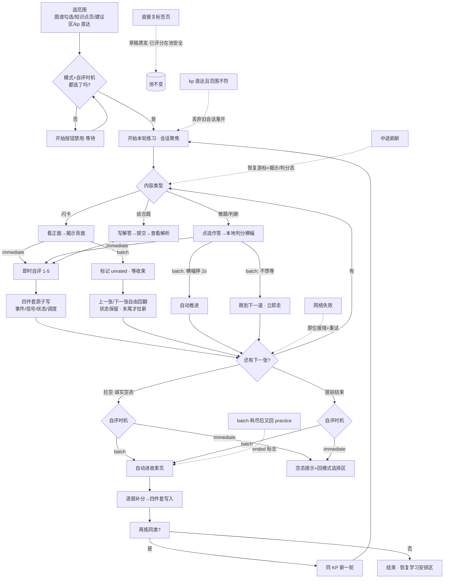
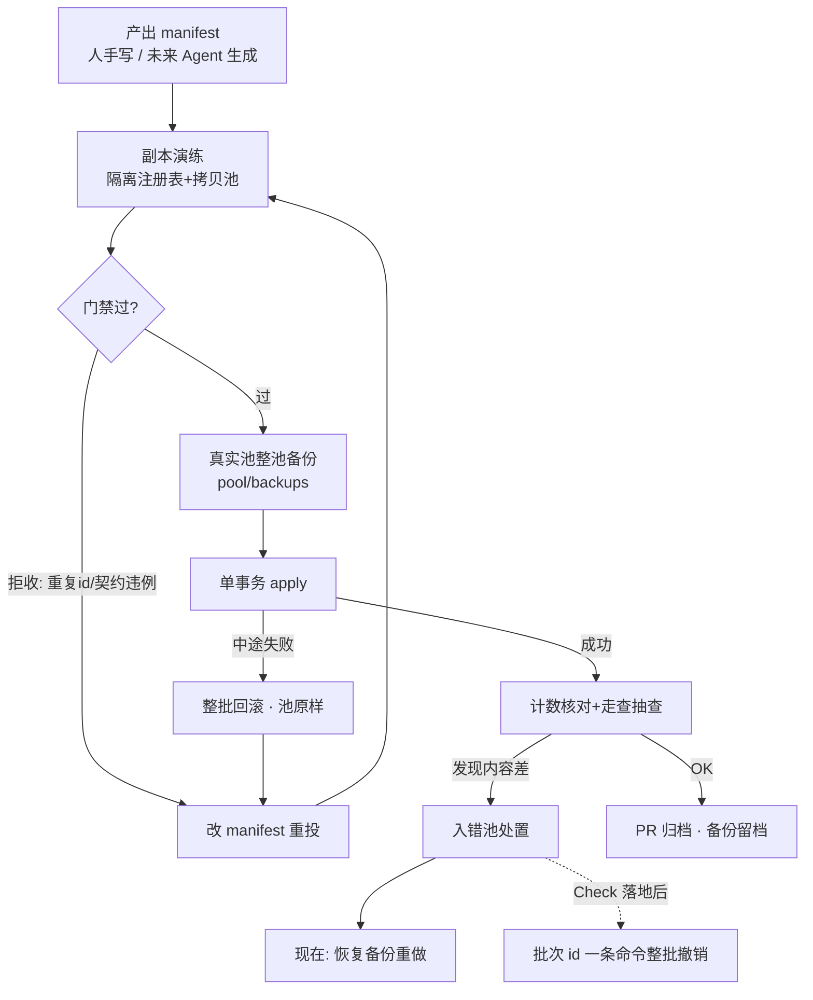
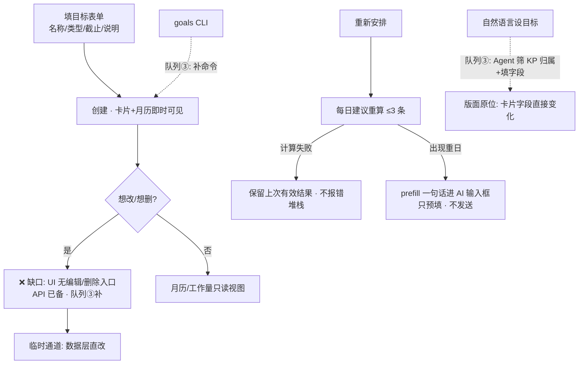
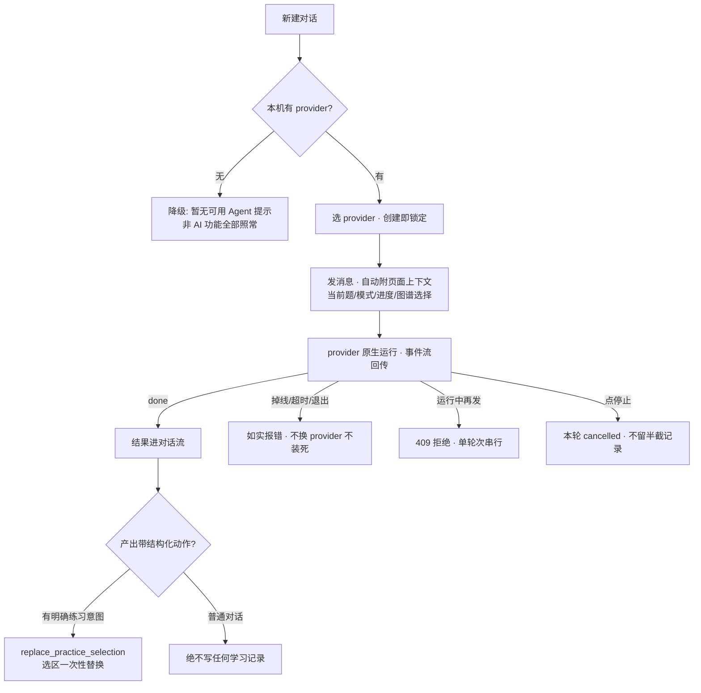

# L4 · 工作流层（用户真实路径 + 全部意外分支）

> 本层是 v2 的灵魂：**不许只画 happy path**。用户会回退、放弃、跳过、直接关闭——
> 每个出口都要有分支和落点。每条边可回溯 L3 动作；每个写库节点可回溯 L0。

## W1 · 练习回路

要点：跳过不降级（已作答/已揭示的条目保持 unrated 等收束）；横幅纯本地不写库；
刷新恢复到"翻到哪一张、揭示没揭示"；耗尽与提前结束在 batch 下同归收束页。

## W2 · 内容入库（唯一合法写池通道）

## W3 · 目标与计划（含缺口标记）

## W4 · Agent 对话与动作

## 意外分支总清单（防"想当然"复查用）

| # | 意外 | 落点 |
|---|---|---|
| 1 | 中途刷新 | 牌组恢复（游标+视图态） |
| 2 | 直接关标签页 | 草稿蒸发；已评分在池安全 |
| 3 | 跳过单题 | 不写库不记欠账；已答/已玩不降级 |
| 4 | 跳过到底直接走 | 空态/收束页，不强迫评完 |
| 5 | 提前结束 | batch→收束页；immediate→回开始区 |
| 6 | batch 耗尽后再回练习页 | ended 标志自动重回收束页 |
| 7 | 拉空范围 | 诚实空态，不偷换内容 |
| 8 | 网络失败 | 原位报错+重试，不吞操作 |
| 9 | 门禁拒收 | 改 manifest 重投，池零污染 |
| 10 | apply 中途失败 | 单事务整批回滚 |
| 11 | 入错池 | 备份恢复（Check 后：整批撤销命令） |
| 12 | provider 掉线/超时 | 如实报错，会话仍锁定 |
| 13 | 双发消息 | 409 串行 |
| 14 | 无 provider | 全功能降级可用 |
| 15 | 目标想改/删 | ❌ 现为缺口（队列③） |
