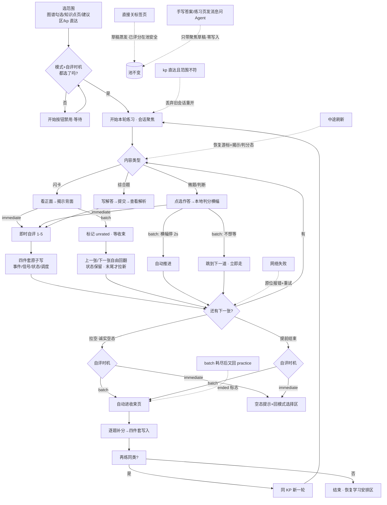
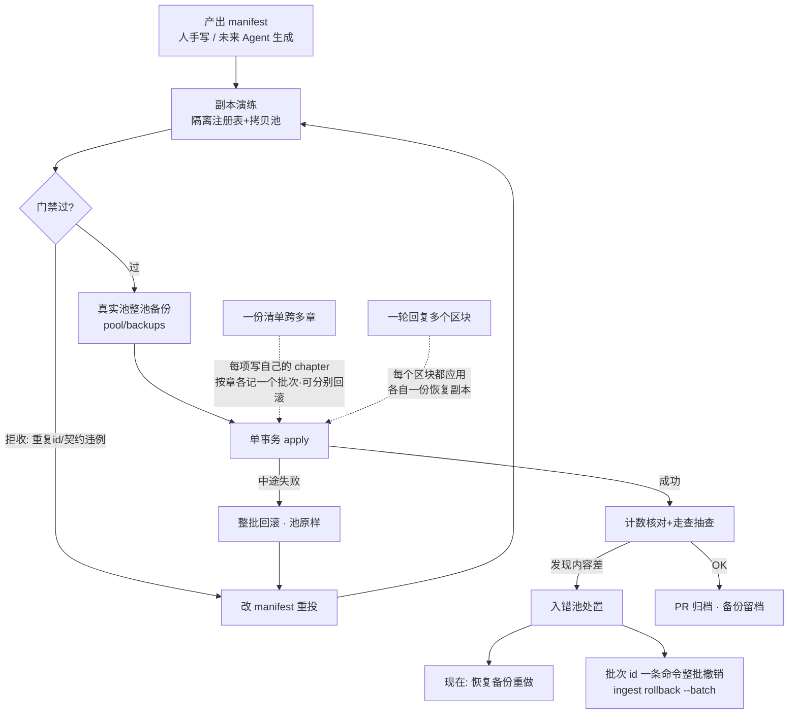
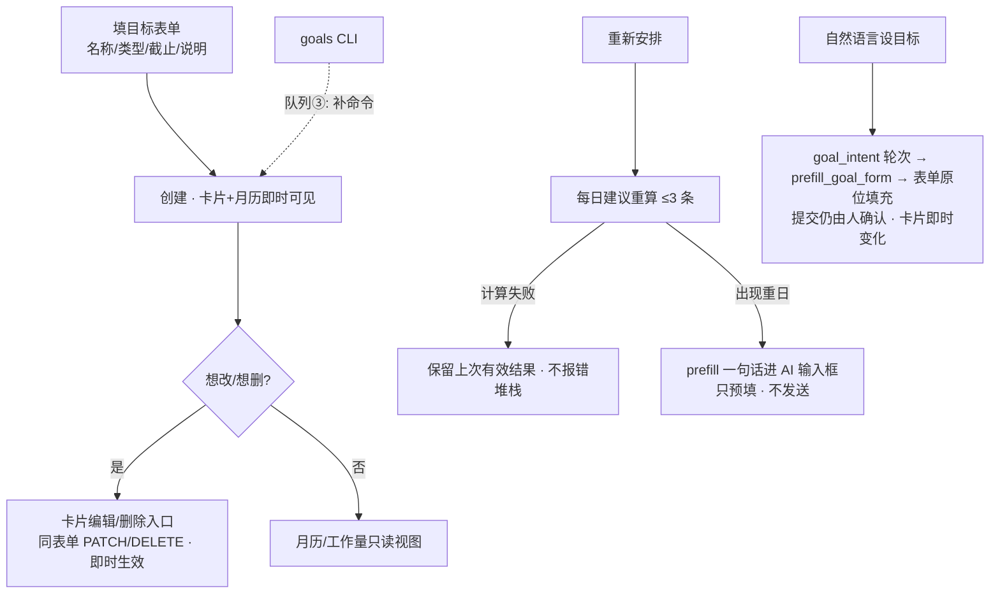
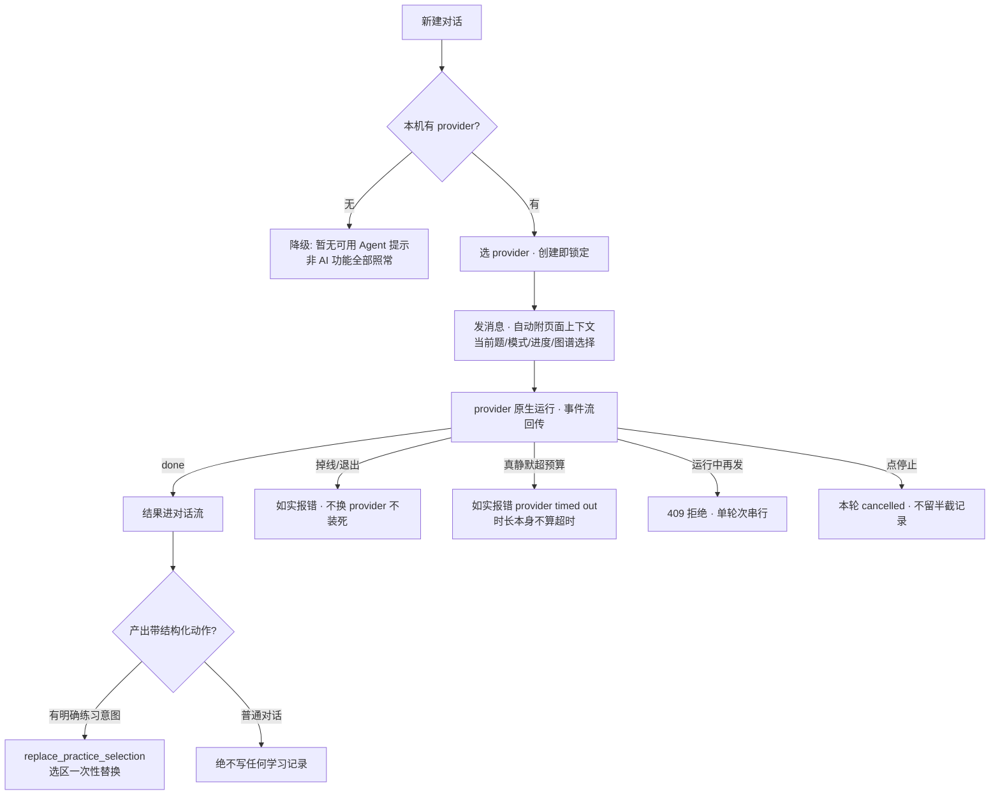
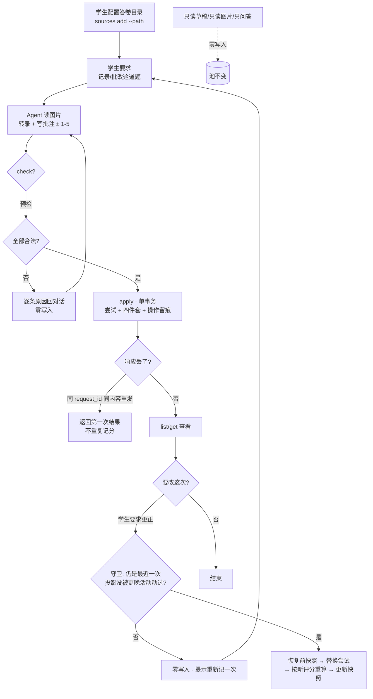

# L4 · 工作流层（用户真实路径 + 全部意外分支）

> 本层是 v2 的灵魂：**不许只画 happy path**。用户会回退、放弃、跳过、直接关闭——
> 每个出口都要有分支和落点。每条边可回溯 L3 动作；每个写库节点可回溯 L0。

## W1 · 练习回路



要点：跳过不降级（已作答/已揭示的条目保持 unrated 等收束）；横幅纯本地不写库；
刷新恢复到"翻到哪一张、揭示没揭示"；耗尽与提前结束在 batch 下同归收束页。
手写答案走 W5（Agent 代录），不在这条回路上写库。

## W2 · 内容入库（唯一合法写池通道）



> 2026-09-25（ingest-mode-choice-and-contract-parity）：入库时可选题型——判断题（`quiz_type: yes_no`）
> 与单选题（`single_choice`/`multiple_choice` + 选项）即使**题源没有答案键**也能入库：这类题不判分，
> 练习页写明「本题未录入答案键」并由学生自评，答案键可事后用 `data update problem` 补；普通题目（不给
> `quiz_type`）进综合题，声明小测/判断模式却不给 `quiz_type` 会被拒收。学生一次说清的章要一轮导完，
> 前一章入完不再问「要不要继续」；章推不出来（该项与清单顶层都没有 `chapter`）时点名拒收，不再
> 静默按当前章落库。

> 2026-09-25（cross-chapter-content-bundles）：清单可跨章（每项声明自己的 `chapter`，缺省顶层→当前章），
> 发号/落图/重复检查都跟随该项的章；按章各记一个批次，因此回滚可以只撤其中一章；一轮回复里的每个
> content-bundle 区块都会被依次应用（各自一份恢复副本），不再只应用第一个。

## W3 · 目标与计划（含缺口标记）



## W4 · Agent 对话与动作



> 2026-09-25（bridge-timeouts-follow-progress）：原 `E -- 掉线/超时/退出 --> F1` 拆成两条——
> **时长本身不构成超时**，只有静默超预算才失败。预算按静默计：任一输出行或归一事件重置时钟，
> 命令/工具在飞时改用更长的工具预算（`bridge add --timeout` / `--tool-timeout`，`bridge list`
> 报生效值），因此 3 分钟以上的回答与长时间安静的构建都不会被截停，也不会再把正在运行的命令
> 一起杀掉；真卡住时仍如实报 `provider timed out`。

## W5 · Agent 代录手写作答（2026-09-24）



## W6 · 组一次练习并打印（2026-09-25）

```mermaid
flowchart TD
  A[确定范围<br/>章透镜/ --kp / 关透镜=整门课] --> B{选题方式}
  B -- 条件筛选 --> C[source_kind / origin_kind / exam_year / 难度]
  B -- 学习证据 --> D[--weak 薄弱 / --due 到期 / --wrong 错题]
  B -- 单题 --> E[--problem 追加·不受筛选与上限约束]
  C & D & E --> F[逐题 reason：scope/weak/due/wrong/explicit]
  F --> G{要固定吗?}
  G -- --plan --> H[练习清单 JSON] --> I{要重跑?}
  I -- --input --> J[同一批题<br/>零写入] --> K{出卷?}
  G -- 否 --> L[打印题目行<br/>--ids 只看题号]
  K -- --check --> M[零写入预检<br/>题数/缺口/缺解/重复/泄漏]
  M -- 泄漏或重复 --> N[非零退出·逐条原因]
  K -- --print --> O[学生卷 + 解答卷<br/>题号对齐·缺解「待补」]
  Y1[新池上 --weak/--due/--wrong] -.空集是诚实结果.-> L
  Y2[未迁移池用 --exam-year] -.报错给 migrate 命令.-> Z[(池不变)]
```

## 意外分支总清单（防"想当然"复查用）

| # | 意外 | 落点 |
|---|---|---|
| 1 | 中途刷新 | 牌组恢复（游标+视图态） |
| 2 | 直接关标签页 | 草稿蒸发；已评分在池安全 |
| 3 | 跳过单题 | 不写库不记欠账；已答/已玩不降级 |
| 4 | 跳过到底直接走 | 空态/收束页，不强迫评完 |
| 5 | 提前结束 | batch→收束页；immediate→回开始区 |
| 6 | batch 耗尽后再回练习页 | ended 标志自动重回收束页 |
| 7 | 拉空范围 | 诚实空态，不偷换内容 |
| 8 | 网络失败 | 原位报错+重试，不吞操作 |
| 9 | 门禁拒收 | 改 manifest 重投，池零污染 |
| 10 | apply 中途失败 | 单事务整批回滚 |
| 11 | 入错池 | `ingest rollback --batch <id>` 整批撤销 |
| 12 | provider 掉线/超时 | 如实报错，会话仍锁定 |
| 13 | 双发消息 | 409 串行 |
| 14 | 无 provider | 全功能降级可用 |
| 15 | 目标想改/删 | 卡片编辑/删除入口（complete-goals-loop） |
| 16 | 代录的响应丢了（重发同 request_id） | 返回第一次结果，不重复记分（W5） |
| 17 | 更正时已有更晚活动/更晚尝试 | 零写入拒绝，提示重新记一次（W5） |
| 18 | 组练习时新池没有学习证据（--weak/--due/--wrong 空集） | 诚实空集 + shortage，提示先用范围/条件筛选（W6） |
| 19 | 练习清单里有陌生或重复题目 | 非零退出、逐条点名，零写入（W6） |
| 20 | 拟打印的学生卷会泄漏内部标识/答案 | 预检拦下并点名，不写文件（W6） |
| 21 | 清单里某项推不出所属章（无 item 章、无顶层章、无章透镜） | 点名该项并整批零写入，其余项不会被静默丢掉 |
| 22 | 显式 id 与该项声明的章不一致 | 拒收并同时说出 id 属于哪一章（图不会再落错目录） |
| 23 | 一轮里第二个内容区块的恢复副本重名 | 每个动作各自一份恢复副本，两个区块都能落盘 |
