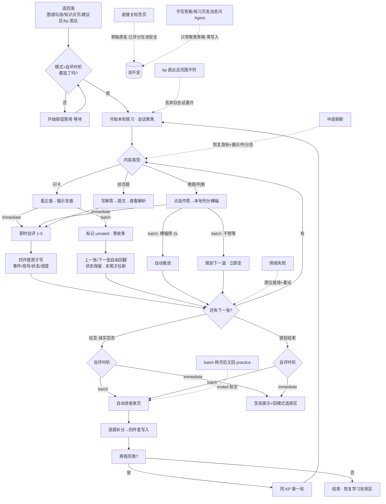
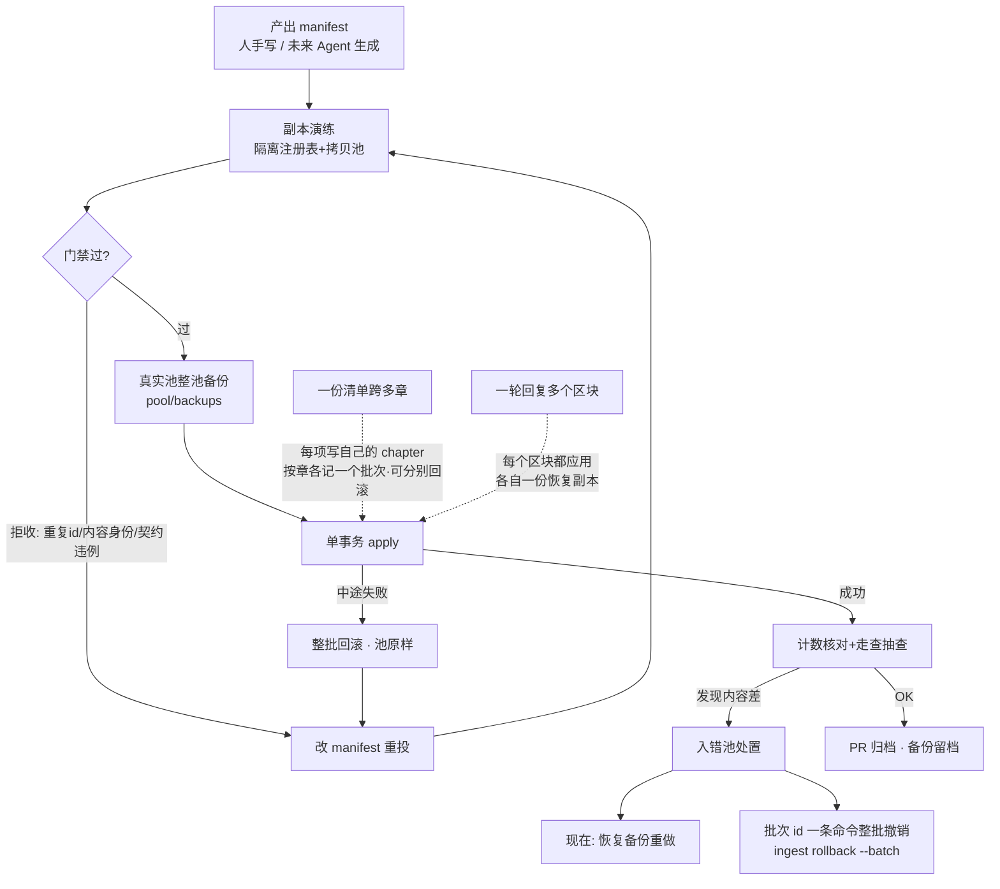
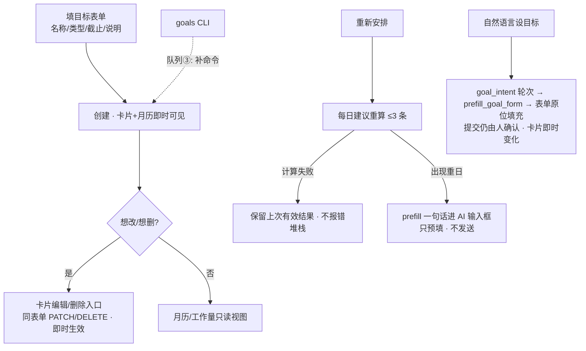
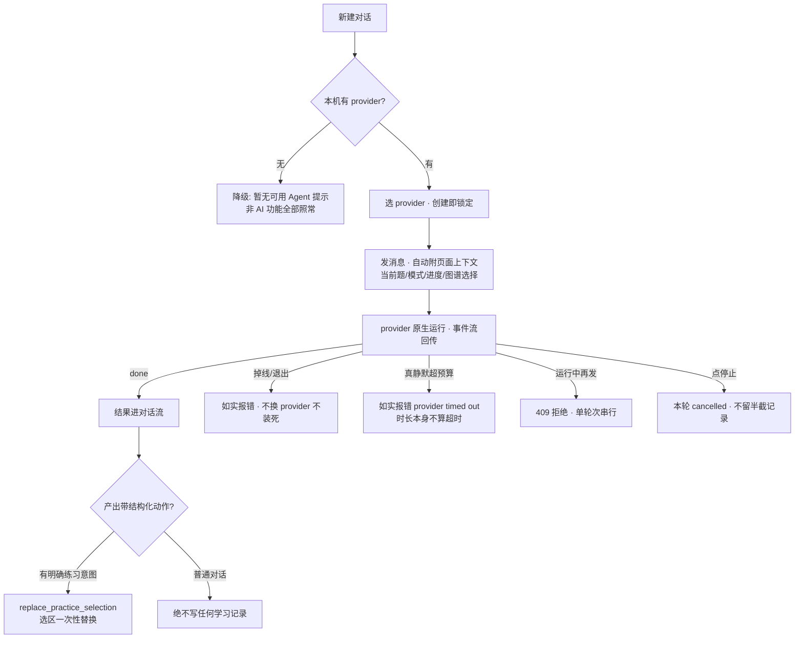
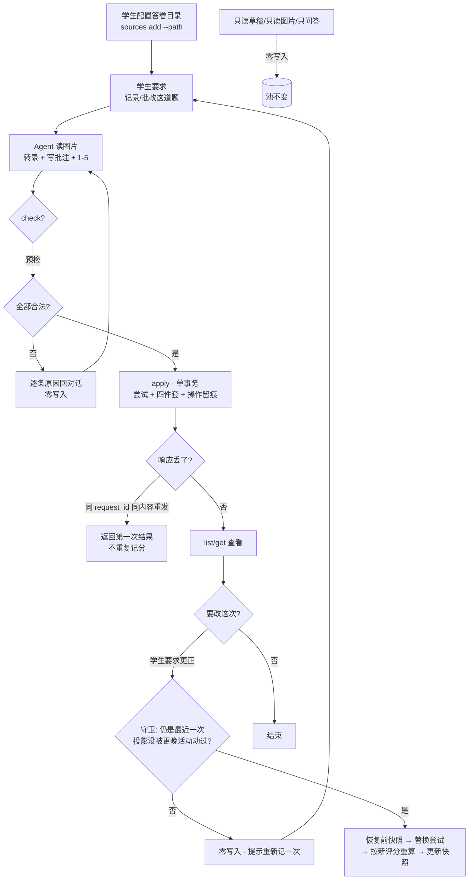
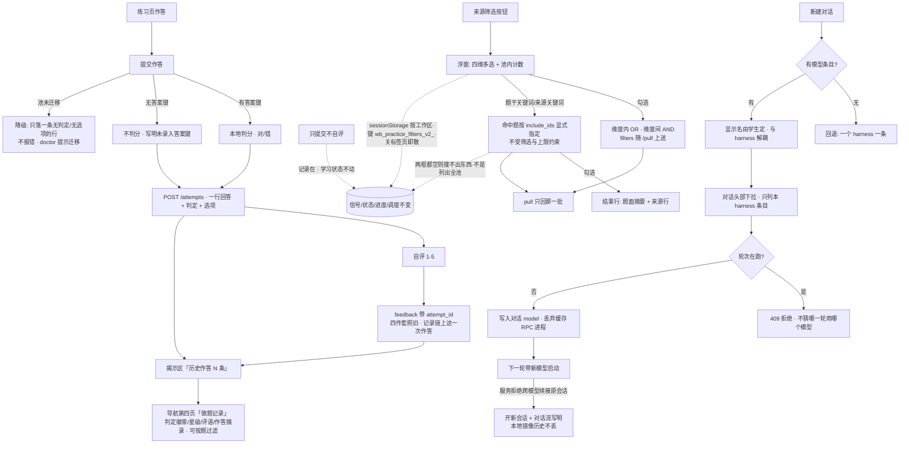
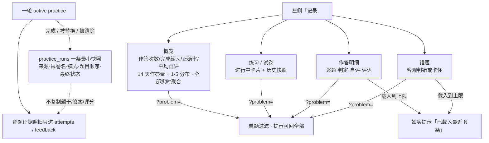
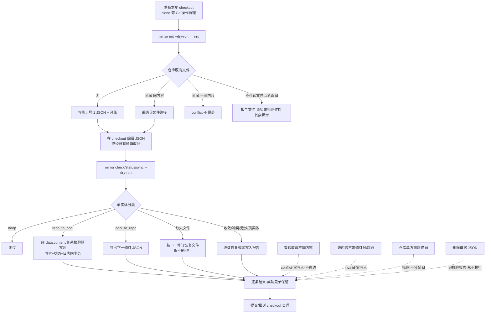

# L4 · 工作流层（用户真实路径 + 全部意外分支）

> 本层是 v2 的灵魂：**不许只画 happy path**。用户会回退、放弃、跳过、直接关闭——
> 每个出口都要有分支和落点。每条边可回溯 L3 动作；每个写库节点可回溯 L0。

## W1 · 练习回路

```mermaid
flowchart TD
  A[选范围<br/>图谱勾选/知识点页/建议区/kp 直达] --> B{模式+自评时机<br/>都选了吗?}
  B -- 否 --> B1[开始按钮禁用·等待] --> B
  B -- 是 --> C[开始本轮练习 · 会话聚焦]
  C --> D{内容类型}
  D -- 闪卡 --> E[看正面→揭示背面]
  D -- 微题/判断 --> F[点选作答→本地判分横幅]
  D -- 综合题 --> G[写解答→提交→查看解析]
  E -- immediate --> H[即时自评 1-5]
  E -- batch --> I[标记 unrated · 等收束]
  F -- batch: 横幅停 2s --> J[自动推进]
  F -- batch: 不想等 --> K[跳到下一道 · 立即走]
  F -- immediate --> H
  G --> H
  H --> L[四件套原子写<br/>事件/信号/状态/调度] --> M{还有下一张?}
  I --> N[上一张/下一张自由回翻<br/>状态保留 · 末尾才拉新]
  N --> M
  J --> M
  K --> M
  M -- 有 --> D
  M -- 拉空·诚实空态 --> O{自评时机}
  O -- batch --> P[自动进收束页]
  O -- immediate --> Q[空态提示+回模式选择区]
  M -- 提前结束 --> O2{自评时机}
  O2 -- batch --> P
  O2 -- immediate --> Q
  P --> R[逐题补分→四件套写入] --> S[再练同类?]
  S -- 是 --> C2[同 KP 新一轮] --> C
  S -- 否 --> T[结束 · 恢复学习安排区]
  X1[中途刷新] -.恢复游标+揭示/判分态.-> D
  X2[直接关标签页] -.草稿蒸发·已评分在池安全.-> Z[(池不变)]
  X3[batch 耗尽后又回 practice] -.ended 标志.-> P
  X4[网络失败] -.原位报错+重试.-> M
  X5[kp 直达且范围不符] -.丢弃旧会话重开.-> C
  X6[手写答案/练习页发消息问 Agent] -.只带聚焦草稿·零写入.-> Z
```

要点：跳过不降级（已作答/已揭示的条目保持 unrated 等收束）；横幅纯本地不写库；
刷新恢复到"翻到哪一张、揭示没揭示"；耗尽与提前结束在 batch 下同归收束页。
手写答案走 W5（Agent 代录），不在这条回路上写库。

## W2 · 内容入库（唯一合法写池通道）

```mermaid
flowchart TD
  A[产出 manifest<br/>人手写 / 未来 Agent 生成] --> B[副本演练<br/>隔离注册表+拷贝池]
  B --> C{门禁过?}
  C -- 拒收: 重复id/内容身份/契约违例 --> C1[改 manifest 重投] --> B
  C -- 过 --> D[真实池整池备份<br/>pool/backups]
  D --> E[单事务 apply]
  E -- 中途失败 --> E1[整批回滚 · 池原样] --> C1
  E -- 成功 --> F[计数核对+走查抽查]
  F -- 发现内容差 --> G[入错池处置] --> G1[现在: 恢复备份重做]
  G --> G2[批次 id 一条命令整批撤销<br/>ingest rollback --batch]
  F -- OK --> H[PR 归档 · 备份留档]
  Y1[一份清单跨多章] -.每项写自己的 chapter<br/>按章各记一个批次·可分别回滚.-> E
  Y2[一轮回复多个区块] -.每个区块都应用<br/>各自一份恢复副本.-> E
```

> 2026-09-25（in-place-problem-edits）：入库之后改题不再等于「删除重导」。原地补丁保留题号与全部学习记录，可把选项从题面拆进 `options` 让旧单选题变成小测题，整批存旧值可 `rollback` 还原；判断题/单选题的题干上限同时从 200 放宽到 800 字。批量修改只在学生明确要求时执行。
> 2026-09-26：题干上限取消（真题长篇客观题不再被退回综合题），摄入门禁与原地改题同步生效。

> 2026-09-25（ingest-mode-choice-and-contract-parity）：入库时可选题型——判断题（`quiz_type: yes_no`）
> 与单选题（`single_choice`/`multiple_choice` + 选项）即使**题源没有答案键**也能入库：这类题不判分，
> 练习页写明「本题未录入答案键」并由学生自评，答案键可事后用 `data update problem` 补；普通题目（不给
> `quiz_type`）进综合题，声明小测/判断模式却不给 `quiz_type` 会被拒收。学生一次说清的章要一轮导完，
> 前一章入完不再问「要不要继续」；章推不出来（该项与清单顶层都没有 `chapter`）时点名拒收，不再
> 静默按当前章落库。

> 2026-09-25（cross-chapter-content-bundles）：清单可跨章（每项声明自己的 `chapter`，缺省顶层→当前章），
> 发号/落图按该项的章，题目身份重复检查覆盖整个课程；按章各记一个批次，因此回滚可以只撤其中一章；一轮回复里的每个
> content-bundle 区块都会被依次应用（各自一份恢复副本），不再只应用第一个。

> 2026-09-29（content-dedup-and-audit）：先用 `lesson-kit data <workspace> audit` 读取题库卫生基线；新题按完整题干身份跨来源、跨章节拒重。apply 后已有内容被修改时，回滚先报告冲突，不创建回滚备份、不覆盖后续内容。

## W3 · 目标与计划（含缺口标记）

```mermaid
flowchart TD
  A[填目标表单<br/>名称/类型/截止/说明] --> B[创建 · 卡片+月历即时可见]
  B --> C{想改/想删?}
  C -- 是 --> X1[卡片编辑/删除入口<br/>同表单 PATCH/DELETE · 即时生效]
  C -- 否 --> D[月历/工作量只读视图]
  E[重新安排] --> F[每日建议重算 ≤3 条]
  F -- 计算失败 --> F1[保留上次有效结果 · 不报错堆栈]
  F -- 出现重日 --> G[prefill 一句话进 AI 输入框<br/>只预填 · 不发送]
  Y1[自然语言设目标] --> Y2[goal_intent 轮次 → prefill_goal_form → 表单原位填充<br/>提交仍由人确认 · 卡片即时变化]
  Y3[goals CLI] -.队列③: 补命令.-> B
```

## W4 · Agent 对话与动作

```mermaid
flowchart TD
  A[新建对话] --> B{本机有 provider?}
  B -- 无 --> Z1[降级: 暂无可用 Agent 提示<br/>非 AI 功能全部照常]
  B -- 有 --> C[选 provider · 创建即锁定]
  C --> D[发消息 · 自动附页面上下文<br/>当前题/模式/进度/图谱选择]
  D --> E[provider 原生运行 · 事件流回传]
  E -- done --> F[结果进对话流]
  E -- 掉线/退出 --> F1[如实报错 · 不换 provider 不装死]
  E -- 真静默超预算 --> F4[如实报错 provider timed out<br/>时长本身不算超时]
  E -- 运行中再发 --> F2[409 拒绝 · 单轮次串行]
  E -- 点停止 --> F3[本轮 cancelled · 不留半截记录]
  F --> G{产出带结构化动作?}
  G -- 有明确练习意图 --> H[replace_practice_selection<br/>选区一次性替换]
  G -- 普通对话 --> I[绝不写任何学习记录]
```

> 2026-09-25（bridge-timeouts-follow-progress）：原 `E -- 掉线/超时/退出 --> F1` 拆成两条——
> **时长本身不构成超时**，只有静默超预算才失败。预算按静默计：任一输出行或归一事件重置时钟，
> 命令/工具在飞时改用更长的工具预算（`bridge add --timeout` / `--tool-timeout`，`bridge list`
> 报生效值），因此 3 分钟以上的回答与长时间安静的构建都不会被截停，也不会再把正在运行的命令
> 一起杀掉；真卡住时仍如实报 `provider timed out`。

## W5 · Agent 代录手写作答（2026-09-24）

```mermaid
flowchart TD
  A[学生配置答卷目录<br/>sources add --path] --> B[学生要求<br/>记录/批改这道题]
  B --> C[Agent 读图片<br/>转录 + 写批注 ± 1-5]
  C --> D{check?}
  D -- 预检 --> E{全部合法?}
  E -- 否 --> E1[逐条原因回对话<br/>零写入] --> C
  E -- 是 --> F[apply · 单事务<br/>尝试 + 四件套 + 操作留痕]
  F --> G{响应丢了?}
  G -- 同 request_id 同内容重发 --> H[返回第一次结果<br/>不重复记分]
  G -- 否 --> I[list/get 查看]
  I --> J{要改这次?}
  J -- 学生要求更正 --> K{守卫: 仍是最近一次<br/>投影没被更晚活动动过?}
  K -- 否 --> K1[零写入 · 提示重新记一次] --> B
  K -- 是 --> L[恢复前快照 → 替换尝试<br/>→ 按新评分重算 → 更新快照]
  J -- 否 --> M[结束]
  Y1[只读草稿/只读图片/只问答] -.零写入.-> Z[(池不变)]
```

## W6 · 组一次练习并打印（2026-09-25）

```mermaid
flowchart TD
  A[确定范围<br/>章透镜/ --kp / 关透镜=整门课] --> B{选题方式}
  B -- 条件筛选 --> C[source_kind / origin_kinds / exam_year / source_evidence<br/>search_stem / search_source 两个关键词域 / 难度]
  B -- 学习证据 --> D[--weak 薄弱 / --due 到期 / --wrong 错题]
  B -- 单题 --> E[--problem 追加·不受筛选与上限约束]
  C & D & E --> F[逐题 reason：scope/weak/due/wrong/explicit]
  F --> G{要固定吗?}
  G -- --plan --> H[练习清单 JSON] --> I{要重跑?}
  I -- --input --> J[同一批题<br/>零写入] --> K{出卷?}
  G -- 否 --> L[打印题目行<br/>--ids 只看题号]
  K -- --check --> M[零写入预检<br/>题数/缺口/缺解/重复/泄漏]
  M -- 泄漏或重复 --> N[非零退出·逐条原因]
  K -- --print --> O[学生卷 + 解答卷<br/>题号对齐·缺解「待补」]
  Y1[新池上 --weak/--due/--wrong] -.空集是诚实结果.-> L
  Y2[未迁移池用 --exam-year] -.报错给 migrate 命令.-> Z[(池不变)]
```

## W7 · 做题记录、来源筛选与对话内换模型（2026-09-26）

```mermaid
flowchart TD
  A[练习页作答] --> B[提交作答]
  B -- 有答案键 --> C[本地判分 · 对/错]
  B -- 无答案键 --> C1[不判分 · 写明未录入答案键]
  B -- 池未迁移 --> C2[降级: 只落一条无判定/无选项的行<br/>不报错 · doctor 提示迁移]
  C & C1 --> D[POST /attempts · 一行回答 + 判定 + 选项]
  D --> E[自评 1-5]
  E --> F[feedback 带 attempt_id<br/>四件套照旧 · 记录链上这一次作答]
  D --> G[揭示区「历史作答 N 条」]
  F --> G
  G --> H[导航第四页「做题记录」<br/>判定徽章/星级/评语/作答摘录 · 可按题过滤]
  X1[只提交不自评] -.记录在 · 学习状态不动.-> Z[(信号/状态/进度/调度不变)]

  P[来源筛选按钮] --> Q[浮窗: 四维多选 + 池内计数]
  Q -- 勾选 --> R[维度内 OR · 维度间 AND<br/>filters 随 /pull 上送]
  Q -- 题干关键词/来源关键词 --> S[命中题按 include_ids 显式指定<br/>不受筛选与上限约束]
  S -- 勾选 --> S1[结果行: 题面摘要 + 来源行]
  R & S --> T[pull 只回那一批]
  Q -.sessionStorage 按工作区·键 wb_practice_filters_v2_<ws>·关标签页即散.-> Z
  S -.两框都空则搜不出东西·不是列出全池.-> Z

  M1[新建对话] --> M2{有模型条目?}
  M2 -- 无 --> M3[回退: 一个 harness 一条]
  M2 -- 有 --> M4[显示名由学生定 · 与 harness 解耦]
  M4 --> M5[对话头部下拉 · 只列本 harness 条目]
  M5 --> M6{轮次在跑?}
  M6 -- 是 --> M7[409 拒绝 · 不猜哪一轮用哪个模型]
  M6 -- 否 --> M8[写入对话 model · 丢弃缓存 RPC 进程]
  M8 --> M9[下一轮带新模型启动]
  M9 -- 服务拒绝跨模型续接原会话 --> M10[开新会话 + 对话流写明<br/>本地镜像历史不丢]
```

> 2026-09-26（attempt-records-filters-and-model-entries）：三件事合并交付。**记录**：提交即落库
> （判定与选项同存），自评通过 `attempt_id` 链回那次作答，于是「作答了什么、判定如何、评为几分」
> 读得成一行；记录只增不改，学习状态仍只由自评驱动。**筛选**：来源维度在
> CLI、API 与练习页浮窗同一语义——维度内 OR、维度间 AND；文档键把两套证据书写格式折成一份文档
> 一个键，计数取自池内实际值。
>
> 2026-10-06（problem-search-and-origin-filter）：来源维度由三个增为**四个**（多一个题目来源方式
> `origin_kinds`，浮窗显示历年原题/改编/AI生成，CLI 改可重复的 `--origin-kinds`，单值 `origin_kind`
> 删除不兼容）。浮窗的「一个搜索框」变成**两个关键词域**：题干域（标题/题面）与来源域
> （来源证据/考查年份/题面开头的 `【…】` 标签段，老池把卷面身份只写在那里），各域按空格切多词、
> 域内 AND，两域都填则跨域 AND；域的定义只有一份，搜索与 `/pull` 的 `--search-stem`/
> `--search-source` 共用。两框都空返回空集而不是全池。旧 `?q=` 参数删除，浮窗存储键升为
> `wb_practice_filters_v2_<ws>`。**模型**：bridges.json 的 `models` 条目让显示名与 harness 解耦
> （不再显示 `pi · deepseek/…`），对话记住自己的模型并可在头部下拉里换，**下一轮**生效。

> 2026-10-06/07（practice-set-item-preview）：组卷页先展示试卷卡片；卡片默认折叠，展开状态
> 按工作区记在当前标签页。卡片命令不切换折叠状态，命令失败的状态行仍在折叠区外；打开题目项
> 只呈现题面与来源，答案继续由导出解答卷提供。

## W8 · 记录中心（2026-09-29）

```mermaid
flowchart TD
  A[一轮 active practice] -- 完成 / 被替换 / 被清除 --> B[practice_runs 一条最小快照<br/>来源·试卷名·模式·题目顺序·最终状态]
  A --> C[逐题证据照旧只进 attempts / feedback]

  D[左侧「记录」] --> E[概览<br/>作答次数/完成练习/正确率/平均自评<br/>14 天作答量 + 1-5 分布 · 全部实时聚合]
  D --> F[练习 / 试卷<br/>进行中卡片 + 历史快照]
  D --> G[作答明细<br/>逐题·判定·自评·评语]
  D --> H[错题<br/>客观判错或卡住]
  G & H -- 载入到上限 --> I[如实提示「已载入最近 N 条」]
  E & F & G & H -- ?problem= --> J[单题过滤 · 提示可回全部]
  B -. 不复制题干/答案/评分 .-> C
```

> 2026-09-29（records-center groundwork）：左侧「记录」从单列历史页扩为记录中心。快照只在
> 一轮结束时写一条，统计图永远实时从 attempts / feedback 聚合、不缓存统计值；旧池迁移增量补
> `practice_runs` 表与 `active_practice.source_label` 列，已有行零改动。错题视图按**值**判
> verdict（sqlite 返回 0/1，不是布尔），作答明细与错题在触到载入上限时如实说明截断。

## W9 · 作者内容镜像审阅与同步（2026-10-10，PR110）

```mermaid
flowchart TD
  A[准备本地 checkout<br/>clone 等 Git 操作自理] --> B[mirror init --dry-run → init]
  B --> C{仓库既有文件}
  C -- 无 --> D[写修订号 1 JSON + 台账]
  C -- 同 id 同内容 --> E[采纳该文件路径]
  C -- 同 id 不同内容 --> F[conflict·不覆盖]
  C -- 不可读文件点名该 id --> G[报告文件·该实体拒绝建档·其余照常]
  D --> H[在 checkout 编辑 JSON<br/>或经既有通道改池]
  E --> H
  H --> I[mirror check/status/sync --dry-run]
  I --> J{单实体分类}
  J -- noop --> K[跳过]
  J -- repo_to_pool --> L[经 data.content/关系校验器写池<br/>内容+状态+日志同事务]
  J -- pool_to_repo --> M[导出下一修订 JSON]
  J -- 缺失文件 --> N[按下一修订恢复文件<br/>永不删池行]
  J -- 收敛/冲突/无效/孤实体 --> O[收敛恢复或零写入报告]
  L --> P[逐条结果·成功兄弟保留]
  M --> P
  N --> P
  O --> P
  P --> Q[提交/推送 checkout 自理]
  X1[双边改成不同内容] -.conflict·零写入·不选边.-> P
  X2[改内容不带修订号/跳跃] -.invalid·零写入.-> P
  X3[仓库单方面新建 id] -.拒绝·不分配 id.-> P
  X4[删除请求 JSON] -.只校验报告·永不执行.-> P
```

## 意外分支总清单（防"想当然"复查用）

| # | 意外 | 落点 |
|---|---|---|
| 1 | 中途刷新 | 牌组恢复（游标+视图态） |
| 2 | 直接关标签页 | 草稿蒸发；已评分在池安全 |
| 3 | 跳过单题 | 不写库不记欠账；已答/已玩不降级 |
| 4 | 跳过到底直接走 | 空态/收束页，不强迫评完 |
| 5 | 提前结束 | batch→收束页；immediate→回开始区 |
| 6 | batch 耗尽后再回练习页 | ended 标志自动重回收束页 |
| 7 | 拉空范围 | 诚实空态，不偷换内容 |
| 8 | 网络失败 | 原位报错+重试，不吞操作 |
| 9 | 门禁拒收 | 改 manifest 重投，池零污染 |
| 10 | apply 中途失败 | 单事务整批回滚 |
| 11 | 入错池 | `ingest rollback --batch <id>` 整批撤销 |
| 12 | provider 掉线/超时 | 如实报错，会话仍锁定 |
| 13 | 双发消息 | 409 串行 |
| 14 | 无 provider | 全功能降级可用 |
| 15 | 目标想改/删 | 卡片编辑/删除入口（complete-goals-loop） |
| 16 | 代录的响应丢了（重发同 request_id） | 返回第一次结果，不重复记分（W5） |
| 17 | 更正时已有更晚活动/更晚尝试 | 零写入拒绝，提示重新记一次（W5） |
| 18 | 组练习时新池没有学习证据（--weak/--due/--wrong 空集） | 诚实空集 + shortage，提示先用范围/条件筛选（W6） |
| 19 | 练习清单里有陌生或重复题目 | 非零退出、逐条点名，零写入（W6） |
| 20 | 拟打印的学生卷会泄漏内部标识/答案 | 预检拦下并点名，不写文件（W6） |
| 21 | 清单里某项推不出所属章（无 item 章、无顶层章、无章透镜） | 点名该项并整批零写入，其余项不会被静默丢掉 |
| 22 | 显式 id 与该项声明的章不一致 | 拒收并同时说出 id 属于哪一章（图不会再落错目录） |
| 23 | 一轮里第二个内容区块的恢复副本重名 | 每个动作各自一份恢复副本，两个区块都能落盘 |
| 24 | 提交作答时池尚未迁移（缺请求记录表） | 浏览器请求拒写并提示迁移命令；旧无请求 id 调用仍可列感知降级（W7） |
| 25 | 客观题没有答案键 | 不判分、写明「未录入答案键」，仍可作答与自评（W7） |
| 26 | 浮窗里某个维度在池内没有值 | 该维度显示「本池暂无此维度」，不回退成假选项（W7） |
| 27 | 对话轮次运行中切模型 | 409 拒绝，不猜哪一轮用哪个模型（W7） |
| 28 | 切模型后服务拒绝续接原会话 | 放弃该原生会话一次、开新会话并在对话流写明，本地镜像不丢（W7） |
| 29 | 条目挂的 harness 不在本机 | 该条目被跳过（不报错、不顶替），其余条目照常可用（W7） |
| 30 | 作答或自评已经落库但响应丢失 | 会话保存原请求 id 和载荷，重试取回首次结果，不再写一条（W7） |
| 31 | 错题视图拿到 sqlite 的 verdict=0（不是布尔 False） | 按值判定：0 计入错题，NULL 才是未判定（W8） |
| 32 | 池还没迁移就打开记录中心 | 只读聚合照常工作；练习轮次功能等 `practice_runs` 表出现后自动可用（W8） |
| 33 | 载入窗口外的更早记录 | 明细/错题页顶部提示「已载入最近 N 条」，不假装是全部（W8） |
| 34 | 仓库缺实体文件 | 不视为删除；池行保留，按新修订恢复文件（W9） |
| 35 | 仓库出现不可读 JSON | 报告文件；被其点名 id 的实体拒绝建档，其余实体照常（W9） |
| 36 | 池与仓库两边改成不同内容 | conflict 零写入，不静默选边（W9） |
| 37 | 仓库单方面新建 id | 拒绝，不分配 id、不写池（W9） |
