6.1 The Basics of Counting

6.2 The Pigeonhole Principle

6.3 Permutations and Combinations

6.4 Binomial Coeficients and Identities

6.5 Generalized Permutations and Combinations

6.6 Generating Permutations and Combinations

ombinatorics, the study of arrangements of objects, is an important part of discrete mathematics. This subject was studied as long ago as the seventeenth century, when combinatorial questions arose in the study of gambling games. Enumeration, the counting of objects with certain properties, is an important part of combinatorics. We must count objects to solve many diferent types of problems. For instance, counting is used to determine the complexity of algorithms. Counting is also required to determine whether there are enough telephone numbers or Internet protocol addresses to meet demand. Recently, it has played a key role in mathematical biology, especially in sequencing DNA. Furthermore, counting techniques are used extensively when probabilities of events are computed.

The basic rules of counting, which we will study in Section 6.1, can solve a tremendous variety of problems. For instance, we can use these rules to enumerate the diferent telephone numbers possible in the United States, the allowable passwords on a computer system, and the diferent orders in which the runners in a race can finish. Another important combinatorial tool is the pigeonhole principle, which we will study in Section 6.2. This states that when objects are placed in boxes and there are more objects than boxes, then there is a box containing at least two objects. For instance, we can use this principle to show that among a set of 15 or more students, at least 3 were born on the same day of the week.

We can phrase many counting problems in terms of ordered or unordered arrangements of the objects of a set with or without repetitions. These arrangements, called permutations and combinations, are used in many counting problems. For instance, suppose the 100 top finishers on a competitive exam taken by 2000 students are invited to a banquet. We can count the possible sets of 100 students that will be invited, as well as the ways in which the top 10 prizes can be awarded.

Another problem in combinatorics involves generating all the arrangements of a specified kind. This is often important in computer simulations. We will devise algorithms to generate arrangements of various types.


## The Basics of Counting

## 6.1.1 Introduction

Suppose that a password on a computer system consists of six, seven, or eight characters. Each of these characters must be a digit or a letter of the alphabet. Each password must contain at least one digit. How many such passwords are there? The techniques needed to answer this question and a wide variety of other counting problems will be introduced in this section.

Counting problems arise throughout mathematics and computer science. For example, we must count the successful outcomes of experiments and all the possible outcomes of these experiments to determine probabilities of discrete events. We need to count the number of operations used by an algorithm to study its time complexity.

We will introduce the basic techniques of counting in this section. These methods serve as the foundation for almost all counting techniques.

## 6.1.2 Basic Counting Principles

## Assessment

We first present two basic counting principles, the product rule and the sum rule. Then we will show how they can be used to solve many diferent counting problems.

The product rule applies when a procedure is made up of separate tasks.

THE PRODUCT RULE Suppose that a procedure can be broken down into a sequence of two tasks. If there are $n _ { 1 }$ ways to do the first task and for each of these ways of doing the first task, there are $n _ { 2 }$ ways to do the second task, then there are $n _ { 1 } n _ { 2 }$ ways to do the procedure.

EXAMPLE 1 A new company with just two employees, Sanchez and Patel, rents a floor of a building with 12 ofices. How many ways are there to assign diferent ofices to these two employees?

Solution: The procedure of assigning ofices to these two employees consists of assigning an ofice to Sanchez, which can be done in 12 ways, then assigning an ofice to Patel diferent from the ofice assigned to Sanchez, which can be done in 11 ways. By the product rule, there are 12 ⋅ 11 = 132 ways to assign ofices to these two employees. ◂

EXAMPLE 2 The chairs of an auditorium are to be labeled with an uppercase English letter followed by a positive integer not exceeding 100. What is the largest number of chairs that can be labeled diferently?

Solution: The procedure of labeling a chair consists of two tasks, namely, assigning to the seat one of the 26 uppercase English letters, and then assigning to it one of the 100 possible integers. The product rule shows that there are 26 ⋅ 100 = 2600 diferent ways that a chair can be labeled. Therefore, the largest number of chairs that can be labeled diferently is 2600. ◂

EXAMPLE 3 There are 32 computers in a data center in the cloud. Each of these computers has 24 ports. How many diferent computer ports are there in this data center?

Solution: The procedure of choosing a port consists of two tasks, first picking a computer and then picking a port on this computer. Because there are 32 ways to choose the computer and 24 ways to choose the port no matter which computer has been selected, the product rule shows that there are 32 ⋅ 24 = 768 ports. ◂

An extended version of the product rule is often useful. Suppose that a procedure is carried out by performing the tasks $T _ { 1 } , T _ { 2 } , \dots , T _ { m }$ in sequence. If each task $T _ { i } , i = 1 , 2 , \ldots , n ,$ can be done in $n _ { i }$ ways, regardless of how the previous tasks were done, then there are $n _ { 1 } \cdot n _ { 2 } \cdot \cdots \cdot n _ { m }$ ways to carry out the procedure. This version of the product rule can be proved by mathematical induction from the product rule for two tasks (see Exercise 76).

## EXAMPLE 4 How many diferent bit strings of length seven are there?

Solution: Each of the seven bits can be chosen in two ways, because each bit is either 0 or 1. Therefore, the product rule shows there are a total of $2 ^ { 7 } = 1 2 8$ diferent bit strings of length seven. ◂

How many diferent license plates can be made if each plate contains a sequence of three uppercase English letters followed by three digits (and no sequences of letters are prohibited, even if they are obscene)?

Solution: There are 26 choices for each of the three uppercase English letters and 10 choices for each of the three digits. Hence, by the product rule there are a total of $2 6 \cdot 2 6 \cdot 2 6 \cdot 1 0 \cdot 1 0 \cdot 1 0 =$ 17,576,000 possible license plates. ◂

Counting Functions How many functions are there from a set with m elements to a set with n elements?

Solution: A function corresponds to a choice of one of the n elements in the codomain for each of the m elements in the domain. Hence, by the product rule there are $n \cdot n \cdot \ \cdots \cdot n = n ^ { m }$ functions from a set with m elements to one with n elements. For example, there are $5 ^ { 3 } = 1 2 5$ diferent functions from a set with three elements to a set with five elements. ◂

EXAMPLE 7 Counting One-to-One Functions How many one-to-one functions are there from a set with m elements to one with n elements?

Solution: First note that when $m > n$ there are no one-to-one functions from a set with m elements to a set with n elements.

Now let $m \leq n .$ Suppose the elements in the domain are $a _ { 1 } , a _ { 2 } , \ldots , a _ { m }$ . There are n ways to choose the value of the function at $a _ { 1 }$ . Because the function is one-to-one, the value of the function at $a _ { 2 }$ can be picked in n − 1 ways (because the value used for $a _ { 1 }$ cannot be used again). In general, the value of the function at $a _ { k }$ can be chosen in $n - k + 1$ ways. By the product rule, there are $n ( n - 1 ) ( n - 2 ) \cdots ( n - m + 1 )$ one-to-one functions from a set with m elements to one with n elements.

For example, there are 5 ⋅ 4 ⋅ 3 = 60 one-to-one functions from a set with three elements to a set with five elements. ◂

The Telephone Numbering Plan The North American numbering plan (NANP) specifies the format of telephone numbers in the U.S., Canada, and many other parts of North America. A telephone number in this plan consists of 10 digits, which are split into a three-digit area code, a three-digit ofice code, and a four-digit station code. Because of signaling considerations, there are certain restrictions on some of these digits. To specify the allowable format, let X denote a digit that can take any of the values 0 through 9, let N denote a digit that can take any of the values 2 through 9, and let Y denote a digit that must be a 0 or a 1. Two numbering plans, which will be called the old plan, and the new plan, will be discussed. (The old plan, in use in the 1960s, has been replaced by the new plan, but the recent rapid growth in demand for new numbers for mobile phones and devices will eventually make even this new plan obsolete. In this example, the letters used to represent digits follow the conventions of the North American Numbering Plan.) As will be shown, the new plan allows the use of more numbers.

In the old plan, the formats of the area code, ofice code, and station code are NYX, NNX, and XXXX, respectively, so that telephone numbers had the form NYX-NNX-XXXX. In the new plan, the formats of these codes are NXX, NXX, and XXXX, respectively, so that telephone numbers have the form NXX-NXX-XXXX. How many diferent North American telephone numbers are possible under the old plan and under the new plan?

Solution: By the product rule, there are $8 \cdot 2 \cdot 1 0 = 1 6 0$ area codes with format NYX and $8 \cdot 1 0 \cdot 1 0 = 8 0 0$ area codes with format NXX. Similarly, by the product rule, there are

$8 \cdot 8 \cdot 1 0 = 6 4 0$ ofice codes with format NNX. The product rule also shows that there are $1 0 \cdot 1 0 \cdot 1 0 \cdot 1 0 = 1 0 , 0 0 0$ station codes with format XXXX.

Consequently, applying the product rule again, it follows that under the old plan there are

$$
1 6 0 \cdot 6 4 0 \cdot 1 0 , 0 0 0 = 1 , 0 2 4 , 0 0 0 , 0 0 0
$$

diferent numbers available in North America. Under the new plan, there are

$$
8 0 0 \cdot 8 0 0 \cdot 1 0 , 0 0 0 = 6 , 4 0 0 , 0 0 0 , 0 0 0
$$

diferent numbers available.

EXAMPLE 9 What is the value of k after the following code, where $n _ { 1 } , n _ { 2 } , \ldots , n _ { m }$ are positive integers, has been executed?

k := 0   
for $i _ { 1 } : = 1$ to $n _ { 1 }$   
for $i _ { 2 } : = 1$ to $n _ { 2 }$   
for $\begin{array} { c } { { i _ { m } : = 1 \mathrm { \bf ~ t o } n _ { m } } } \\ { { k : = k + 1 } } \end{array}$

Solution: The initial value of $k$ is zero. Each time the nested loop is traversed, 1 is added to k. Let $T _ { i }$ be the task of traversing the ith loop. Then the number of times the loop is traversed is the number of ways to do the tasks $T _ { 1 } , T _ { 2 } , \dots , T _ { m } .$ The number of ways to carry out the task $T _ { j } , j = 1 , 2 , \ldots , m$ , is $n _ { j } .$ , because the jth loop is traversed once for each integer $i _ { j }$ with $1 \leq i _ { j } \leq n _ { j }$ . By the product rule, it follows that the nested loop is traversed $n _ { 1 } n _ { 2 } \cdots n _ { m }$ times. Hence, the final value of k is $n _ { 1 } n _ { 2 } \cdots n _ { m }$ ◂

EXAMPLE 10 Counting Subsets of a Finite Set Use the product rule to show that the number of diferent subsets of a finite set S is $2 ^ { | S | }$

Solution: Let S be a finite set. List the elements of S in arbitrary order. Recall from Section 2.2 that there is a one-to-one correspondence between subsets of S and bit strings of length <sup>|</sup>S<sup>|</sup>. Namely, a subset of S is associated with the bit string with a 1 in the ith position if the ith element in the list is in the subset, and a 0 in this position otherwise. By the product rule, there are $2 ^ { | S | }$ bit strings of length <sup>|</sup>S<sup>|</sup>. Hence, $| P ( S ) | = \widehat { 2 } ^ { | S | }$ . (Recall that we used mathematical induction to prove this fact in Example 10 of Section 5.1.) ◂

The product rule is often phrased in terms of sets in this way: If $A _ { 1 } , A _ { 2 } , \ldots , A _ { m }$ are finite sets, then the number of elements in the Cartesian product of these sets is the product of the number of elements in each set. To relate this to the product rule, note that the task of choosing an element in the Cartesian product $A _ { 1 } \times A _ { 2 } \times \cdots \times A _ { m }$ is done by choosing an element in $A _ { 1 }$ , an element in $A _ { 2 } , \dots$ , and an element in $A _ { m } .$ By the product rule it follows that

$$
| A _ { 1 } \times A _ { 2 } \times \cdots \times A _ { m } | = | A _ { 1 } | \cdot | A _ { 2 } | \cdot \cdots \cdot | A _ { m } | .
$$

DNA and Genomes The hereditary information of a living organism is encoded using deoxyribonucleic acid (DNA), or in certain viruses, ribonucleic acid (RNA). DNA and RNA are extremely complex molecules, with diferent molecules interacting in a vast variety of ways to enable living process. For our purposes, we give only the briefest description of how DNA and RNA encode genetic information.

DNA molecules consist of two strands consisting of blocks known as nucleotides. Each nucleotide contains subcomponents called bases, each of which is adenine (A), cytosine (C), guanine (G), or thymine (T). The two strands of DNA are held together by hydrogen bonds connecting diferent bases, with A bonding only with T, and C bonding only with G. Unlike DNA, RNA is single stranded, with uracil (U) replacing thymine as a base. So, in DNA the possible base pairs are A-T and C-G, while in RNA they are A-U, and C-G. The DNA of a living creature consists of multiple pieces of DNA forming separate chromosomes. A gene is a segment of a DNA molecule that encodes a particular protein. The entirety of genetic information of an organism is called its genome.

Sequences of bases in DNA and RNA encode long chains of proteins called amino acids. There are 22 essential amino acids for human beings. We can quickly see that a sequence of at least three bases are needed to encode these 22 diferent amino acid. First note, that because there are four possibilities for each base in DNA, A, C, G, and T, by the product rule there are $4 ^ { 2 } = 1 6 < 2 2$ diferent sequences of two bases. However, there are $\dot { 4 } ^ { 3 } = \dot { 6 } 4$ diferent sequences of three bases, which provide enough diferent sequences to encode the 22 diferent amino acids (even after taking into account that several diferent sequences of three bases encode the same amino acid).

The DNA of simple living creatures such as algae and bacteria have between $1 0 ^ { 5 }$ and $1 0 ^ { 7 }$ links, where each link is one of the four possible bases. More complex organisms, such as insects, birds, and mammals, have between $1 0 ^ { 8 }$ and $1 0 ^ { 1 0 }$ links in their DNA. So, by the product rule, there are at least $4 ^ { 1 0 ^ { 5 } }$ diferent sequences of bases in the DNA of simple organisms and at least $4 ^ { 1 0 ^ { 8 } }$ diferent sequences of bases in the DNA of more complex organisms. These are both incredibly huge numbers, which helps explain why there is such tremendous variability among living organisms. In the past several decades techniques have been developed for determining the genome of diferent organisms. The first step is to locate each gene in the DNA of an organism. The next task, called gene sequencing, is the determination of the sequence of links on each gene. (The specific sequence of links on these genes depends on the particular individual representative of a species whose DNA is analyzed.) For example, the human genome includes approximately 23,000 genes, each with 1000 or more links. Gene sequencing techniques take advantage of many recently developed algorithms and are based on numerous new ideas in combinatorics. Many mathematicians and computer scientists work on problems involving genomes, taking part in the fast moving fields of bioinformatics and computational biology. ◂

We now introduce the sum rule.

THE SUM RULE If a task can be done either in one of $n _ { 1 }$ ways or in one of $n _ { 2 }$ ways, where none of the set of $n _ { 1 }$ ways is the same as any of the set of $n _ { 2 }$ ways, then there are $n _ { 1 } + n _ { 2 }$ ways to do the task.

Example 12 illustrates how the sum rule is used.

Suppose that either a member of the mathematics faculty or a student who is a mathematics major is chosen as a representative to a university committee. How many diferent choices are there for this representative if there are 37 members of the mathematics faculty and 83 mathematics majors and no one is both a faculty member and a student?

Solution: There are 37 ways to choose a member of the mathematics faculty and there are 83 ways to choose a student who is a mathematics major. Choosing a member of the mathematics faculty is never the same as choosing a student who is a mathematics major because no one is both a faculty member and a student. By the sum rule it follows that there are $3 7 + 8 3 = 1 2 0$ possible ways to pick this representative. ◂

We can extend the sum rule to more than two tasks. Suppose that a task can be done in one of $n _ { 1 }$ ways, in one of $n _ { 2 } { \mathrm { ~ w a y s , ~ . . . ~ , ~ o r ~ } }$ in one of $n _ { m }$ ways, where none of the set of $n _ { i }$ ways of doing the task is the same as any of the set of n ways, for all pairs i and j with $1 \leq i < j \leq m$ Then the number of ways to do the task is $n _ { 1 } ^ { ' + } n _ { 2 } + \cdots + n _ { m }$ . This extended version of the sum rule is often useful in counting problems, as Examples 13 and 14 show. This version of the sum rule can be proved using mathematical induction from the sum rule for two sets. (See Exercise 75.)

A student can choose a computer project from one of three lists. The three lists contain 23, 15, and 19 possible projects, respectively. No project is on more than one list. How many possible projects are there to choose from?

Solution: The student can choose a project by selecting a project from the first list, the second list, or the third list. Because no project is on more than one list, by the sum rule there are $2 3 + 1 5 + 1 9 = 5 7$ ways to choose a project. ◂

EXAMPLE 14 What is the value of k after the following code, where $n _ { 1 } , n _ { 2 } , \ldots , n _ { m }$ are positive integers, has been executed?

```perl
$k : = 0$
for $i _ { 1 } : = 1$ to $n _ { 1 }$
$k : = k + 1$
for $i _ { 2 } : = 1$ to $n _ { 2 }$
$k : = k + 1$
for $i _ { m } : = 1$ to $n _ { m }$
$k : = k + 1$
```

Solution: The initial value of k is zero. This block of code is made up of m diferent loops. Each time a loop is traversed, 1 is added to $k .$ To determine the value of k after this code has been executed, we need to determine how many times we traverse a loop. Note that there are $n _ { i }$ ways to traverse the ith loop. Because we only traverse one loop at a time, the sum rule shows that the final value of k, which is the number of ways to traverse one of the m loops is $n _ { 1 } + n _ { 2 } + \cdots + n _ { m }$ ◂

The sum rule can be phrased in terms of sets as: If $A _ { 1 } , A _ { 2 } , \ldots , A _ { m }$ are pairwise disjoint finite sets, then the number of elements in the union of these sets is the sum of the numbers of elements in the sets. To relate this to our statement of the sum rule, note there are $| A _ { i } |$ ways to choose an element from $A _ { i }$ for $i = 1 , 2 , \dots , m$ . Because the sets are pairwise disjoint, when we select an element from one of the sets $A _ { i } ,$ we do not also select an element from a diferent set $A _ { j }$ . Consequently, by the sum rule, because we cannot select an element from two of these sets at the same time, the number of ways to choose an element from one of the sets, which is the number of elements in the union, is

$$
| A _ { 1 } \cup A _ { 2 } \cup \cdots \cup A _ { m } | = | A _ { 1 } | + | A _ { 2 } | + \cdots + | A _ { m } | { \mathrm { ~ w h e n } } A _ { i } \cap A _ { j } = { \mathrm { f o r ~ a l l } } i , j .
$$

This equality applies only when the sets in question are pairwise disjoint. The situation is much more complicated when these sets have elements in common. That situation will be briefly discussed later in this section and discussed in more depth in Chapter 8.

## 6.1.3 More Complex Counting Problems

Many counting problems cannot be solved using just the sum rule or just the product rule. However, many complicated counting problems can be solved using both of these rules in combination. We begin by counting the number of variable names in the programming language BASIC. (In the exercises, we consider the number of variable names in JAVA.) Then we will count the number of valid passwords subject to a particular set of restrictions.

In a version of the computer language BASIC, the name of a variable is a string of one or two alphanumeric characters, where uppercase and lowercase letters are not distinguished. (An alphanumeric character is either one of the 26 English letters or one of the 10 digits.) Moreover, a variable name must begin with a letter and must be diferent from the five strings of two characters that are reserved for programming use. How many diferent variable names are there in this version of BASIC?

Solution: Let V equal the number of diferent variable names in this version of BASIC. Let $V _ { 1 }$ be the number of these that are one character long and $V _ { 2 }$ be the number of these that are two characters long. Then by the sum rule, $V = V _ { 1 } + V _ { 2 }$ . Note that $V _ { 1 } = 2 6$ , because a one-character variable name must be a letter. Furthermore, by the product rule there are 26 ⋅ 36 strings of length two that begin with a letter and end with an alphanumeric character. However, five of these are excluded, so $V _ { 2 } = 2 6 \cdot 3 6 - 5 = 9 3 1$ . Hence, there are $V = V _ { 1 } + V _ { 2 } = 2 6 + 9 3 1 = 9 5 7$ diferent names for variables in this version of BASIC. ◂

## EXAMPLE 16

Each user on a computer system has a password, which is six to eight characters long, where each character is an uppercase letter or a digit. Each password must contain at least one digit. How many possible passwords are there?

Solution: Let P be the total number of possible passwords, and let $P _ { 6 } , P _ { 7 }$ , and $P _ { 8 }$ denote the number of possible passwords of length $6 , 7 ,$ , and 8, respectively. By the sum rule, $P = P _ { 6 } +$ $P _ { 7 } + P _ { 8 }$ . We will now find $P _ { 6 } , P _ { 7 }$ , and $P _ { 8 } .$ . Finding $P _ { 6 }$ directly is dificult. To find $P _ { 6 }$ it is easier to find the number of strings of uppercase letters and digits that are six characters long, including those with no digits, and subtract from this the number of strings with no digits. By the product rule, the number of strings of six characters is $3 6 ^ { 6 }$ , and the number of strings with no digits is $2 6 ^ { 6 }$ . Hence,

$$
P _ { 6 } = 3 6 ^ { 6 } - 2 6 ^ { 6 } = 2 , 1 7 6 , 7 8 2 , 3 3 6 - 3 0 8 , 9 1 5 , 7 7 6 = 1 , 8 6 7 , 8 6 6 , 5 6 0 .
$$

Similarly, we have

$$
P _ { 7 } = 3 6 ^ { 7 } - 2 6 ^ { 7 } = 7 8 , 3 6 4 , 1 6 4 , 0 9 6 - 8 , 0 3 1 , 8 1 0 , 1 7 6 = 7 0 , 3 3 2 , 3 5 3 , 9 2 0
$$

and

$$
\begin{array} { r l } & { P _ { 8 } = 3 6 ^ { 8 } - 2 6 ^ { 8 } = 2 , 8 2 1 , 1 0 9 , 9 0 7 , 4 5 6 - 2 0 8 , 8 2 7 , 0 6 4 , 5 7 6 } \\ & { \quad = 2 , 6 1 2 , 2 8 2 , 8 4 2 , 8 8 0 . } \end{array}
$$

Consequently,

$$
P = P _ { 6 } + P _ { 7 } + P _ { 8 } = 2 , 6 8 4 , 4 8 3 , 0 6 3 , 3 6 0 .
$$

<table><tr><td>Bit Number</td><td>0</td><td>1</td><td>2</td><td>3 4</td><td></td><td>8</td><td>16</td><td>24</td><td>31</td></tr><tr><td>Class A</td><td>0</td><td colspan="4">netid</td><td colspan="4">hostid</td></tr><tr><td>Class B</td><td>1</td><td>0</td><td></td><td colspan="4">netid</td><td colspan="2">hostid</td></tr><tr><td>Class C</td><td>1</td><td>1</td><td>0</td><td></td><td colspan="3">netid</td><td>hostid</td><td></td></tr><tr><td>Class D</td><td>1</td><td>1</td><td>1</td><td>0</td><td colspan="4">Multicast Address</td><td></td></tr><tr><td>Class E</td><td>1</td><td>1</td><td>1</td><td>1 0</td><td colspan="4">Address</td></tr></table>

## FIGURE 1 Internet addresses (IPv4).

Counting Internet Addresses In the Internet, which is made up of interconnected physical networks of computers, each computer (or more precisely, each network connection of a computer) is assigned an Internet address. In Version 4 of the Internet Protocol (IPv4), still in use today, an address is a string of 32 bits. It begins with a network number (netid ). The netid is followed by a host number (hostid ), which identifies a computer as a member of a particular network.

Three forms of addresses are used, with diferent numbers of bits used for netids and hostids. Class A addresses, used for the largest networks, consist of 0, followed by a 7-bit netid and a 24-bit hostid. Class B addresses, used for medium-sized networks, consist of 10, followed by a 14-bit netid and a 16-bit hostid. Class C addresses, used for the smallest networks, consist of 110, followed by a 21-bit netid and an 8-bit hostid. There are several restrictions on addresses because of special uses: 1111111 is not available as the netid of a Class A network, and the hostids consisting of all 0s and all 1s are not available for use in any network. A computer on the Internet has either a Class A, a Class B, or a Class C address. (Besides Class A, B, and C addresses, there are also Class D addresses, reserved for use in multicasting when multiple computers are addressed at a single time, consisting of 1110 followed by 28 bits, and Class E addresses, reserved for future use, consisting of 11110 followed by 27 bits. Neither Class D nor Class E addresses are assigned as the IPv4 address of a computer on the Internet.) Figure 1 illustrates IPv4 addressing. (Limitations on the number of Class A and Class B netids have made IPv4 addressing inadequate; IPv6, a new version of IP, uses 128-bit addresses to solve this problem.)

How many diferent IPv4 addresses are available for computers on the Internet?

Solution: Let x be the number of available addresses for computers on the Internet, and let $x _ { A } .$ $x _ { B } ,$ and $x _ { C }$ denote the number of Class A, Class B, and Class C addresses available, respectively. By the sum rule, $x = x _ { A } + x _ { B } + x _ { C }$

To find $x _ { A } ,$ note that there are $2 ^ { 7 } - 1 = 1 2 7$ Class A netids, recalling that the netid 1111111 is unavailable. For each netid, there are $2 ^ { 2 4 } - 2 = 1 6 , 7 7 7 , 2 1$ 4 hostids, recalling that the hostids consisting of all 0s and all 1s are unavailable. Consequently, $x _ { A } = 1 2 7 \cdot 1 6 , 7 7 7 , 2 1 4 =$ 2,130,706,178.

To find $x _ { B }$ and $x _ { C } ,$ note that there are $2 ^ { 1 4 } = 1 6 { , } 3 8 4$ Class B netids and $2 ^ { 2 1 } = 2 , 0 9 7 , 1 5 2$ Class C netids. For each Class B netid, there are $2 ^ { 1 6 } - 2 = 6 5 { , } 5 3 4$ hostids, and for each Class C netid, there are $2 ^ { 8 } - 2 = 2 5 4$ hostids, recalling that in each network the hostids consisting of all 0s and all 1s are unavailable. Consequently, $x _ { B } = 1 , 0 7 3 , 7 0 9 , 0 5 6$ and $x _ { C } = $ 532,676,608.

We conclude that the total number of IPv4 addresses available is $x = x _ { A } + x _ { B } + x _ { C } =$ $2 , 1 3 0 , 7 0 6 , 1 7 8 + 1 , 0 7 3 , 7 0 9 , 0 5 6 + 5 3 2 , 6 7 6 , 6 0 8 = 3 , 7 3 7 , 0 9 1 , 8 4 2$ ◂

## 6.1.4 The Subtraction Rule (Inclusion–Exclusion for Two Sets)

Suppose that a task can be done in one of two ways, but some of the ways to do it are common to both ways. In this situation, we cannot use the sum rule to count the number of ways to do the task. If we add the number of ways to do the tasks in these two ways, we get an overcount of the total number of ways to do it, because the ways to do the task that are common to the two ways are counted twice.

To correctly count the number of ways to do the two tasks, we must subtract the number of ways that are counted twice. This leads us to an important counting rule.

THE SUBTRACTION RULE If a task can be done in either $n _ { 1 }$ ways or $n _ { 2 }$ ways, then the number of ways to do the task is $n _ { 1 } + n _ { 2 }$ minus the number of ways to do the task that are common to the two diferent ways.

The subtraction rule is also known as the principle of inclusion–exclusion, especially when it is used to count the number of elements in the union of two sets. Suppose that $A _ { 1 }$ and $A _ { 2 }$ are sets. Then, there are $\left| A _ { 1 } \right|$ ways to select an element from $A _ { 1 }$ and $\left| A _ { 2 } \right|$ ways to select an element from $A _ { 2 }$ . The number of ways to select an element from $A _ { 1 }$ or from $A _ { 2 } .$ , that is, the number of ways to select an element from their union, is the sum of the number of ways to select an element from $A _ { 1 }$ and the number of ways to select an element from $A _ { 2 } .$ , minus the number of ways to select an element that is in both $A _ { 1 }$ and $A _ { 2 } .$ . Because there are $| A _ { 1 } \cup A _ { 2 } |$ ways to select an element in either $A _ { 1 }$ or in $A _ { 2 }$ , and $| A _ { 1 } \cap A _ { 2 } |$ ways to select an element common to both sets, we have

$$
| A _ { 1 } \cup A _ { 2 } | = | A _ { 1 } | + | A _ { 2 } | - | A _ { 1 } \cap A _ { 2 } | .
$$

This is the formula given in Section 2.2 for the number of elements in the union of two sets.

Example 18 illustrates how we can solve counting problems using the subtraction principle.

How many bit strings of length eight either start with a 1 bit or end with the two bits 00?

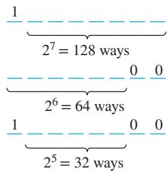

Solution: Figure 2 illustrates the three counting problems we need to solve before we can apply the principle of inclusion–exclusion. We can construct a bit string of length eight that either starts with a 1 bit or ends with the two bits 00, by constructing a bit string of length eight beginning with a 1 bit or by constructing a bit string of length eight that ends with the two bits 00. We can construct a bit string of length eight that begins with a 1 in $2 ^ { 7 } = 1 2 8$ ways. This follows by the product rule, because the first bit can be chosen in only one way and each of the other seven bits can be chosen in two ways. Similarly, we can construct a bit string of length eight ending with the two bits 00, in $2 ^ { 6 } = 6 4$ ways. This follows by the product rule, because each of the first six bits can be chosen in two ways and the last two bits can be chosen in only one way.

Some of the ways to construct a bit string of length eight starting with a 1 are the same as the ways to construct a bit string of length eight that ends with the two bits 00. There are $2 ^ { 5 } = 3 2$ ways to construct such a string. This follows by the product rule, because the first bit can be chosen in only one way, each of the second through the sixth bits can be chosen in two ways, and the last two bits can be chosen in one way. Consequently, the number of bit strings of length eight that begin with a 1 or end with a 00, which equals the number of ways to construct a bit string of length eight that begins with a 1 or that ends with 00, equals $1 2 8 + 6 4 - 3 2 = 1 6 0$ ◂

We present an example that illustrates how the formulation of the principle of inclusion– exclusion can be used to solve counting problems.

A computer company receives 350 applications from college graduates for a job planning a line of new web servers. Suppose that 220 of these applicants majored in computer science, 147 majored in business, and 51 majored both in computer science and in business. How many of these applicants majored neither in computer science nor in business?

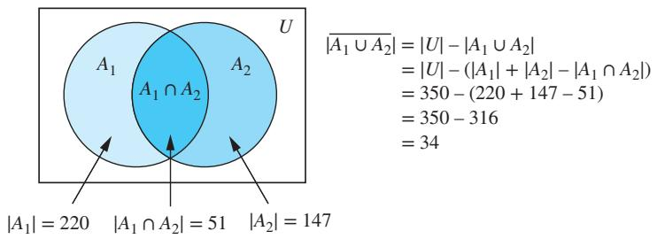  
FIGURE 3 Applicants who majored in neither computer science nor business.

Solution: To find the number of these applicants who majored neither in computer science nor in business, we can subtract the number of students who majored either in computer science or in business (or both) from the total number of applicants. Let $A _ { 1 }$ be the set of students who majored in computer science and $A _ { 2 }$ the set of students who majored in business. Then $A _ { 1 } \cup A _ { 2 }$ is the set of students who majored in computer science or business (or both), and $A _ { 1 } \cap A _ { 2 }$ is the set of students who majored both in computer science and in business. By the subtraction rule the number of students who majored either in computer science or in business (or both) equals

$$
| A _ { 1 } \cup A _ { 2 } | = | A _ { 1 } | + | A _ { 2 } | - | A _ { 1 } \cap A _ { 2 } | = 2 2 0 + 1 4 7 - 5 1 = 3 1 6 .
$$

We conclude that $3 5 0 - 3 1 6 = 3 4$ of the applicants majored neither in computer science nor in business. A Venn diagram for this example is shown in Figure 3. ◂

The subtraction rule, or the principle of inclusion–exclusion, can be generalized to find the number of ways to do one of n diferent tasks or, equivalently, to find the number of elements in the union of n sets, whenever n is a positive integer. We will study the inclusion–exclusion principle and some of its many applications in Chapter 8.

## 6.1.5 The Division Rule

We have introduced the product, sum, and subtraction rules for counting. You may wonder whether there is also a division rule for counting. In fact, there is such a rule, which can be useful when solving certain types of enumeration problems.

THE DIVISION RULE There are n∕d ways to do a task if it can be done using a procedure that can be carried out in n ways, and for every way w, exactly d of the n ways correspond to way w.

We can restate the division rule in terms of sets: “If the finite set A is the union of n pairwise disjoint subsets each with d elements, then $n = | A | / d . ^ { \prime \prime }$

We can also formulate the division rule in terms of functions: “If f is a function from A to B where A and B are finite sets, and that for every value $y \in B$ there are exactly d values $x \in A$ such that $f ( x ) = y$ (in which case, we say that f is d-to-one), then $| B | = | A | / \dot { d _ { \cdot } } ^ { \cdot \gamma }$

Remark: The division rule comes in handy when it appears that a task can be done in n diferent ways, but it turns out that for each way of doing the task, there are d equivalent ways of doing it. Under these circumstances, we can conclude that there are n∕d inequivalent ways of doing the task.

We illustrate the use of the division rule for counting with two examples.

Suppose that an automated system has been developed that counts the legs of cows in a pasture. Suppose that this system has determined that in a farmer’s pasture there are exactly 572 legs. How many cows are there is this pasture, assuming that each cow has four legs and that there are no other animals present?

Solution: Let n be the number of cow legs counted in a pasture. Because each cow has four legs, by the division rule we know that the pasture contains n∕4 cows. Consequently, the pasture with 572 cow legs has 572∕4 = 143 cows in it. ◂

## EXAMPLE 21

How many diferent ways are there to seat four people around a circular table, where two seatings are considered the same when each person has the same left neighbor and the same right neighbor?

Solution: We arbitrarily select a seat at the table and label it seat 1. We number the rest of the seats in numerical order, proceeding clockwise around the table. Note that are four ways to select the person for seat 1, three ways to select the person for seat 2, two ways to select the person for seat 3, and one way to select the person for seat 4. Thus, there are 4! = 24 ways to order the given four people for these seats. However, each of the four choices for seat 1 leads to the same arrangement, as we distinguish two arrangements only when one of the people has a diferent immediate left or immediate right neighbor. Because there are four ways to choose the person for seat 1, by the division rule there are 24∕4 = 6 diferent seating arrangements of four people around the circular table. ◂

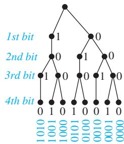

## 6.1.6 Tree Diagrams

Counting problems can be solved using tree diagrams. A tree consists of a root, a number of branches leaving the root, and possible additional branches leaving the endpoints of other branches. (We will study trees in detail in Chapter 11.) To use trees in counting, we use a branch to represent each possible choice. We represent the possible outcomes by the leaves, which are the endpoints of branches not having other branches starting at them.

Note that when a tree diagram is used to solve a counting problem, the number of choices of which branch to follow to reach a leaf can vary as in Example 22.

## EXAMPLE 22

How many bit strings of length four do not have two consecutive 1s?

Solution: The tree diagram in Figure 4 displays all bit strings of length four without two consecutive 1s. We see that there are eight bit strings of length four without two consecutive 1s. ◂

## EXAMPLE 23

A playof between two teams consists of at most five games. The first team that wins three games wins the playof. In how many diferent ways can the playof occur?

Solution: The tree diagram in Figure 5 displays all the ways the playof can proceed, with the winner of each game shown. We see that there are 20 diferent ways for the playof to occur. ◂

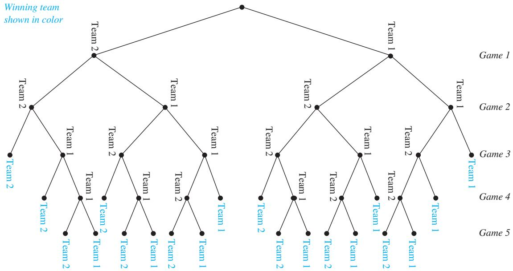  
FIGURE 5 Best three games out of five playofs.

EXAMPLE 24 Suppose that “I Love New Jersey” T-shirts come in five diferent sizes: S, M, L, XL, and XXL. Further suppose that each size comes in four colors, white, red, green, and black, except for XL, which comes only in red, green, and black, and XXL, which comes only in green and black. How many diferent shirts does a souvenir shop have to stock to have at least one of each available size and color of the T-shirt?

Solution: The tree diagram in Figure 6 displays all possible size and color pairs. It follows that the souvenir shop owner needs to stock 17 diferent T-shirts. ◂

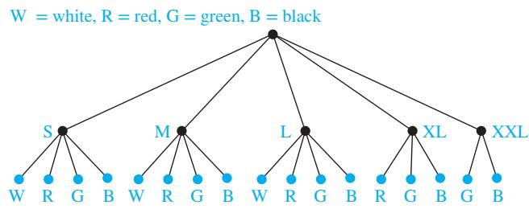  
FIGURE 6 Counting varieties of T-shirts.

## Exercises

1. There are 18 mathematics majors and 325 computer science majors at a college.

a) In how many ways can two representatives be picked so that one is a mathematics major and the other is a computer science major?

b) In how many ways can one representative be picked who is either a mathematics major or a computer science major?

2. An ofice building contains 27 floors and has 37 ofices on each floor. How many ofices are in the building?

3. A multiple-choice test contains 10 questions. There are four possible answers for each question.

a) In how many ways can a student answer the questions on the test if the student answers every question?

b) In how many ways can a student answer the questions on the test if the student can leave answers blank?

4. A particular brand of shirt comes in 12 colors, has a male version and a female version, and comes in three sizes for each sex. How many diferent types of this shirt are made?

5. Six diferent airlines fly from New York to Denver and seven fly from Denver to San Francisco. How many different pairs of airlines can you choose on which to book a trip from New York to San Francisco via Denver, when you pick an airline for the flight to Denver and an airline for the continuation flight to San Francisco?

6. There are four major auto routes from Boston to Detroit and six from Detroit to Los Angeles. How many major auto routes are there from Boston to Los Angeles via Detroit?

7. How many diferent three-letter initials can people have?

8. How many diferent three-letter initials with none of the letters repeated can people have?

9. How many diferent three-letter initials are there that begin with an A?

10. How many bit strings are there of length eight?

11. How many bit strings of length ten both begin and end with a 1?

12. How many bit strings are there of length six or less, not counting the empty string?

13. How many bit strings with length not exceeding n, where n is a positive integer, consist entirely of 1s, not counting the empty string?

14. How many bit strings of length n, where n is a positive integer, start and end with 1s?

15. How many strings are there of lowercase letters of length four or less, not counting the empty string?

16. How many strings are there of four lowercase letters that have the letter x in them?

17. How many strings of five ASCII characters contain the character @ (“at” sign) at least once? [Note: There are 128 diferent ASCII characters.]

18. How many 5-element DNA sequences a) end with A? b) start with T and end with G? c) contain only A and T? d) do not contain C?

19. How many 6-element RNA sequences a) do not contain U? b) end with GU? c) start with C? d) contain only A or U?

20. How many positive integers between 5 and 31 a) are divisible by 3? Which integers are these? b) are divisible by 4? Which integers are these? c) are divisible by 3 and by 4? Which integers are these?

21. How many positive integers between 50 and 100 a) are divisible by 7? Which integers are these? b) are divisible by 11? Which integers are these?

c) are divisible by both 7 and 11? Which integers are these?

22. How many positive integers less than 1000 a) are divisible by 7? b) are divisible by 7 but not by 11? c) are divisible by both 7 and 11? d) are divisible by either 7 or 11? e) are divisible by exactly one of 7 and 11? f ) are divisible by neither 7 nor 11? g) have distinct digits? h) have distinct digits and are even?

23. How many positive integers between 100 and 999 inclusive a) are divisible by 7? b) are odd? c) have the same three decimal digits? d) are not divisible by 4? e) are divisible by 3 or 4? f ) are not divisible by either 3 or 4? g) are divisible by 3 but not by 4? h) are divisible by 3 and 4?

24. How many positive integers between 1000 and 9999 inclusive a) are divisible by 9? b) are even? c) have distinct digits? d) are not divisible by 3? e) are divisible by 5 or 7? f ) are not divisible by either 5 or 7? g) are divisible by 5 but not by 7? h) are divisible by 5 and 7?

25. How many strings of three decimal digits a) do not contain the same digit three times? b) begin with an odd digit? c) have exactly two digits that are 4s?

26. How many strings of four decimal digits a) do not contain the same digit twice? b) end with an even digit? c) have exactly three digits that are 9s?

27. A committee is formed consisting of one representative from each of the 50 states in the United States, where the representative from a state is either the governor or one of the two senators from that state. How many ways are there to form this committee?

28. How many license plates can be made using either three digits followed by three uppercase English letters or three uppercase English letters followed by three digits?

29. How many license plates can be made using either two uppercase English letters followed by four digits or two digits followed by four uppercase English letters?

30. How many license plates can be made using either three uppercase English letters followed by three digits or four uppercase English letters followed by two digits?

31. How many license plates can be made using either two or three uppercase English letters followed by either two or three digits?

32. How many strings of eight uppercase English letters are there a) if letters can be repeated? b) if no letter can be repeated? c) that start with X, if letters can be repeated? d) that start with X, if no letter can be repeated? e) that start and end with X, if letters can be repeated?

f ) that start with the letters BO (in that order), if letters can be repeated?

g) that start and end with the letters BO (in that order), if letters can be repeated?

h) that start or end with the letters BO (in that order), if letters can be repeated?

33. How many strings of eight English letters are there a) that contain no vowels, if letters can be repeated? b) that contain no vowels, if letters cannot be repeated? c) that start with a vowel, if letters can be repeated? d) that start with a vowel, if letters cannot be repeated? e) that contain at least one vowel, if letters can be repeated? f ) that contain exactly one vowel, if letters can be repeated? g) that start with X and contain at least one vowel, if letters can be repeated? h) that start and end with X and contain at least one vowel, if letters can be repeated?

34. How many different functions are there from a set with 10 elements to sets with the following numbers of elements? a) 2 b) 3 c) 4 d) 5

35. How many one-to-one functions are there from a set with five elements to sets with the following number of elements? a) 4 b) 5 c) 6 d) 7

36. How many functions are there from the set {1, 2, … , n}, where n is a positive integer, to the set {0, 1}?

37. How many functions are there from the set {1, 2, … , n}, where n is a positive integer, to the set {0, 1} a) that are one-to-one? b) that assign 0 to both 1 and n? c) that assign 1 to exactly one of the positive integers less than n?

38. How many partial functions (see Section 2.3) are there from a set with five elements to sets with each of these number of elements? a) 1 b) 2 c) 5 d) 9

39. How many partial functions (see Definition 13 of Section 2.3) are there from a set with m elements to a set with n elements, where m and n are positive integers?

40. How many subsets of a set with 100 elements have more than one element?

41. A palindrome is a string whose reversal is identical to the string. How many bit strings of length n are palindromes?

42. How many 4-element DNA sequences a) do not contain the base T? b) contain the sequence ACG?

c) contain all four bases A, T, C, and G?

d) contain exactly three of the four bases A, T, C, and G?

43. How many 4-element RNA sequences a) contain the base U? b) do not contain the sequence CUG? c) do not contain all four bases A, U, C, and G? d) contain exactly two of the four bases A, U, C, and G?

44. On each of the 22 work days in a particular month, every employee of a start-up venture was sent a company communication. If a total of 4642 total company communications were sent, how many employees does the company have, assuming that no stafing changes were made that month?

45. At a large university, 434 freshmen, 883 sophomores, and 43 juniors are enrolled in an introductory algorithms course. How many sections of this course need to be scheduled to accommodate all these students if each section contains 34 students?

46. How many ways are there to seat four of a group of ten people around a circular table where two seatings are considered the same when everyone has the same immediate left and immediate right neighbor?

47. How many ways are there to seat six people around a circular table where two seatings are considered the same when everyone has the same two neighbors without regard to whether they are right or left neighbors?

48. In how many ways can a photographer at a wedding arrange 6 people in a row from a group of 10 people, where the bride and the groom are among these 10 people, if a) the bride must be in the picture? b) both the bride and groom must be in the picture? c) exactly one of the bride and the groom is in the picture?

49. In how many ways can a photographer at a wedding arrange six people in a row, including the bride and groom, if a) the bride must be next to the groom? b) the bride is not next to the groom? c) the bride is positioned somewhere to the left of the groom?

50. How many bit strings of length seven either begin with two 0s or end with three 1s?

51. How many bit strings of length 10 either begin with three 0s or end with two 0s?

<sup>∗</sup>52. How many bit strings of length 10 contain either five consecutive 0s or five consecutive 1s?

<sup>∗∗</sup>53. How many bit strings of length eight contain either three consecutive 0s or four consecutive 1s?

54. Every student in a discrete mathematics class is either a computer science or a mathematics major or is a joint major in these two subjects. How many students are in the class if there are 38 computer science majors (including joint majors), 23 mathematics majors (including joint majors), and 7 joint majors?

55. How many positive integers not exceeding 100 are divisible either by 4 or by 6?

56. How many diferent initials can someone have if a person has at least two, but no more than five, diferent initials? Assume that each initial is one of the 26 uppercase letters of the English language.

57. Suppose that a password for a computer system must have at least 8, but no more than 12, characters, where each character in the password is a lowercase English letter, an uppercase English letter, a digit, or one of the six special characters ∗, $> , \ < , \ 1 ,$ +, and =.

a) How many diferent passwords are available for this computer system?

b) How many of these passwords contain at least one occurrence of at least one of the six special characters?

c) Using your answer to part (a), determine how long it takes a hacker to try every possible password, assuming that it takes one nanosecond for a hacker to check each possible password.

58. The name of a variable in the C programming language is a string that can contain uppercase letters, lowercase letters, digits, or underscores. Further, the first character in the string must be a letter, either uppercase or lowercase, or an underscore. If the name of a variable is determined by its first eight characters, how many diferent variables can be named in C? (Note that the name of a variable may contain fewer than eight characters.)

59. The name of a variable in the JAVA programming language is a string of between 1 and 65,535 characters, inclusive, where each character can be an uppercase or a lowercase letter, a dollar sign, an underscore, or a digit, except that the first character must not be a digit. Determine the number of diferent variable names in JAVA.

60. The International Telecommunications Union (ITU) specifies that a telephone number must consist of a country code with between 1 and 3 digits, except that the code 0 is not available for use as a country code, followed by a number with at most 15 digits. How many available possible telephone numbers are there that satisfy these restrictions?

61. Suppose that at some future time every telephone in the world is assigned a number that contains a country code 1 to 3 digits long, that is, of the form X, XX, or XXX, followed by a 10-digit telephone number of the form NXX-NXX-XXXX (as described in Example 8). How many diferent telephone numbers would be available worldwide under this numbering plan?

62. A key in the Vigenere cryptosystem is a string of English\` letters, where the case of the letters does not matter. How many diferent keys for this cryptosystem are there with three, four, five, or six letters?

63. A wired equivalent privacy (WEP) key for a wireless fidelity (WiFi) network is a string of either 10, 26, or 58 hexadecimal digits. How many diferent WEP keys are there?

64. Suppose that p and q are prime numbers and that $n = p q$ Use the principle of inclusion–exclusion to find the number of positive integers not exceeding n that are relatively prime to n.

65. Use the principle of inclusion–exclusion to find the number of positive integers less than 1,000,000 that are not divisible by either 4 or by 6.

66. Use a tree diagram to find the number of bit strings of length four with no three consecutive 0s.

67. How many ways are there to arrange the letters a, b, c, and d such that a is not followed immediately by b?

68. Use a tree diagram to find the number of ways that the World Series can occur, where the first team that wins four games out of seven wins the series.

69. Use a tree diagram to determine the number of subsets of {3, 7, 9, 11, 24} with the property that the sum of the elements in the subset is less than 28.

70. a) Suppose that a store sells six varieties of soft drinks: cola, ginger ale, orange, root beer, lemonade, and cream soda. Use a tree diagram to determine the number of diferent types of bottles the store must stock to have all varieties available in all size bottles if all varieties are available in 12-ounce bottles, all but lemonade are available in 20-ounce bottles, only cola and ginger ale are available in 32-ounce bottles, and all but lemonade and cream soda are available in 64- ounce bottles?

b) Answer the question in part (a) using counting rules.

71. a) Suppose that a popular style of running shoe is available for both men and women. The woman’s shoe comes in sizes 6, 7, 8, and 9, and the man’s shoe comes in sizes 8, 9, 10, 11, and 12. The man’s shoe comes in white and black, while the woman’s shoe comes in white, red, and black. Use a tree diagram to determine the number of diferent shoes that a store has to stock to have at least one pair of this type of running shoe for all available sizes and colors for both men and women.

b) Answer the question in part (a) using counting rules.

72. Determine the number of matches played in a singleelimination tournament with n players, where for each game between two players the winner goes on, but the loser is eliminated.

73. Determine the minimum and the maximum number of matches that can be played in a double-elimination tournament with n players, where after each game between two players, the winner goes on and the loser goes on if and only if this is not a second loss.

<sup>∗</sup>74. Use the product rule to show that there are $2 ^ { 2 ^ { n } }$ diferent truth tables for propositions in n variables.

75. Use mathematical induction to prove the sum rule for m tasks from the sum rule for two tasks.

76. Use mathematical induction to prove the product rule for m tasks from the product rule for two tasks.

77. How many diagonals does a convex polygon with n sides have? (Recall that a polygon is convex if every line segment connecting two points in the interior or boundary of the polygon lies entirely within this set and that a diagonal of a polygon is a line segment connecting two vertices that are not adjacent.)

78. Data are transmitted over the Internet in datagrams, which are structured blocks of bits. Each datagram contains header information organized into a maximum of 14 diferent fields (specifying many things, including the source and destination addresses) and a data area that contains the actual data that are transmitted. One of the 14 header fields is the header length field (denoted by HLEN), which is specified by the protocol to be 4 bits long and that specifies the header length in terms of 32- bit blocks of bits. For example, if HLEN = 0110, the header is made up of six 32-bit blocks. Another of the 14 header fields is the 16-bit-long total length field (denoted by TOTAL LENGTH), which specifies the length in bits of the entire datagram, including both the header fields and the data area. The length of the data area is the total length of the datagram minus the length of the header.

a) The largest possible value of TOTAL LENGTH (which is 16 bits long) determines the maximum total length in octets (blocks of 8 bits) of an Internet datagram. What is this value?

b) The largest possible value of HLEN (which is 4 bits long) determines the maximum total header length in 32-bit blocks. What is this value? What is the maximum total header length in octets?

c) The minimum (and most common) header length is 20 octets. What is the maximum total length in octets of the data area of an Internet datagram?

d) How many diferent strings of octets in the data area can be transmitted if the header length is 20 octets and the total length is as long as possible?


## The Pigeonhole Principle

## 6.2.1 Introduction


Suppose that a flock of 20 pigeons flies into a set of 19 pigeonholes to roost. Because there are 20 pigeons but only 19 pigeonholes, a least one of these 19 pigeonholes must have at least two pigeons in it. To see why this is true, note that if each pigeonhole had at most one pigeon in it, at most 19 pigeons, one per hole, could be accommodated. This illustrates a general principle called the pigeonhole principle, which states that if there are more pigeons than pigeonholes, then there must be at least one pigeonhole with at least two pigeons in it (see Figure 1). This principle is extremely useful; it applies to much more than pigeons and pigeonholes.

## THEOREM 1

THE PIGEONHOLE PRINCIPLE If k is a positive integer and k + 1 or more objects are placed into k boxes, then there is at least one box containing two or more of the objects.

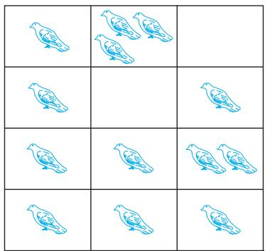  
(a)

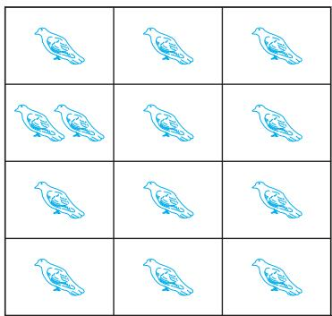  
(b)  
FIGURE 1 There are more pigeons than pigeonholes.

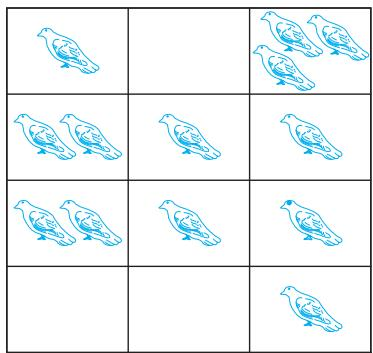  
(c)

Proof: We prove the pigeonhole principle using a proof by contraposition. Suppose that none of the k boxes contains more than one object. Then the total number of objects would be at most k. This is a contradiction, because there are at least k + 1 objects. V

The pigeonhole principle is also called the Dirichlet drawer principle, after the nineteenthcentury German mathematician G. Lejeune Dirichlet, who often used this principle in his work. (Dirichlet was not the first person to use this principle; a demonstration that there were at least two Parisians with the same number of hairs on their heads dates back to the 17th century— see Exercise 35.) It is an important additional proof technique supplementing those we have developed in earlier chapters. We introduce it in this chapter because of its many important applications to combinatorics.

We will illustrate the usefulness of the pigeonhole principle. We first show that it can be used to prove a useful corollary about functions.

## COROLLARY 1

A function f from a set with k + 1 or more elements to a set with k elements is not one-to-one.

Proof: Suppose that for each element y in the codomain of f we have a box that contains all elements x of the domain of f such that $f ( x ) = y$ . Because the domain contains k + 1 or more elements and the codomain contains only k elements, the pigeonhole principle tells us that one of these boxes contains two or more elements x of the domain. This means that f cannot be one-to-one. A

Examples 1–3 show how the pigeonhole principle is used.

## EXAMPLE 1

Among any group of 367 people, there must be at least two with the same birthday, because there are only 366 possible birthdays. ◂

## EXAMPLE 2

In any group of 27 English words, there must be at least two that begin with the same letter, because there are 26 letters in the English alphabet.

EXAMPLE 3 How many students must be in a class to guarantee that at least two students receive the same score on the final exam, if the exam is graded on a scale from 0 to 100 points?

Solution: There are 101 possible scores on the final. The pigeonhole principle shows that among any 102 students there must be at least 2 students with the same score. ◂

Links

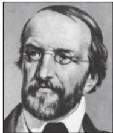  
-c INTERFOTO/Alamy Stock Photo

G. LEJEUNE DIRICHLET (1805–1859) G. Lejeune Dirichlet was born into a Belgian family living near Cologne, Germany. His father was a postmaster. He became passionate about mathematics at a young age. He was spending all his spare money on mathematics books by the time he entered secondary school in Bonn at the age of 12. At 14 he entered the Jesuit College in Cologne, and at 16 he began his studies at the University of Paris. In 1825 he returned to Germany and was appointed to a position at the University of Breslau. In 1828 he moved to the University of Berlin. In 1855 he was chosen to succeed Gauss at the University of Gottingen. Dirichlet is said to be the first person to master Gauss’s¨ Disquisitiones Arithmeticae, which appeared 20 years earlier. He is said to have kept a copy at his side even when he traveled. Dirichlet made many important discoveries in number theory, including the theorem that there are infinitely many primes in arithmetical progressions an + b when a and b are relatively prime. He proved the

$$
n = 5
$$

$$
\mathbf { \dot { \boldsymbol { x } } } ^ { 5 } + \boldsymbol { y } ^ { 5 } = z ^ { 5 }
$$

also made many contributions to analysis. Dirichlet was considered to be an excellent teacher who could explain ideas with great clarity. He was married to Rebecka Mendelssohn, one of the sisters of the composer Felix Mendelssohn.

## THEOREM 2

The pigeonhole principle is a useful tool in many proofs, including proofs of surprising results, such as that given in Example 4.

Show that for every integer n there is a multiple of n that has only 0s and 1s in its decimal expansion.

Solution: Let n be a positive integer. Consider the n + 1 integers 1, 11, 111, … , 11 … 1 (where the last integer in this list is the integer with $n + 1$ 1s in its decimal expansion). Note that there are n possible remainders when an integer is divided by n. Because there are n + 1 integers in this list, by the pigeonhole principle there must be two with the same remainder when divided by n. The larger of these integers less the smaller one is a multiple of n, which has a decimal expansion consisting entirely of 0s and 1s. ◂

## 6.2.2 The Generalized Pigeonhole Principle

The pigeonhole principle states that there must be at least two objects in the same box when there are more objects than boxes. However, even more can be said when the number of objects exceeds a multiple of the number of boxes. For instance, among any set of 21 decimal digits there must be 3 that are the same. This follows because when 21 objects are distributed into 10 boxes, one box must have more than 2 objects.

THE GENERALIZED PIGEONHOLE PRINCIPLE If N objects are placed into k boxes, then there is at least one box containing at least $\lceil N / k \rceil$ objects.

Proof: We will use a proof by contraposition. Suppose that none of the boxes contains more than $\lceil N / k \rceil - 1$ objects. Then, the total number of objects is at most

$$
k \left( \left\lceil { \frac { N } { k } } \right\rceil - 1 \right) < k \left( \left( { \frac { N } { k } } + 1 \right) - 1 \right) = N ,
$$

where the inequality $\lceil N / k \rceil < ( N / k ) + 1$ has been used. Thus, the total number of objects is less than N. This completes the proof by contraposition. A

A common type of problem asks for the minimum number of objects such that at least r of these objects must be in one of k boxes when these objects are distributed among the boxes. When we have N objects, the generalized pigeonhole principle tells us there must be at least r objects in one of the boxes as long as $\left\lceil N / k \right\rceil \geq r .$ The smallest integer N with $N / k > r - 1$ namely, $N = k ( r - 1 ) + 1$ , is the smallest integer satisfying the inequality $\lceil N / k \rceil \geq r .$ Could a smaller value of N sufice? The answer is no, because if we had $k ( r - 1 )$ objects, we could put r − 1 of them in each of the k boxes and no box would have at least r objects.

When thinking about problems of this type, it is useful to consider how you can avoid having at least r objects in one of the boxes as you add successive objects. To avoid adding a rth object to any box, you eventually end up with r − 1 objects in each box. There is no way to add the next object without putting an rth object in that box.

Examples 5–8 illustrate how the generalized pigeonhole principle is applied.

Among 100 people there are at least $\lceil 1 0 0 / 1 2 \rceil = 9$ who were born in the same month. ◂

What is the minimum number of students required in a discrete mathematics class to be sure that at least six will receive the same grade, if there are five possible grades, A, B, C, D, and F?

## EXAMPLE 7

Solution: The minimum number of students needed to ensure that at least six students receive the same grade is the smallest integer N such that $\lceil N / 5 \rceil = 6$ . The smallest such integer is $N = 5 \cdot 5 + 1 = 2 6$ . If you have only 25 students, it is possible for there to be five who have received each grade so that no six students have received the same grade. Thus, 26 is the minimum number of students needed to ensure that at least six students will receive the same grade. ◂

a) How many cards must be selected from a standard deck of 52 cards to guarantee that at least three cards of the same suit are selected?

b) How many must be selected from a standard deck of 52 cards to guarantee that at least three hearts are selected?

Solution: a) Suppose there are four boxes, one for each suit, and as cards are selected they are placed in the box reserved for cards of that suit. Using the generalized pigeonhole principle, we see that if N cards are selected, there is at least one box containing at least $\lceil N / 4 \rceil$ cards. Consequently, we know that at least three cards of one suit are selected if $\lceil N / 4 \rceil \geq 3$ . The smallest integer N such that $\lceil N / 4 \rceil \geq 3 { \mathrm { ~ i s ~ } } N = 2 \cdot 4 + 1 = 9$ , so nine cards sufice. Note that if eight cards are selected, it is possible to have two cards of each suit, so more than eight cards are needed. Consequently, nine cards must be selected to guarantee that at least three cards of one suit are chosen. One good way to think about this is to note that after the eighth card is chosen, there is no way to avoid having a third card of some suit.

b) We do not use the generalized pigeonhole principle to answer this question, because we want to make sure that there are three hearts, not just three cards of one suit. Note that in the worst case, we can select all the clubs, diamonds, and spades, 39 cards in all, before we select a single heart. The next three cards will be all hearts, so we may need to select 42 cards to get three hearts. ◂

AMPLE 8 What is the least number of area codes needed to guarantee that the 25 million phones in a state can be assigned distinct 10-digit telephone numbers? (Assume that telephone numbers are of the form NXX-NXX-XXXX, where the first three digits form the area code, N represents a digit from 2 to 9 inclusive, and X represents any digit.)

Solution: There are eight million diferent phone numbers of the form NXX-XXXX (as shown in Example 8 of Section 6.1). Hence, by the generalized pigeonhole principle, among 25 million telephones, at least $\lceil 2 5 , 0 0 0 , 0 0 0 / 8 , 0 0 0 , 0 0 0 \rceil = 4$ of them must have identical phone numbers. Hence, at least four area codes are required to ensure that all 10-digit numbers are diferent. ◂

Example 9, although not an application of the generalized pigeonhole principle, makes use of similar principles.

## EXAMPLE 9

Suppose that a computer science laboratory has 15 workstations and 10 servers. A cable can be used to directly connect a workstation to a server. For each server, only one direct connection to that server can be active at any time. We want to guarantee that at any time any set of 10 or fewer workstations can simultaneously access diferent servers via direct connections. Although we could do this by connecting every workstation directly to every server (using 150 connections), what is the minimum number of direct connections needed to achieve this goal?

Solution: Suppose that we label the workstations $W _ { 1 } , W _ { 2 } , \ldots , W _ { 1 5 }$ and the servers $S _ { 1 } , S _ { 2 } , \ldots , S _ { 1 0 } .$ First, we would like to find a way for there to be far fewer than 150 direct connections between workstations and servers to achieve our goal. One promising approach is to directly connect $W _ { k }$ to $S _ { k }$ for $k = 1 , 2 , \ldots , 1 0$ and then to connect each of $W _ { 1 1 } , W _ { 1 2 } , W _ { 1 3 } , W _ { 1 4 }$ , and $W _ { 1 5 }$ to all

10 servers. This gives us a total of $1 0 + 5 \cdot 1 0 = 6 0$ direct connections. We need to determine whether with this configuration any set of 10 or fewer workstations can simultaneously access diferent servers. We note that if workstation $W _ { j }$ is included with $1 \leq j \leq 1 0$ , it can access server $S _ { j } ,$ and for each workstation $W _ { k }$ with $k \geq 1 1$ included, there must be a corresponding workstation $\ddot { W } _ { j }$ with $1 \leq j \leq 1 0$ not included, so $W _ { k }$ can access server $S _ { j }$ . (This follows because there are at least as many available servers $S _ { j }$ as there are workstations $\ddot { W } _ { j }$ with $1 \leq j \leq 1 0$ not included.) $\mathrm { S o } .$ any set of 10 or fewer workstations are able to simultaneously access diferent servers.

But can we use fewer than 60 direct connections? Suppose there are fewer than 60 direct connections between workstations and servers. Then some server would be connected to at most $\lfloor 5 9 / 1 0 \rfloor = 5$ workstations. (If all servers were connected to at least six workstations, there would be at least $6 \cdot 1 0 = 6 0$ direct connections.) This means that the remaining nine servers are not enough for the other 10 or more workstations to simultaneously access diferent servers. Consequently, at least 60 direct connections are needed. It follows that 60 is the answer. ◂

## 6.2.3 Some Elegant Applications of the Pigeonhole Principle

In many interesting applications of the pigeonhole principle, the objects to be placed in boxes must be chosen in a clever way. A few such applications will be described here.

During a month with 30 days, a baseball team plays at least one game a day, but no more than 45 games. Show that there must be a period of some number of consecutive days during which the team must play exactly 14 games.

Solution: Let $a _ { j }$ be the number of games played on or before the jth day of the month. Then $a _ { 1 } , a _ { 2 } , \dots , a _ { 3 0 }$ is an increasing sequence of distinct positive integers, with $1 \leq a _ { i } \leq 4 5$ . Moreover, $a _ { 1 } + 1 4 , a _ { 2 } + 1 4 , \dots , a _ { 3 0 } + 1 4$ is also an increasing sequence of distinct positive integers, with $1 5 \leq a _ { i } + 1 4 \leq 5 9 .$

The 60 positive integers $a _ { 1 } , a _ { 2 } , \dots , a _ { 3 0 } , a _ { 1 } + 1 4 , a _ { 2 } + 1 4 , \dots , a _ { 3 0 } + 1 4$ are all less than or equal to 59. Hence, by the pigeonhole principle two of these integers are equal. Because the integers $a _ { j } , j = 1 , 2 , \ldots , 3 0$ are all distinct and the integers $a _ { j } + 1 4 , j = 1 , 2 , \ldots , 3 0$ are all distinct, there must be indices i and j with $a _ { i } = a _ { j } + 1 4$ . This means that exactly 14 games were played from day j + 1 to day i.

EXAMPLE 11 Show that among any $n + 1$ positive integers not exceeding 2n there must be an integer that divides one of the other integers.

Solution: Write each of the $n + 1$ integers $a _ { 1 } , a _ { 2 } , \ldots , a _ { n + 1 }$ as a power of $^ 2$ times an odd integer. In other words, let $q _ { j } = 2 ^ { k _ { j } } q _ { j }$ for $j = 1 , 2 , \dots , n + 1$ , where $k _ { j }$ is a nonnegative integer and $q _ { j }$ is odd. The integers $q _ { 1 } , q _ { 2 } , \ldots , q _ { n + 1 }$ are all odd positive integers less than 2n. Because there are only n odd positive integers less than 2n, it follows from the pigeonhole principle that two of the integers $q _ { 1 } , q _ { 2 } , \ldots , q _ { n + 1 }$ must be equal. Therefore, there are distinct integers i and j such that $q _ { i } = q _ { j }$ . Let q be the common value of $q _ { i }$ and $q _ { j }$ . Then, $a _ { i } = 2 ^ { k _ { i } } q$ and $a _ { j } = 2 ^ { k _ { j } } q$ . It follows that if $k _ { i } < \dot { k }$ , then $a _ { i }$ divides $\begin{array} { r } { { a } _ { \mathfrak { j } } ; } \end{array}$ while if $k _ { i } > k _ { \mathfrak { j } }$ , then $a _ { \mathfrak { j } }$ divides $a _ { i }$ ◂

A clever application of the pigeonhole principle shows the existence of an increasing or a decreasing subsequence of a certain length in a sequence of distinct integers. We review some definitions before this application is presented. Suppose that $a _ { 1 } , a _ { 2 } , \dots , a _ { N }$ is a sequence of real numbers. A subsequence of this sequence is a sequence of the form $a _ { i _ { 1 } } , a _ { i _ { 2 } } , \ldots , a _ { i _ { m } }$ , where $1 \leq$ $i _ { 1 } < i _ { 2 } < \cdots < i _ { m } \leq N$ . Hence, a subsequence is a sequence obtained from the original sequence by including some of the terms of the original sequence in their original order, and perhaps not including other terms. A sequence is called strictly increasing if each term is larger than the one that precedes it, and it is called strictly decreasing if each term is smaller than the one that precedes it.

Every sequence of $n ^ { 2 } + 1$ distinct real numbers contains a subsequence of length $n + 1$ that is either strictly increasing or strictly decreasing.

We give an example before presenting the proof of Theorem 3.

The sequence 8, 11, 9, 1, 4, 6, 12, 10, 5, 7 contains 10 terms. Note that $1 0 = 3 ^ { 2 } + 1$ . There are four strictly increasing subsequences of length four, namely, 1, 4, 6, 12; 1, 4, 6, 7; 1, 4, 6, 10; and 1, 4, 5, 7. There is also a strictly decreasing subsequence of length four, namely, 11, 9, 6, 5. ◂

The proof of the theorem will now be given.

Proof: Let $a _ { 1 } , a _ { 2 } , \ldots , a _ { n ^ { 2 } + 1 }$ be a sequence of $n ^ { 2 } + 1$ distinct real numbers. Associate an ordered pair with each term of the sequence, namely, associate $( i _ { k } , d _ { k } )$ to the term $a _ { k } .$ , where $i _ { k }$ is the length of the longest increasing subsequence starting at $a _ { k } ,$ and $d _ { k }$ is the length of the longest decreasing subsequence starting at $a _ { k }$


Suppose that there are no increasing or decreasing subsequences of length $n + 1$ . Then $i _ { k }$ and $d _ { k }$ are both positive integers less than or equal to n, for $k = 1 , 2 , \ldots , n ^ { 2 } + 1$ . Hence, by the product rule there are $n ^ { \widetilde { 2 } }$ possible ordered pairs for $( i _ { k } , d _ { k } )$ . By the pigeonhole principle, two of these $n ^ { 2 } + 1$ ordered pairs are equal. In other words, there exist terms $a _ { s }$ and $a _ { t } ,$ with $s < t$ such that $i _ { s } = i _ { t }$ and $d _ { s } = d _ { t }$ . We will show that this is impossible. Because the terms of the sequence are distinct, either $a _ { s } < a _ { t }$ or $a _ { s } > a _ { t }$ . If $a _ { s } < a _ { t }$ , then, because $i _ { s } = i _ { t }$ , an increasing subsequence of length $i _ { t } + 1$ can be built starting at $a _ { s } ,$ by taking $a _ { s }$ followed by an increasing subsequence of length $i _ { t }$ beginning at $a _ { t } .$ . This is a contradiction. Similarly, if $a _ { s } > a _ { t }$ , the same reasoning shows that $d _ { s }$ must be greater than $d _ { t } ,$ which is a contradiction. A

The final example shows how the generalized pigeonhole principle can be applied to an important part of combinatorics called Ramsey theory, after the English mathematician F. P. Ramsey. In general, Ramsey theory deals with the distribution of subsets of elements of sets.

## EXAMPLE 13

Assume that in a group of six people, each pair of individuals consists of two friends or two enemies. Show that there are either three mutual friends or three mutual enemies in the group.

Solution: Let A be one of the six people. Of the five other people in the group, there are either three or more who are friends of A, or three or more who are enemies of A. This follows from

## Links

  
Courtesy of Stephen Frank Burch

FRANK PLUMPTON RAMSEY (1903–1930) Frank Plumpton Ramsey, son of the president of Magdalene College, Cambridge, was educated at Winchester and Trinity Colleges. After graduating in 1923, he was elected a fellow of King’s College, Cambridge, where he spent the remainder of his life. Ramsey made important contributions to mathematical logic. What we now call Ramsey theory began with his clever combinatorial arguments, published in the paper “On a Problem of Formal Logic.” Ramsey also made contributions to the mathematical theory of economics. He was noted as an excellent lecturer on the foundations of mathematics. According to one of his brothers, he was interested in almost everything, including English literature and politics. Ramsey was married and had two daughters. His death at the age of 26 resulting from chronic liver problems deprived the mathematical community and Cambridge University of a brilliant young scholar.

the generalized pigeonhole principle, because when five objects are divided into two sets, one of the sets has at least $\lceil 5 / 2 \rceil = 3$ elements. In the former case, suppose that B, C, and D are friends of A. If any two of these three individuals are friends, then these two and A form a group of three mutual friends. Otherwise, $B , C ,$ and D form a set of three mutual enemies. The proof in the latter case, when there are three or more enemies of A, proceeds in a similar manner. ◂

The Ramsey number $R ( m , n )$ , where m and n are positive integers greater than or equal to 2, denotes the minimum number of people at a party such that there are either m mutual friends or n mutual enemies, assuming that every pair of people at the party are friends or enemies. Example 13 shows that $R ( 3 , 3 ) \leq 6$ . We conclude that $R ( 3 , 3 ) = 6$ because in a group of five people where every two people are friends or enemies, there may not be three mutual friends or three mutual enemies (see Exercise 28).

It is possible to prove some useful properties about Ramsey numbers, but for the most part it is dificult to find their exact values. Note that by symmetry it can be shown that $R ( m , n ) = R ( n , m )$ (see Exercise 32). We also have $R ( 2 , n ) = n$ for every positive integer $n \geq 2$ (see Exercise 31). The exact values of only nine Ramsey numbers $R ( m , n )$ with $3 \leq m \leq n$ are known, including $R ( 4 , 4 ) = 1 8$ . Only bounds are known for many other Ramsey numbers, including R(5, 5), which is known to satisfy $4 3 \leq R ( 5 , 5 ) \leq 4 9$ . The reader interested in learning more about Ramsey numbers should consult [MiRo91] or [GrRoSp90].

## Exercises

1. Show that in any set of six classes, each meeting regularly once a week on a particular day of the week, there must be two that meet on the same day, assuming that no classes are held on weekends.

2. Show that if there are 30 students in a class, then at least two have last names that begin with the same letter.

3. A drawer contains a dozen brown socks and a dozen black socks, all unmatched. A man takes socks out at random in the dark.

a) How many socks must he take out to be sure that he has at least two socks of the same color?

b) How many socks must he take out to be sure that he has at least two black socks?

4. A bowl contains 10 red balls and 10 blue balls. A woman selects balls at random without looking at them.

a) How many balls must she select to be sure of having at least three balls of the same color?

b) How many balls must she select to be sure of having at least three blue balls?

5. Undergraduate students at a college belong to one of four groups depending on the year in which they are expected to graduate. Each student must choose one of 21 diferent majors. How many students are needed to assure that there are two students expected to graduate in the same year who have the same major?

6. There are six professors teaching the introductory discrete mathematics class at a university. The same final exam is given by all six professors. If the lowest possible score on the final is 0 and the highest possible score is 100, how many students must there be to guarantee that there are two students with the same professor who earned the same final examination score?

7. Show that among any group of five (not necessarily consecutive) integers, there are two with the same remainder when divided by 4.

8. Let d be a positive integer. Show that among any group of d + 1 (not necessarily consecutive) integers there are two with exactly the same remainder when they are divided by d.

9. Let n be a positive integer. Show that in any set of n consecutive integers there is exactly one divisible by n.

10. Show that if f is a function from S to T, where S and T are finite sets with $\vert S \vert > \vert T \vert$ , then there are elements $s _ { 1 }$ and $s _ { 2 }$ in S such that $f ( s _ { 1 } ) = f ( s _ { 2 } )$ , or in other words, f is not one-to-one.

11. What is the minimum number of students, each of whom comes from one of the 50 states, who must be enrolled in a university to guarantee that there are at least 100 who come from the same state?

<sup>∗</sup>12. Let $( x _ { i } , y _ { i } ) , i = 1 , 2 , 3 , 4 , 5 ,$ , be a set of five distinct points with integer coordinates in the xy plane. Show that the midpoint of the line joining at least one pair of these points has integer coordinates.

<sup>∗</sup>13. Let $( x _ { i } , y _ { i } , z _ { i } ) , i = 1 , 2 , 3 , 4 , 5 , 6 , 7 , 8 , 9$ , be a set of nine distinct points with integer coordinates in xyz space. Show that the midpoint of at least one pair of these points has integer coordinates.

14. How many ordered pairs of integers (a, b) are needed to guarantee that there are two ordered pairs $( a _ { 1 } , b _ { 1 } )$ and $( a _ { 2 } , b _ { 2 } )$ such that $a _ { 1 }$ mod $5 = a _ { 2 }$ mod 5 and $b _ { 1 }$ mod $5 = b _ { 2 }$ mod 5?

15. a) Show that if five integers are selected from the first eight positive integers, there must be a pair of these integers with a sum equal to 9.

b) Is the conclusion in part (a) true if four integers are selected rather than five?

16. a) Show that if seven integers are selected from the first 10 positive integers, there must be at least two pairs of these integers with the sum 11.

b) Is the conclusion in part (a) true if six integers are selected rather than seven?

17. How many numbers must be selected from the set {1, 2, 3, 4, 5, 6} to guarantee that at least one pair of these numbers add up to 7?

18. How many numbers must be selected from the set {1, 3, 5, 7, 9, 11, 13, 15} to guarantee that at least one pair of these numbers add up to 16?

19. A company stores products in a warehouse. Storage bins in this warehouse are specified by their aisle, location in the aisle, and shelf. There are 50 aisles, 85 horizontal locations in each aisle, and 5 shelves throughout the warehouse. What is the least number of products the company can have so that at least two products must be stored in the same bin?

20. Suppose that there are nine students in a discrete mathematics class at a small college.

a) Show that the class must have at least five male students or at least five female students.

b) Show that the class must have at least three male students or at least seven female students.

21. Suppose that every student in a discrete mathematics class of 25 students is a freshman, a sophomore, or a junior.

a) Show that there are at least nine freshmen, at least nine sophomores, or at least nine juniors in the class.

b) Show that there are either at least three freshmen, at least 19 sophomores, or at least five juniors in the class.

22. Find an increasing subsequence of maximal length and a decreasing subsequence of maximal length in the sequence 22, 5, 7, 2, 23, 10, 15, 21, 3, 17.

23. Construct a sequence of 16 positive integers that has no increasing or decreasing subsequence of five terms.

24. Show that if there are 101 people of diferent heights standing in a line, it is possible to find 11 people in the order they are standing in the line with heights that are either increasing or decreasing.

<sup>∗</sup>25. Show that whenever 25 girls and 25 boys are seated around a circular table there is always a person both of whose neighbors are boys.

<sup>∗∗</sup>26. Suppose that 21 girls and 21 boys enter a mathematics competition. Furthermore, suppose that each entrant solves at most six questions, and for every boy-girl pair, there is at least one question that they both solved. Show that there is a question that was solved by at least three girls and at least three boys.

<sup>∗</sup>27. Describe an algorithm in pseudocode for producing the largest increasing or decreasing subsequence of a sequence of distinct integers.

28. Show that in a group of five people (where any two people are either friends or enemies), there are not necessarily three mutual friends or three mutual enemies.

29. Show that in a group of 10 people (where any two people are either friends or enemies), there are either three mutual friends or four mutual enemies, and there are either three mutual enemies or four mutual friends.

30. Use Exercise 29 to show that among any group of 20 people (where any two people are either friends or enemies), there are either four mutual friends or four mutual enemies.

31. Show that if n is an integer with n ≥ 2, then the Ramsey number R(2, n) equals n. (Recall that Ramsey numbers were discussed after Example 13 in Section 6.2.)

32. Show that if m and n are integers with m ≥ 2 and n ≥ 2, then the Ramsey numbers R(m, n) and R(n, m) are equal. (Recall that Ramsey numbers were discussed after Example 13 in Section 6.2.)

33. Show that there are at least six people in California (population: 39 million) with the same three initials who were born on the same day of the year (but not necessarily in the same year). Assume that everyone has three initials.

34. Show that if there are 100,000,000 wage earners in the United States who earn less than 1,000,000 dollars (but at least a penny), then there are two who earned exactly the same amount of money, to the penny, last year.

35. In the 17th century, there were more than 800,000 inhabitants of Paris. At the time, it was believed that no one had more than 200,000 hairs on their head. Assuming these numbers are correct and that everyone has at least one hair on their head (that is, no one is completely bald), use the pigeonhole principle to show, as the French writer Pierre Nicole did, that there had to be two Parisians with the same number of hairs on their heads. Then use the generalized pigeonhole principle to show that there had to be at least five Parisians at that time with the same number of hairs on their heads.

36. Assuming that no one has more than 1,000,000 hairs on their head and that the population of New York City was 8,537,673 in 2016, show there had to be at least nine people in New York City in 2016 with the same number of hairs on their heads.

37. There are 38 diferent time periods during which classes at a university can be scheduled. If there are 677 diferent classes, how many diferent rooms will be needed?

38. A computer network consists of six computers. Each computer is directly connected to at least one of the other computers. Show that there are at least two computers in the network that are directly connected to the same number of other computers.

39. A computer network consists of six computers. Each computer is directly connected to zero or more of the other computers. Show that there are at least two computers in the network that are directly connected to the same number of other computers. [Hint: It is impossible to have a computer linked to none of the others and a computer linked to all the others.]

40. Find the least number of cables required to connect eight computers to four printers to guarantee that for every choice of four of the eight computers, these four computers can directly access four diferent printers. Justify your answer.

41. Find the least number of cables required to connect 100 computers to 20 printers to guarantee that every subset of 20 computers can directly access 20 diferent printers. (Here, the assumptions about cables and computers are the same as in Example 9.) Justify your answer.

<sup>∗</sup>42. Prove that at a party where there are at least two people, there are two people who know the same number of other people there.

43. An arm wrestler is the champion for a period of 75 hours. (Here, by an hour, we mean a period starting from an exact hour, such as 1 P.M., until the next hour.) The arm wrestler had at least one match an hour, but no more than 125 total matches. Show that there is a period of consecutive hours during which the arm wrestler had exactly 24 matches.

<sup>∗</sup>44. Is the statement in Exercise 43 true if 24 is replaced by a) 2? b) 23? c) 25? d) 30?

45. Show that if f is a function from S to T, where S and T are nonempty finite sets and $m = \lceil \left. S \right. / \left. T \right. \rceil$ , then there are at least m elements of S mapped to the same value of T. That is, show that there are distinct elements $s _ { 1 } , s _ { 2 } , \ldots , s _ { m }$ of S such that $f ( s _ { 1 } ) = f ( s _ { 2 } ) = \cdots = f ( s _ { m } )$

46. There are 51 houses on a street. Each house has an address between 1000 and 1099, inclusive. Show that at least two houses have addresses that are consecutive integers.

<sup>∗</sup>47. Let x be an irrational number. Show that for some positive integer j not exceeding the positive integer n, the absolute value of the diference between jx and the nearest integer to jx is less than 1/n.

48. Let $n _ { 1 } , n _ { 2 } , \ldots , n _ { t }$ be positive integers. Show that if $n _ { 1 } + n _ { 2 } + \cdots + n _ { t } - t + 1$ objects are placed into t boxes, then for some $i , i = 1 , 2 , \dots , t ,$ the ith box contains at least $n _ { i }$ objects.

<sup>∗</sup>49. An alternative proof of Theorem 3 based on the generalized pigeonhole principle is outlined in this exercise. The notation used is the same as that used in the proof in the text.

a) Assume that $i _ { k } \le n$ for $k = 1 , 2 , \ldots , n ^ { 2 } + 1$ . Use the generalized pigeonhole principle to show that there are n + 1 terms $a _ { k _ { 1 } } , a _ { k _ { 2 } } , \ldots , a _ { k _ { n + 1 } }$ with $i _ { k _ { 1 } } = i _ { k _ { 2 } } = \cdots =$ $i _ { k _ { n + 1 } }$ , where $1 \leq \dot { k _ { 1 } } < \tilde { k } _ { 2 } < \cdots < k _ { n + 1 }$

b) Show that $a _ { k _ { j } } > a _ { k _ { j + 1 } }$ for $j = 1 , 2 , \dots , n .$ [Hint: Assume that $a _ { k _ { i } } < a _ { k _ { i + 1 } }$ , and show that this implies that $i _ { k _ { j } } > i _ { k _ { j + 1 } }$ , which is a contradiction.]

c) Use parts (a) and (b) to show that if there is no increasing subsequence of length n + 1, then there must be a decreasing subsequence of this length.


## 6.3 Permutations and Combinations

## 6.3.1 Introduction

Many counting problems can be solved by finding the number of ways to arrange a specified number of distinct elements of a set of a particular size, where the order of these elements matters. Many other counting problems can be solved by finding the number of ways to select a particular number of elements from a set of a particular size, where the order of the elements selected does not matter. For example, in how many ways can we select three students from a group of five students to stand in line for a picture? How many diferent committees of three students can be formed from a group of four students? In this section we will develop methods to answer questions such as these.

## 6.3.2 Permutations

We begin by solving the first question posed in the introduction to this section, as well as related questions.

EXAMPLE 1 In how many ways can we select three students from a group of five students to stand in line for a picture? In how many ways can we arrange all five of these students in a line for a picture?

## Extra Examples

Solution: First, note that the order in which we select the students matters. There are five ways to select the first student to stand at the start of the line. Once this student has been selected, there are four ways to select the second student in the line. After the first and second students have been selected, there are three ways to select the third student in the line. By the product rule, there are $5 \cdot 4 \cdot 3 = 6 0$ ways to select three students from a group of five students to stand in line for a picture.

To arrange all five students in a line for a picture, we select the first student in five ways, the second in four ways, the third in three ways, the fourth in two ways, and the fifth in one way. Consequently, there are $5 \cdot 4 \cdot 3 \cdot 2 \cdot 1 = 1 2 0$ ways to arrange all five students in a line for a picture. ◂

Example 1 illustrates how ordered arrangements of distinct objects can be counted. This leads to some terminology.

## Links

A permutation of a set of distinct objects is an ordered arrangement of these objects. We also are interested in ordered arrangements of some of the elements of a set. An ordered arrangement of r elements of a set is called an r-permutation.

## EXAMPLE 2

Let $S = \{ 1 , 2 , 3 \}$ . The ordered arrangement 3, 1, 2 is a permutation of S. The ordered arrangement 3, 2 is a 2-permutation of S. ◂

The number of r-permutations of a set with n elements is denoted by $P ( n , r )$ . We can find $P ( n , r )$ using the product rule.

## EXAMPLE 3

Let $S = \{ a , b , c \}$ . The 2-permutations of S are the ordered arrangements a, b; $a , c ; b , a ; b , c ; c , a ;$ and $c , b .$ Consequently, there are six 2-permutations of this set with three elements. There are always six 2-permutations of a set with three elements. There are three ways to choose the first element of the arrangement. There are two ways to choose the second element of the arrangement, because it must be diferent from the first element. Hence, by the product rule, we see that $P ( 3 , 2 ) = 3 \cdot 2 = 6$ . the first element. By the product rule, it follows that $P ( 3 , 2 ) = 3 \cdot 2 = 6 .$ ◂

We now use the product rule to find a formula for $P ( n , r )$ whenever n and r are positive integers with $1 \leq r \leq n$

## THEOREM 1

If n is a positive integer and r is an integer with $1 \leq r \leq n ,$ then there are

$$
P ( n , r ) = n ( n - 1 ) ( n - 2 ) \cdots ( n - r + 1 )
$$

r-permutations of a set with n distinct elements.

Proof: We will use the product rule to prove that this formula is correct. The first element of the permutation can be chosen in n ways because there are n elements in the set. There are n − 1 ways to choose the second element of the permutation, because there are $n - 1$ elements left in the set after using the element picked for the first position. Similarly, there are $n - 2$ ways to choose the third element, and so on, until there are exactly $n - ( r - 1 ) = n - r + 1$ ways to choose the rth element. Consequently, by the product rule, there are

$$
n ( n - 1 ) ( n - 2 ) \cdots ( n - r + 1 )
$$

r-permutations of the set.

Note that $P ( n , 0 ) = 1$ whenever n is a nonnegative integer because there is exactly one way to order zero elements. That is, there is exactly one list with no elements in it, namely the empty list. We now state a useful corollary of Theorem 1.

## COROLLARY 1

If n and r are integers with $0 \leq r \leq n ,$ then $P ( n , r ) = \frac { n ! } { ( n - r ) ! } .$

Proof: When n and r are integers with $1 \leq r \leq n ,$ by Theorem 1 we have

$$
P ( n , r ) = n ( n - 1 ) ( n - 2 ) \cdots ( n - r + 1 ) = { \frac { n ! } { ( n - r ) ! } }
$$

Because $\frac { n ! } { ( n - 0 ) ! } = \frac { n ! } { n ! } = 1$ whenever n is a nonnegative integer, we see that the formula $P ( n , r ) = \frac { n ! } { ( n - r ) ! }$ also holds when $r = 0$ A

By Theorem 1 we know that if n is a positive integer, then $P ( n , n ) = n !$ . We will illustrate this result with some examples.

## EXAMPLE 4

How many ways are there to select a first-prize winner, a second-prize winner, and a third-prize winner from 100 diferent people who have entered a contest?

Solution: Because it matters which person wins which prize, the number of ways to pick the three prize winners is the number of ordered selections of three elements from a set of 100 elements, that is, the number of 3-permutations of a set of 100 elements. Consequently, the answer is

$$
P ( 1 0 0 , 3 ) = 1 0 0 \cdot 9 9 \cdot 9 8 = 9 7 0 , 2 0 0 .
$$

## EXAMPLE 5

Suppose that there are eight runners in a race. The winner receives a gold medal, the secondplace finisher receives a silver medal, and the third-place finisher receives a bronze medal. How many diferent ways are there to award these medals, if all possible outcomes of the race can occur and there are no ties?

Solution: The number of diferent ways to award the medals is the number of 3-permutations of a set with eight elements. Hence, there are $P ( 8 , 3 ) = 8 \cdot 7 \cdot 6 = 3 3 6$ possible ways to award the medals. ◂

EXAMPLE 6 Suppose that a saleswoman has to visit eight diferent cities. She must begin her trip in a specified city, but she can visit the other seven cities in any order she wishes. How many possible orders can the saleswoman use when visiting these cities?

Solution: The number of possible paths between the cities is the number of permutations of seven elements, because the first city is determined, but the remaining seven can be ordered arbitrarily. Consequently, there are $\dot { 7 ! } = 7 \cdot 6 \cdot 5 \cdot 4 \cdot 3 \cdot 2 \cdot 1 = 5 0 4 0$ ways for the saleswoman to choose her tour. If, for instance, the saleswoman wishes to find the path between the cities with minimum distance, and she computes the total distance for each possible path, she must consider a total of 5040 paths! ◂

## EXAMPLE 7 How many permutations of the letters ABCDEFGH contain the string ABC ?

Solution: Because the letters ABC must occur as a block, we can find the answer by finding the number of permutations of six objects, namely, the block ABC and the individual letters D, E, F, G, and H. Because these six objects can occur in any order, there are 6! = 720 permutations of the letters ABCDEFGH in which ABC occurs as a block. ◂

## 6.3.3 Combinations

We now turn our attention to counting unordered selections of objects. We begin by solving a question posed in the introduction to this section of the chapter.

EXAMPLE 8 How many diferent committees of three students can be formed from a group of four students?

Solution: To answer this question, we need only find the number of subsets with three elements from the set containing the four students. We see that there are four such subsets, one for each of the four students, because choosing three students is the same as choosing one of the four students to leave out of the group. This means that there are four ways to choose the three students for the committee, where the order in which these students are chosen does not matter. ◂

## Links

Example 8 illustrates that many counting problems can be solved by finding the number of subsets of a particular size of a set with n elements, where n is a positive integer.

An r-combination of elements of a set is an unordered selection of r elements from the set. Thus, an r-combination is simply a subset of the set with r elements.

## EXAMPLE 9

Let S be the set {1, 2, 3, 4}. Then {1, 3, 4} is a 3-combination from S. (Note that {4, 1, 3} is the same 3-combination as {1, 3, 4}, because the order in which the elements of a set are listed does not matter.) ◂

The number of r-combinations of a set with n distinct elements is denoted by C(n, r). Note<sub>( )</sub> that C(n, r) is also denoted by <sup>n</sup> and is called a binomial coeficient. We will learn where this terminology comes from in Section 6.4.

## EXAMPLE 10

We see that C(4, 2) = 6, because the 2-combinations of $\{ a , b , c , d \}$ are the six subsets {a, b}, {a, c}, {a, d}, {b, c}, {b, d}, and {c, d}. ◂

We can determine the number of r-combinations of a set with n elements using the formula for the number of r-permutations of a set. To do this, note that the r-permutations of a set can be obtained by first forming r-combinations and then ordering the elements in these combinations. The proof of Theorem 2, which gives the value of C(n, r), is based on this observation.

## THEOREM 2

The number of r-combinations of a set with n elements, where n is a nonnegative integer and r is an integer with $0 \leq r \leq n .$ , equals

$$
C ( n , r ) = \frac { n ! } { r ! \left( n - r \right) ! } .
$$

Proof: The $P ( n , r )$ r-permutations of the set can be obtained by forming the $C ( n , r )$ r-combinations of the set, and then ordering the elements in each r-combination, which can be done in $P ( r , r )$ ways. Consequently, by the product rule,

$$
P ( n , r ) = C ( n , r ) \cdot P ( r , r ) .
$$

This implies that

$$
C ( n , r ) = { \frac { P ( n , r ) } { P ( r , r ) } } = { \frac { n ! / ( n - r ) ! } { r ! / ( r - r ) ! } } = { \frac { n ! } { r ! ( n - r ) ! } } .
$$

We can also use the division rule for counting to construct a proof of this theorem. Because the order of elements in a combination does not matter and there are $P ( r , r )$ ways to order r elements in an r-combination of n elements, each of the $C ( n , r )$ r-combinations of a set with n elements corresponds to exactly $P ( r , r )$ r-permutations. Hence, by the division rule, $\begin{array} { r } { C ( n , r ) = \frac { P ( n , r ) } { P ( r , r ) } } \end{array}$ , which implies as before that $\begin{array} { r } { C ( n , r ) = \frac { n ! } { r ! ( n - r ) ! } } \end{array}$ A

The formula in Theorem 2, although explicit, is not helpful when $C ( n , r )$ is computed for large values of n and r. The reasons are that it is practical to compute exact values of factorials exactly only for small integer values, and when floating point arithmetic is used, the formula in Theorem 2 may produce a value that is not an integer. When computing $C ( n , r )$ , first note that when we cancel out $( n - r ) !$ from the numerator and denominator of the expression for $C ( n , r )$ in Theorem 2, we obtain

$$
C ( n , r ) = { \frac { n ! } { r ! \left( n - r \right) ! } } = { \frac { n ( n - 1 ) \cdots ( n - r + 1 ) } { r ! } } .
$$

Consequently, to compute $C ( n , r )$ you can cancel out all the terms in the larger factorial in the denominator from the numerator and denominator, then multiply all the terms that do not cancel in the numerator and finally divide by the smaller factorial in the denominator. [When doing this calculation by hand, instead of by machine, it is also worthwhile to factor out common factors in the numerator $n ( n - 1 ) \cdots ( n - r + 1 )$ and in the denominator r!.] Note that many computational programs can be used to find $C ( n , r )$ . [Such functions may be called choose(n, k) or binom(n, k).]

Example 11 illustrates how $C ( n , k )$ is computed when k is relatively small compared to n and when k is close to n. It also illustrates a key identity enjoyed by the numbers $C ( n , k )$ .

How many poker hands of five cards can be dealt from a standard deck of 52 cards? Also, how many ways are there to select 47 cards from a standard deck of 52 cards?

Solution: Because the order in which the five cards are dealt from a deck of 52 cards does not matter, there are

$$
C ( 5 2 , 5 ) = { \frac { 5 2 ! } { 5 ! 4 7 ! } }
$$

diferent hands of five cards that can be dealt. To compute the value of C(52, 5), first divide the numerator and denominator by 47! to obtain

$$
C ( 5 2 , 5 ) = \frac { 5 2 \cdot 5 1 \cdot 5 0 \cdot 4 9 \cdot 4 8 } { 5 \cdot 4 \cdot 3 \cdot 2 \cdot 1 } .
$$

This expression can be simplified by first dividing the factor 5 in the denominator into the factor 50 in the numerator to obtain a factor 10 in the numerator, then dividing the factor 4 in the denominator into the factor 48 in the numerator to obtain a factor of 12 in the numerator,

then dividing the factor 3 in the denominator into the factor 51 in the numerator to obtain a factor of 17 in the numerator, and finally, dividing the factor 2 in the denominator into the factor 52 in the numerator to obtain a factor of 26 in the numerator. We find that

$$
C ( 5 2 , 5 ) = 2 6 \cdot 1 7 \cdot 1 0 \cdot 4 9 \cdot 1 2 = 2 , 5 9 8 , 9 6 0 .
$$

Consequently, there are 2,598,960 diferent poker hands of five cards that can be dealt from a standard deck of 52 cards.

Note that there are

$$
C ( 5 2 , 4 7 ) = { \frac { 5 2 ! } { 4 7 ! 5 ! } }
$$

diferent ways to select 47 cards from a standard deck of 52 cards. We do not need to compute this value because $C ( 5 2 , 4 7 ) = C ( 5 2 , 5 )$ . (Only the order of the factors 5! and 47! is diferent in the denominators in the formulae for these quantities.) It follows that there are also 2,598,960 diferent ways to select 47 cards from a standard deck of 52 cards. ◂

In Example 11 we observed that $C ( 5 2 , 5 ) = C ( 5 2 , 4 7 )$ . This is not surprising because selecting five cards out of 52 is the same as selecting the 47 that we leave out. The identity $C ( 5 2 , 5 ) = C ( 5 2 , 4 7 )$ is a special case of the useful identity for the number of r-combinations of a set given in Corollary 2.

## COROLLARY 2

Let n and r be nonnegative integers with $r \leq n .$ . Then $C ( n , r ) = C ( n , n - r )$

Proof: From Theorem 2 it follows that

$$
C ( n , r ) = \frac { n ! } { r ! \left( n - r \right) ! }
$$

and

$$
C ( n , n - r ) = { \frac { n ! } { ( n - r ) ! [ n - ( n - r ) ] ! } } = { \frac { n ! } { ( n - r ) ! r ! } } .
$$

Hence, $C ( n , r ) = C ( n , n - r )$

We can also prove Corollary 2 without relying on algebraic manipulation. Instead, we can use a combinatorial proof. We describe this important type of proof in Definition 1.

## Definition 1

A combinatorial proof of an identity is a proof that uses counting arguments to prove that both sides of the identity count the same objects but in diferent ways or a proof that is based on showing that there is a bijection between the sets of objects counted by the two sides of the identity. These two types of proofs are called double counting proofs and bijective proofs, respectively.

Combinatorial proofs are almost always much shorter and provide more insights than proofs based on algebraic manipulation

Many identities involving binomial coeficients can be proved using combinatorial proofs. We now show how to prove Corollary 2 using a combinatorial proof. We will provide both a double counting proof and a bijective proof, both based on the same basic idea.

Proof: We will use a bijective proof to show that $C ( n , r ) = C ( n , n - r )$ for all integers n and r with $0 \leq r \leq n$ . Suppose that S is a set with n elements. The function that maps a subset A of S to $\overline { { A } }$ is a bijection between subsets of S with r elements and subsets with $n - r$ elements (as the reader should verify). The identity $C ( n , r ) = C ( n , n - r )$ follows because when there is a bijection between two finite sets, the two sets must have the same number of elements.

Alternatively, we can reformulate this argument as a double counting proof. By definition, the number of subsets of S with r elements equals $C ( n , r )$ . But each subset A of S is also determined by specifying which elements are not in A, and so are in ${ \overline { { A } } } .$ Because the complement of a subset of S with r elements has n − r elements, there are also $C ( n , n - r )$ subsets of S with r elements. It follows that $C ( n , r ) = C ( n , n - r )$ A

## EXAMPLE 12

How many ways are there to select five players from a 10-member tennis team to make a trip to a match at another school?

Solution: The answer is given by the number of 5-combinations of a set with 10 elements. By Theorem 2, the number of such combinations is

$$
C ( 1 0 , 5 ) = { \frac { 1 0 ! } { 5 ! 5 ! } } = 2 5 2 .
$$

## EXAMPLE 13

A group of 30 people have been trained as astronauts to go on the first mission to Mars. How many ways are there to select a crew of six people to go on this mission (assuming that all crew members have the same job)?

Solution: The number of ways to select a crew of six from the pool of 30 people is the number of 6-combinations of a set with 30 elements, because the order in which these people are chosen does not matter. By Theorem 2, the number of such combinations is

$$
C ( 3 0 , 6 ) = \frac { 3 0 ! } { 6 ! 2 4 ! } = \frac { 3 0 \cdot 2 9 \cdot 2 8 \cdot 2 7 \cdot 2 6 \cdot 2 5 } { 6 \cdot 5 \cdot 4 \cdot 3 \cdot 2 \cdot 1 } = 5 9 3 , 7 7 5 .
$$

## EXAMPLE 14 How many bit strings of length n contain exactly r 1s?

Solution: The positions of r 1s in a bit string of length n form an r-combination of the set $\{ 1 , 2 , 3 , \dots , n \}$ . Hence, there are C(n, r) bit strings of length n that contain exactly r 1s. ◂

## EXAMPLE 15

Suppose that there are 9 faculty members in the mathematics department and 11 in the computer science department. How many ways are there to select a committee to develop a discrete mathematics course at a school if the committee is to consist of three faculty members from the mathematics department and four from the computer science department?

Solution: By the product rule, the answer is the product of the number of 3-combinations of a set with nine elements and the number of 4-combinations of a set with 11 elements. By Theorem 2, the number of ways to select the committee is

$$
C ( 9 , 3 ) \cdot C ( 1 1 , 4 ) = \frac { 9 ! } { 3 ! 6 ! } \cdot \frac { 1 1 ! } { 4 ! 7 ! } = 8 4 \cdot 3 3 0 = 2 7 , 7 2 0 .
$$

1. List all the permutations of {a, b, c}.

2. How many diferent permutations are there of the set {a, b, c, d, e, f, g}?

3. How many permutations of {a, b, c, d, e, f, g} end with a?

4. Let S = {1, 2, 3, 4, 5}. a) List all the 3-permutations of S. b) List all the 3-combinations of S.

5. Find the value of each of these quantities. a) P(6, 3) b) P(6, 5) c) P(8, 1) d) P(8, 5) e) P(8, 8) f ) P(10, 9)

6. Find the value of each of these quantities. a) C(5, 1) b) C(5, 3) c) C(8, 4) d) C(8, 8) e) C(8, 0) f ) C(12, 6)

7. Find the number of 5-permutations of a set with nine elements.

8. In how many diferent orders can five runners finish a race if no ties are allowed?

9. How many possibilities are there for the win, place, and show (first, second, and third) positions in a horse race with 12 horses if all orders of finish are possible?

10. There are six diferent candidates for governor of a state. In how many diferent orders can the names of the candidates be printed on a ballot?

11. How many bit strings of length 10 contain a) exactly four 1s? b) at most four 1s? c) at least four 1s? d) an equal number of 0s and 1s?

12. How many bit strings of length 12 contain a) exactly three 1s? b) at most three 1s? c) at least three 1s? d) an equal number of 0s and 1s?

13. A group contains n men and n women. How many ways are there to arrange these people in a row if the men and women alternate?

14. In how many ways can a set of two positive integers less than 100 be chosen?

15. In how many ways can a set of five letters be selected from the English alphabet?

16. How many subsets with an odd number of elements does a set with 10 elements have?

17. How many subsets with more than two elements does a set with 100 elements have?

18. A coin is flipped eight times where each flip comes up either heads or tails. How many possible outcomes a) are there in total? b) contain exactly three heads? c) contain at least three heads? d) contain the same number of heads and tails?

19. A coin is flipped 10 times where each flip comes up either heads or tails. How many possible outcomes a) are there in total? b) contain exactly two heads? c) contain at most three tails? d) contain the same number of heads and tails?

20. How many bit strings of length 10 have a) exactly three 0s? b) more 0s than 1s? c) at least seven 1s? d) at least three 1s?

21. How many permutations of the letters ABCDEFG contain a) the string BCD? b) the string CFGA? c) the strings BA and GF? d) the strings ABC and DE? e) the strings ABC and CDE? f ) the strings CBA and BED?

22. How many permutations of the letters ABCDEFGH contain a) the string ED? b) the string CDE? c) the strings BA and FGH? d) the strings AB, DE, and GH? e) the strings CAB and BED? f ) the strings BCA and ABF?

23. How many ways are there for eight men and five women to stand in a line so that no two women stand next to each other? [Hint: First position the men and then consider possible positions for the women.]

24. How many ways are there for 10 women and six men to stand in a line so that no two men stand next to each other? [Hint: First position the women and then consider possible positions for the men.]

25. How many ways are there for four men and five women to stand in a line so that a) all men stand together? b) all women stand together?

26. How many ways are there for three penguins and six pufins to stand in a line so that a) all pufins stand together? b) all penguins stand together?

27. One hundred tickets, numbered 1, 2, 3, … , 100, are sold to 100 diferent people for a drawing. Four diferent prizes are awarded, including a grand prize (a trip to Tahiti). How many ways are there to award the prizes if a) there are no restrictions? b) the person holding ticket 47 wins the grand prize? c) the person holding ticket 47 wins one of the prizes? d) the person holding ticket 47 does not win a prize? e) the people holding tickets 19 and 47 both win prizes? f) the people holding tickets 19, 47, and 73 all win f ) the people holding tickets 19, 47, and 73 all win prizes?

g) the people holding tickets 19, 47, 73, and 97 all win prizes?

h) none of the people holding tickets 19, 47, 73, and 97 wins a prize?

i) the grand prize winner is a person holding ticket 19, 47, 73, or 97?

j) the people holding tickets 19 and 47 win prizes, but the people holding tickets 73 and 97 do not win prizes?

28. Thirteen people on a softball team show up for a game.

a) How many ways are there to choose 10 players to take the field?

b) How many ways are there to assign the 10 positions by selecting players from the 13 people who show up?

c) Of the 13 people who show up, three are women. How many ways are there to choose 10 players to take the field if at least one of these players must be a woman?

29. A club has 25 members.

a) How many ways are there to choose four members of the club to serve on an executive committee?

b) How many ways are there to choose a president, vice president, secretary, and treasurer of the club, where no person can hold more than one ofice?

30. A professor writes 40 discrete mathematics true/false questions. Of the statements in these questions, 17 are true. If the questions can be positioned in any order, how many diferent answer keys are possible?

<sup>∗</sup>31. How many 4-permutations of the positive integers not exceeding 100 contain three consecutive integers k, k + 1, k + 2, in the correct order

a) where these consecutive integers can perhaps be separated by other integers in the permutation?

b) where they are in consecutive positions in the permutation?

32. Seven women and nine men are on the faculty in the mathematics department at a school.

a) How many ways are there to select a committee of five members of the department if at least one woman must be on the committee?

b) How many ways are there to select a committee of five members of the department if at least one woman and at least one man must be on the committee?

33. The English alphabet contains 21 consonants and five vowels. How many strings of six lowercase letters of the English alphabet contain

a) exactly one vowel?

b) exactly two vowels?

c) at least one vowel?

d) at least two vowels?

34. How many strings of six lowercase letters from the English alphabet contain

a) the letter a?

b) the letters a and b?

c) the letters a and b in consecutive positions with a preceding b, with all the letters distinct?

d) the letters a and b, where a is somewhere to the left of b in the string, with all the letters distinct?

35. Suppose that a department contains 10 men and 15 women. How many ways are there to form a committee with six members if it must have the same number of men and women?

36. Suppose that a department contains 10 men and 15 women. How many ways are there to form a committee with six members if it must have more women than men?

37. How many bit strings contain exactly eight 0s and 10 1s if every 0 must be immediately followed by a 1?

38. How many bit strings contain exactly five 0s and 14 1s if every 0 must be immediately followed by two 1s?

39. How many bit strings of length 10 contain at least three 1s and at least three 0s?

40. How many ways are there to select 12 countries in the United Nations to serve on a council if 3 are selected from a block of 45, 4 are selected from a block of 57, and the others are selected from the remaining 69 countries?

41. How many license plates consisting of three letters followed by three digits contain no letter or digit twice?

A circular r-permutation of n people is a seating of r of these n people around a circular table, where seatings are considered to be the same if they can be obtained from each other by rotating the table.

42. Find the number of circular 3-permutations of 5 people.

43. Find a formula for the number of circular r-permutations of n people.

44. Find a formula for the number of ways to seat r of n people around a circular table, where seatings are considered the same if every person has the same two neighbors without regard to which side these neighbors are sitting on.

45. How many ways are there for a horse race with three horses to finish if ties are possible? [Note: Two or three horses may tie.]

<sup>∗</sup>46. How many ways are there for a horse race with four horses to finish if ties are possible? [Note: Any number of the four horses may tie.]

<sup>∗</sup>47. There are six runners in the 100-yard dash. How many ways are there for three medals to be awarded if ties are possible? (The runner or runners who finish with the fastest time receive gold medals, the runner or runners who finish with exactly one runner ahead receive silver medals, and the runner or runners who finish with exactly two runners ahead receive bronze medals.)

<sup>∗</sup>48. This procedure is used to break ties in games in the championship round of the World Cup soccer tournament. Each team selects five players in a prescribed order. Each of these players takes a penalty kick, with a player from the first team followed by a player from the second team and so on, following the order of players specified. If the score is still tied at the end of the 10 penalty kicks, this procedure is repeated. If the score is still tied after 20 penalty kicks, a sudden-death shootout occurs, with the first team scoring an unanswered goal victorious.

a) How many diferent scoring scenarios are possible if the game is settled in the first round of 10 penalty kicks, where the round ends once it is impossible for a team to equal the number of goals scored by the other team?

the game is settled in the second round of 10 penalty kicks?

b) How many diferent scoring scenarios for the first and second groups of penalty kicks are possible if c) How many scoring scenarios are possible for the full set of penalty kicks if the game is settled with no more than 10 total additional kicks after the two rounds of five kicks for each team?


## Binomial Coeficients and Identities

As we remarked in Section 6.3, the number of r-combinations from a set with n elements is often denoted by $\binom { n } { r }$ . This number is also called a binomial coeficient because these numbers occur as coeficients in the expansion of powers of binomial expressions such as $( a + b ) ^ { n }$ . We will discuss the binomial theorem, which gives a power of a binomial expression as a sum of terms involving binomial coeficients. We will prove this theorem using a combinatorial proof. We will also show how combinatorial proofs can be used to establish some of the many diferent identities that express relationships among binomial coeficients.

## 6.4.1 The Binomial Theorem

## Links

The binomial theorem gives the coeficients of the expansion of powers of binomial expressions. A binomial expression is simply the sum of two terms, such as $x + y$ . (The terms can be products of constants and variables, but that does not concern us here.)

Example 1 illustrates how the coeficients in a typical expansion can be found and prepares us for the statement of the binomial theorem.

## EXAMPLE 1

The expansion of $( x + y ) ^ { 3 }$ can be found using combinatorial reasoning instead of multiplying the three terms out. When $( x + y ) ^ { 3 } = ( x + y ) ( x + y ) ( x + y )$ is expanded, all products of a term in the first sum, a term in the second sum, and a term in the third sum are added. Terms of the form $x ^ { 3 }$ $x ^ { 2 } y , x y ^ { 2 }$ , and $y ^ { 3 }$ arise. To obtain a term of the form $x ^ { 3 }$ , an x must be chosen in each of the sums, and this can be done in only one way. Thus, the $x ^ { 3 }$ term in the product has a coefficient of 1. To obtain a term of the form $x ^ { 2 } y$ , an x must be chosen in two of the three sums (and consequently a y in the other sum). Hence, the number of such terms is the number of 2-combinations of three objects, namely, $\binom { 3 } { 2 }$ . Similarly, the number of terms of the form $x y ^ { 2 }$ is the number of ways to pick one of the three sums to obtain an x (and consequently take a y from each of the other two sums). This can be done in $\binom { 3 } { 1 }$ ways. Finally, the only way to obtain a $y ^ { 3 }$ term is to choose the y for each of the three sums in the product, and this can be done in exactly one way. Consequently, it follows that

$$
\begin{array} { l } { ( x + y ) ^ { 3 } = ( x + y ) ( x + y ) ( x + y ) = ( x x + x y + y x + y y ) ( x + y ) } \\ { \qquad = x x x + x x y + x y x + x y y + y x x + y x y + y y x + y y y } \\ { \qquad = x ^ { 3 } + 3 x ^ { 2 } y + 3 x y ^ { 2 } + y ^ { 3 } . } \end{array}
$$

We now state the binomial theorem.

## THEOREM1

THE BINOMIAL THEOREM Let x and y be variables, and let n be a nonnegative integer. Then

$$
( x + y ) ^ { n } = \sum _ { j = 0 } ^ { n } { \binom { n } { j } } x ^ { n - j } y ^ { j } = { \binom { n } { 0 } } x ^ { n } + { \binom { n } { 1 } } x ^ { n - 1 } y + \cdots + { \binom { n } { n - 1 } } x y ^ { n - 1 } + { \binom { n } { n } } y ^ { n } .
$$

Proof: We use a combinatorial proof. The terms in the product when it is expanded are of the form $x ^ { n - j } y ^ { j }$ for $j = 0 , 1 , 2 , \dots , n$ . To count the number of terms of the form $x ^ { \bar { n } - j } y ^ { j }$ , note that to obtain such a term it is necessary to choose $n - j$ xs from the n binomial factors (so that the<sub>( )</sub> other j terms in the product are ys). Therefore, the coeficient of $x ^ { n - j } y ^ { j } { \mathrm { ~ i s ~ } } \left( { n \atop n - j } \right)$ , which is equal to $\binom { n } { j }$ . This proves the theorem. A

Some computational uses of the binomial theorem are illustrated in Examples 2–4.

EXAMPLE 2 What is the expansion of $( x + y ) ^ { 4 } ?$

Extra Solution: From the binomial theorem it follows that   
Examples

$$
\begin{array} { l } { { ( x + y ) ^ { 4 } = \displaystyle \sum _ { j = 0 } ^ { 4 } { { { \binom { 4 } { j } } } x ^ { 4 - j } y ^ { j } } } } \\  { \qquad = { { \binom { 4 } { 0 } } x ^ { 4 } + { { \binom { 4 } { 1 } } } x ^ { 3 } y + { { \binom { 4 } { 2 } } } x ^ { 2 } y ^ { 2 } + { { \binom { 4 } { 3 } } } x y ^ { 3 } + { { \binom { 4 } { 4 } } } y ^ { 4 } } } \\ { { \qquad = x ^ { 4 } + 4 x ^ { 3 } y + 6 x ^ { 2 } y ^ { 2 } + 4 x y ^ { 3 } + y ^ { 4 } . } } \end{array}
$$

EXAMPLE 3 What is the coeficient of $x ^ { 1 2 } y ^ { 1 3 }$ in the expansion of $( x + y ) ^ { 2 5 } \colon$

Solution: From the binomial theorem it follows that this coeficient is

$$
{ \binom { 2 5 } { 1 3 } } = { \frac { 2 5 ! } { 1 3 ! 1 2 ! } } = 5 { , } 2 0 0 { , } 3 0 0 .
$$

EXAMPLE 4 What is the coeficient of $x ^ { 1 2 } y ^ { 1 3 }$ in the expansion of $( 2 x - 3 y ) ^ { 2 5 } \colon$

Solution: First, note that this expression equals $( 2 x + ( - 3 y ) ) ^ { 2 5 }$ . By the binomial theorem, we have

$$
( 2 x + ( - 3 y ) ) ^ { 2 5 } = \sum _ { j = 0 } ^ { 2 5 } { \binom { 2 5 } { j } } ( 2 x ) ^ { 2 5 - j } ( - 3 y ) ^ { j } .
$$

Consequently, the coeficient of $x ^ { 1 2 } y ^ { 1 3 }$ in the expansion is obtained when $j = 1 3$ , namely,

$$
{ \binom { 2 5 } { 1 3 } } 2 ^ { 1 2 } ( - 3 ) ^ { 1 3 } = - { \frac { 2 5 ! } { 1 3 ! 1 2 ! } } 2 ^ { 1 2 } 3 ^ { 1 3 } .
$$

Note that another way to find the solution is to first use the binomial theorem to see that

$$
( u + \nu ) ^ { 2 5 } = \sum _ { j = 0 } ^ { 2 5 } { \binom { 2 5 } { j } } u ^ { 2 5 - j } \nu ^ { j } .
$$

Setting $u = 2 x$ and $\nu = - 3 y$ in this equation yields the same result.

We can prove some useful identities using the binomial theorem, as Corollaries 1, 2, and 3 demonstrate.

COROLLARY 1

Let n be a nonnegative integer. Then

$$
\sum _ { k = 0 } ^ { n } { \binom { n } { k } } = 2 ^ { n } .
$$

Proof: Using the binomial theorem with $x = 1$ and $y = 1$ , we see that

$$
2 ^ { n } = ( 1 + 1 ) ^ { n } = \sum _ { k = 0 } ^ { n } { \binom { n } { k } } 1 ^ { k } 1 ^ { n - k } = \sum _ { k = 0 } ^ { n } { \binom { n } { k } } .
$$

This is the desired result.

There is also a nice combinatorial proof of Corollary 1, which we now present.

Proof: A set with n elements has a total of $2 ^ { n }$ diferent subsets. Each subset has zero elements, one element, two elements, … , or n elements in it. There are $\binom { n } { 0 }$ subsets with zero elements, $\binom { n } { 1 }$ subsets with one element, ${ \binom { n } { 2 } }$ subsets with two elements, … , and $\binom { n } { n }$ subsets with n elements. Therefore,

$$
\sum _ { k = 0 } ^ { n } { \binom { n } { k } }
$$

counts the total number of subsets of a set with n elements. By equating the two formulas we have for the number of subsets of a set with n elements, we see that

$$
\sum _ { k = 0 } ^ { n } { \binom { n } { k } } = 2 ^ { n } .
$$

## COROLLARY 2

Let n be a positive integer. Then

$$
\sum _ { k = 0 } ^ { n } ( - 1 ) ^ { k } { \binom { n } { k } } = 0 .
$$

Proof: When we use the binomial theorem with $x = - 1$ and $y = 1$ , we see that

$$
0 = 0 ^ { n } = ( ( - 1 ) + 1 ) ^ { n } = \sum _ { k = 0 } ^ { n } { \binom { n } { k } } ( - 1 ) ^ { k } 1 ^ { n - k } = \sum _ { k = 0 } ^ { n } { \binom { n } { k } } ( - 1 ) ^ { k } .
$$

This proves the corollary.

Remark: Corollary 2 implies that

$$
{ \binom { n } { 0 } } + { \binom { n } { 2 } } + { \binom { n } { 4 } } + \cdots = { \binom { n } { 1 } } + { \binom { n } { 3 } } + { \binom { n } { 5 } } + \cdots .
$$

COROLLARY 3

Let n be a nonnegative integer. Then

$$
\sum _ { k = 0 } ^ { n } 2 ^ { k } { \binom { n } { k } } = 3 ^ { n } .
$$

Proof: We recognize that the left-hand side of this formula is the expansion of $( 1 + 2 ) ^ { n }$ provided by the binomial theorem. Therefore, by the binomial theorem, we see that

$$
( 1 + 2 ) ^ { n } = \sum _ { k = 0 } ^ { n } { \binom { n } { k } } 1 ^ { n - k } 2 ^ { k } = \sum _ { k = 0 } ^ { n } { \binom { n } { k } } 2 ^ { k } .
$$

Hence

$$
\sum _ { k = 0 } ^ { n } 2 ^ { k } { \binom { n } { k } } = 3 ^ { n } .
$$

## 6.4.2 Pascal’s Identity and Triangle

The binomial coeficients satisfy many diferent identities. We introduce one of the most important of these now.

THEOREM 2

PASCAL’S IDENTITY Let n and k be positive integers with $n \geq k .$ Then

$$
{ \binom { n + 1 } { k } } = { \binom { n } { k - 1 } } + { \binom { n } { k } } .
$$

Proof: We will use a combinatorial proof. Suppose that $T$ is a set containing $n + 1$ elements. Let a be an element in $T ,$ and let $S = T - \{ a \}$ . Note that there are $\textstyle { \binom { n + 1 } { k } }$ subsets of $T$ containing k elements. However, a subset of T with k elements either contains a together with $k - 1$ elements of S, or contains k elements of S and does not contain a. Because there are $\binom { n } { k - 1 }$ subsets of $k - 1$ elements of $S ,$ there are $\binom { n } { k - 1 }$ subsets of k elements of $T$ that contain a. And there are $\binom { n } { k }$ subsets of k elements of $T$ that do not contain $^ { a , }$ because there are $\binom { n } { k }$ subsets of k elements of S. Consequently,

$$
{ \binom { n + 1 } { k } } = { \binom { n } { k - 1 } } + { \binom { n } { k } } .
$$

Remark: It is also possible to prove this identity by algebraic manipulation from the formula<sub>( )</sub> for $\binom { n } { r }$ (see Exercise 23).

Remark: Pascal’s identity, together with the initial conditions ${ \binom { n } { 0 } } = { \binom { n } { n } } = 1$ for all integers n, can be used to recursively define binomial coeficients. This recursive definition is useful in the

<table><tr><td>(0) 1 (1) (1) 1 1 (%) (1) (ν) By Pascal&#x27;s identity: 2</td></tr></table>

## FIGURE 1 Pascal’s triangle.

computation of binomial coeficients because only addition, and not multiplication, of integers is needed to use this recursive definition.

Pascal’s identity is the basis for a geometric arrangement of the binomial coeficients in a triangle, as shown in Figure 1.

The nth row in the triangle consists of the binomial coeficients

$$
{ \binom { n } { k } } , k = 0 , 1 , \ldots , n .
$$

This triangle is known as Pascal’s triangle, named after the French mathematician Blaise Pascal. Pascal’s identity shows that when two adjacent binomial coeficients in this triangle are added, the binomial coeficient in the next row between these two coeficients is produced.

Pascal’s triangle has a long and ancient history, predating Pascal by many centuries. In the East, binomial coeficients and Pascal’s identity were known in the second century B.C.E. by the Indian mathematician Pingala. Later, Indian mathematicians included commentaries relating to Pascal’s triangle in their books written in the first half of the last millennium. The Persian

Links

  
Source: National Library of Medicine

BLAISE PASCAL (1623–1662) Blaise Pascal was taught by his father, a tax collector in Rouen, France. He exhibited his talents at an early age, although his father, who had made discoveries in analytic geometry, kept mathematics books away from him to encourage other interests. At 16 Pascal discovered an important result concerning conic sections. At 18 he designed a calculating machine, which he built and sold. Pascal, along with Fermat, laid the foundations for the modern theory of probability. In this work, he made new discoveries concerning what is now called Pascal’s triangle. In 1654, Pascal abandoned his mathematical pursuits to devote himself to theology. After this, he returned to mathematics only once. One night, distracted by a severe toothache, he sought comfort by studying the mathematical properties of the cycloid. Miraculously, his pain subsided, which he took as a sign of divine approval of the study of mathematics.

mathematician Al-Karaji and the multitalented Omar Khayyam wrote about Pascal’s triangle in´ the eleventh and twelfth centuries, respectively; in Iran, Pascal’s triangle is known as Khayyam’s´ triangle. The triangle was known by the Chinese mathematician Jia Xian in the eleventh century and was written about in the 13th century by Yang Hui; in Chinese Pascal’s triangle is often known as Yang Hui’s triangle.

In the West, Pascal’s triangle appears on the frontispiece of a 1527 book on business calculation written by the German scholar Petrus Apianus. In Italy, Pascal’s triangle is called Tartaglia’s triangle, after the Italian mathematician Niccolo Fontana Tartaglia who published the first few\` rows of the triangle in 1556. In his book Traite du triangle arithm\` etique´ , published posthumously 1665, Pascal presented results about Pascal’s triangle and used them to solve probability theory problems. Later French mathematicians named this triangle after Pascal; in 1730 Abraham de Moivre coined the name “Pascal’s Arithmetic Triangle,” which later became “Pascal’s Triangle.”

## 6.4.3 Other Identities Involving Binomial Coeficients

We conclude this section with combinatorial proofs of two of the many identities enjoyed by the binomial coeficients.

VANDERMONDE’S IDENTITY Let $m , n ,$ and r be nonnegative integers with r not exceeding either m or n. Then

$$
{ \binom { m + n } { r } } = \sum _ { k = 0 } ^ { r } { \binom { m } { r - k } } { \binom { n } { k } } .
$$

## Links

Remark: This identity was discovered by mathematician Alexandre-Theophile Vandermonde´ in the eighteenth century.

Proof: Suppose that there are m items in one set and n items in a second set. Then the total number of ways to pick r elements from the union of these sets is $\binom { m + n } { r }$ .

Another way to pick r elements from the union is to pick k elements from the second set and then $r - k$ elements from the first set, where k is an integer with $0 \leq k \leq r .$ Because there are $\binom { n } { k }$ ways to choose k elements from the second set and ${ \binom { \underset { m } { m } } { r - k } }$ ways to choose $r - k$ elements from the first set, the product rule tells us that this can be done in ${ \binom { m } { r - k } } \left( { \binom { n } { k } } \right)$ ways. Hence, the total number of ways to pick r elements from the union also equals $\begin{array} { r } { \dot { \sum _ { k = 0 } ^ { r } } \binom { m } { r - k } \binom { n } { k } } \end{array}$

We have found two expressions for the number of ways to pick r elements from the union of a set with m items and a set with n items. Equating them gives us Vandermonde’s identity. A

Corollary 4 follows from Vandermonde’s identity.

COROLLARY 4

If n is a nonnegative integer, then

$$
{ \binom { 2 n } { n } } = \sum _ { k = 0 } ^ { n } { \binom { n } { k } } ^ { 2 } .
$$

Proof: We use Vandermonde’s identity with $m = r = n$ to obtain

$$
{ \binom { 2 n } { n } } = \sum _ { k = 0 } ^ { n } { \binom { n } { n - k } } { \binom { n } { k } } = \sum _ { k = 0 } ^ { n } { \binom { n } { k } } ^ { 2 } .
$$

The last equality was obtained using the identity ${ \binom { n } { k } } = { \binom { n } { n - k } }$

We can prove combinatorial identities by counting bit strings with diferent properties, as the proof of Theorem 4 will demonstrate.

THEOREM 4

Let n and r be nonnegative integers with $r \leq n$ . Then

$$
{ \binom { n + 1 } { r + 1 } } = \sum _ { j = r } ^ { n } { \binom { j } { r } } .
$$

Proof: We use a combinatorial proof. By Example 14 in Section 6.3, the left-hand side, $\binom { n + 1 } { r + 1 }$ , counts the bit strings of length $n + 1$ containing $r + 1$ ones.

We show that the right-hand side counts the same objects by considering the cases corresponding to the possible locations of the final 1 in a string with $r + 1$ ones. This final one must occur at position $r + 1 , r + 2 , \ldots , \operatorname { o r } n + 1$ . Furthermore, if the last one is the kth bit there must be r ones among the first $k - 1$ positions. Consequently, by Example 14 in Section 6.3, there are $\binom { k - 1 } { r }$ such bit strings. Summing over k with $r + 1 \leq k \leq n + 1$ , we find that there are

$$
\sum _ { k = r + 1 } ^ { n + 1 } \binom { k - 1 } { r } = \sum _ { j = r } ^ { n } \binom { j } { r }
$$

bit strings of length n containing exactly $r + 1$ ones. (Note that the last step follows from the change of variables $j = k - 1 . )$ Because the left-hand side and the right-hand side count the same objects, they are equal. This completes the proof. A

## Exercises

1. Find the expansion of $( x + y ) ^ { 4 }$ a) using combinatorial reasoning, as in Example 1. b) using the binomial theorem.

2. Find the expansion of $( x + y ) ^ { 5 }$ a) using combinatorial reasoning, as in Example 1. b) using the binomial theorem.

3. Find the expansion of $( x + y ) ^ { 6 }$

4. Find the coeficient of $x ^ { 5 } y ^ { 8 } \mathrm { i n } ( x + y ) ^ { 1 3 }$

5. How many terms are there in the expansion of $( x + y ) ^ { 1 0 0 }$ after like terms are collected?

6. What is the coeficient of $x ^ { 7 } \mathrm { i n } ( 1 + x ) ^ { 1 1 } \hat { . }$

7. What is the coeficient of $x ^ { 9 }$ in $( 2 - x ) ^ { 1 9 } ?$

8. What is the coeficient of $x ^ { 8 } y ^ { 9 }$ in the expansion of $( 3 x + 2 y ) ^ { 1 7 } ?$

9. What is the coeficient of $x ^ { 1 0 1 } y ^ { 9 9 }$ in the expansion of $( 2 x - 3 y ) ^ { 2 0 0 } ?$

10. Use the binomial theorem to expand $( 3 x - y ^ { 2 } ) ^ { 4 }$ into a sum of terms of the form $c x ^ { a } y ^ { b }$ , where c is a real number and a and b are nonnegative integers.

11. Use the binomial theorem to expand $( 3 x ^ { 4 } - 2 y ^ { 3 } ) ^ { 5 }$ into a sum of terms of the form $c x ^ { a } y ^ { b }$ , where c is a real number and a and b are nonnegative integers.

12. Use the binomial theorem to find the coeficient of $x ^ { a } y ^ { b }$ in the expansion of $( 5 x ^ { 2 } + 2 y ^ { 3 } ) ^ { 6 }$ , where a) $a = 6 , b = 9 .$ b) $a = 2 , b = 1 5 .$ c) $a = 3 , b = 1 2 .$ d) $a = 1 2 , b = 0 .$ e) $a = 8 , b = 9 .$

13. Use the binomial theorem to find the coeficient of $x ^ { a } y ^ { b }$ in the expansion of $( 2 x ^ { 3 } - 4 y ^ { 2 } ) ^ { 7 }$ , where a) $a = 9 , b = 8 .$ b) $a = 8 , b = 9 .$ c) $a = 0 , b = 1 4 .$ d) $a = 1 2 , b = 6 .$ e) $a = 1 8 , b = 2 .$

<sup>∗</sup>14. Give a formula for the coeficient of $x ^ { k }$ in the expansion of $( x + 1 / x ) ^ { 1 0 0 }$ , where k is an integer.

<sup>∗</sup>15. Give a formula for the coeficient of $x ^ { k }$ in the expansion of $( x ^ { 2 } - 1 / x ) ^ { 1 0 0 }$ , where k is an integer.

16. The row of Pascal’s triangle containing the binomial coeficients $\binom { 1 0 } { k } , 0 \leq k \leq 1 0 ,$ is:

$$
1 1 1 4 5 1 2 0 2 1 0 2 5 2 2 1 0 1 2 0 4 5 1 0 1
$$

Use Pascal’s identity to produce the row immediately following this row in Pascal’s triangle.

17. What is the row of Pascal’s triangle containing the binomial coeficients $\textstyle { \binom { 9 } { k } } , 0 \leq k \leq 9 ?$

18. Show that if n is a positive integer, then $\begin{array} { r } { 1 = { \binom { n } { 0 } } < { \binom { n } { 1 } } < } \end{array}$ $\begin{array} { r } { \cdots < { \binom { n } { \lfloor n / 2 \rfloor } } = { \binom { n } { \lceil n / 2 \rceil } } > \cdots > { \binom { n } { n - 1 } } > { \binom { n } { n } } = \stackrel { \cup } { 1 } . } \end{array}$

19. Show that ${ \binom { n } { k } } \leq 2 ^ { n }$ for all positive integers n and all integers k with $0 \leq k \leq n$

20. a) Use Exercise 18 and Corollary 1 to show that if n is an integer greater than 1, then $\binom { n } { | n / 2 | } \geq 2 ^ { n } / n$

b) Conclude from part (a) that if n is a positive integer, then ${ \binom { 2 n } { n } } \geq 4 ^ { n } / 2 n$

21. Show that if n and k are integers with $1 \leq k \leq n ,$ , then ${ \binom { n } { k } } \leq n ^ { k } / 2 ^ { k - 1 }$

22. Suppose that b is an integer with $b \geq 7$ . Use the binomial theorem and the appropriate row of Pascal’s triangle to find the base-b expansion of $( 1 1 ) _ { b } ^ { 4 }$ [that is, the fourth power of the number $( 1 1 ) _ { b }$ in base-b notation].

23. Prove Pascal’s identity, using the formula for <sup>n</sup> .

24. Suppose that k and n are integers with $1 \leq k < n .$ . Prove the hexagon identity

$$
{ \binom { n - 1 } { k - 1 } } { \binom { n } { k + 1 } } { \binom { n + 1 } { k } } = { \binom { n - 1 } { k } } { \binom { n } { k - 1 } } { \binom { n + 1 } { k + 1 } } ,
$$

which relates terms in Pascal’s triangle that form a hexagon.

25. Prove that if n and k are integers with $1 \leq k \leq n ,$ , then $\begin{array} { r } { k \binom { n } { k } = n \binom { n - 1 } { k - 1 } } \end{array}$ ，

a) using a combinatorial proof. [Hint: Show that the two sides of the identity count the number of ways to select a subset with k elements from a set with n elements and then an element of this subset.]

b) using an algebraic proof based on the formula for $\binom { n } { r }$ given in Theorem 2 in Section 6.3.

26. Prove the identity $\textstyle { \binom { n } { r } } { \binom { r } { k } } = { \binom { n } { k } } { \binom { n - k } { r - k } }$ , whenever $n , r ,$ and k are nonnegative integers with $r \leq n$ and $k \leq r ,$

a) using a combinatorial argument.

b) using an argument based on the formula for the number of r-combinations of a set with n elements.

27. Show that if n and k are positive integers, then

$$
\binom { n + 1 } { k } = ( n + 1 ) \binom { n } { k - 1 } \nearrow
$$

Use this identity to construct an inductive definition of the binomial coeficients.

28. Show that if p is a prime and k is an integer such that $1 \leq k \leq p - 1$ , then p divides $\binom { p } { k }$

29. Let n be a positive integer. Show that

$$
{ \binom { 2 n } { n + 1 } } + { \binom { 2 n } { n } } = { \binom { 2 n + 2 } { n + 1 } } / 2 .
$$

<sup>∗</sup>30. Let n and k be integers with $1 \leq k \leq n .$ . Show that

$$
\sum _ { k = 1 } ^ { n } { \binom { n } { k } } { \binom { n } { k - 1 } } = { \binom { 2 n + 2 } { n + 1 } } / 2 - { \binom { 2 n } { n } } .
$$

<sup>∗</sup>31. Prove the hockeystick identity

$$
\sum _ { k = 0 } ^ { r } { \binom { n + k } { k } } = { \binom { n + r + 1 } { r } }
$$

whenever n and r are positive integers,

a) using a combinatorial argument.

b) using Pascal’s identity.

32. Show that if n is a positive integer, then $\textstyle { \binom { 2 n } { 2 } } = 2 { \binom { n } { 2 } } + n ^ { 2 }$ a) using a combinatorial argument. b) by algebraic manipulation.

<sup>∗</sup>33. Give a combinatorial proof that $\begin{array} { r } { \sum _ { k = 1 } ^ { n } k { \binom { n } { k } } = n 2 ^ { n - 1 } } \end{array}$ [Hint: Count in two ways the number of ways to select a committee and to then select a leader of the committee.]

<sup>∗</sup>34. Give a combinatorial proof that $\begin{array} { r } { \sum _ { k = 1 } ^ { n } k \binom { n } { k } ^ { 2 } = n \binom { 2 n - 1 } { n - 1 } } \end{array}$ [Hint: Count in two ways the number of ways to select a committee, with n members from a group of n mathematics professors and n computer science professors, such that the chairperson of the committee is a mathematics professor.]

35. Show that a nonempty set has the same number of subsets with an odd number of elements as it does subsets with an even number of elements.

<sup>∗</sup>36. Prove the binomial theorem using mathematical induction.

37. In this exercise we will count the number of paths in the xy plane between the origin (0, 0) and point (m, n), where m and n are nonnegative integers, such that each path is made up of a series of steps, where each step is a move one unit to the right or a move one unit upward. (No moves to the left or downward are allowed.) Two such paths from (0, 0) to (5, 3) are illustrated here.

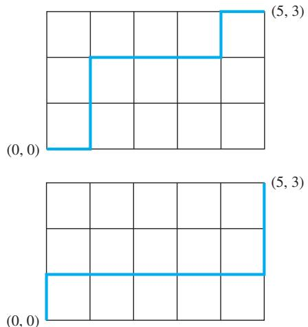

a) Show that each path of the type described can be represented by a bit string consisting of m 0s and n 1s, where a 0 represents a move one unit to the right and a 1 represents a move one unit upward.(

b) Conclude from part (a) that there are $\widetilde { \binom { m + n } { n } }$ paths of the desired type.

38. Use Exercise 37 to give an alternative proof of Corol-<sub>( ) ( )</sub> lary 2 in Section 6.3, which states that ${ \binom { n } { k } } = { \binom { n } { n - k } }$ whenever k is an integer with $0 \leq k \leq n .$ . [Hint: Consider the number of paths of the type described in Exercise 37 from (0, 0) to (n − k, k) and from (0, 0) to (k, n − k).]

39. Use Exercise 37 to prove Theorem 4. [Hint: Count the number of paths with n steps of the type described in Exercise 37. Every such path must end at one of the points (n − k, k) for $k = 0 , 1 , 2 , \ldots , n . ]$

40. Use Exercise 37 to prove Pascal’s identity. [Hint: Show that a path of the type described in Exercise 37 from (0, 0) to $( n + 1 - k , k )$ passes through either $( n + 1 - k , k - 1 )$ or $( n - k , k )$ , but not through both.]

41. Use Exercise 37 to prove the hockeystick identity from Exercise 31. [Hint: First, note that the number of paths from (0, 0) to (n + 1, r) equals ${ \binom { n + 1 + r } { r } }$ . Second, count the number of paths by summing the number of these paths that start by going k units upward for $k =$ $0 , 1 , 2 , \ldots , r . ]$

42. Give a combinatorial proof that if n is a positive inte-<sub>( )</sub> ger then $\begin{array} { r } { \sum _ { k = 0 } ^ { n } k ^ { 2 } { \binom { n } { k } } \stackrel { \bullet } { = } n ( n + 1 ) 2 ^ { n - 2 } . } \end{array}$ . [Hint: Show that both sides count the ways to select a subset of a set of n elements together with two not necessarily distinct elements from this subset. Furthermore, express the righthand side as $n ( n - 1 ) 2 ^ { n - 2 } + n 2 ^ { n - 1 } .$ ]

<sup>∗</sup>43. Determine a formula involving binomial coeficients for the nth term of a sequence if its initial terms are those listed. [Hint: Looking at Pascal’s triangle will be helpful. Although infinitely many sequences start with a specified set of terms, each of the following lists is the start of a sequence of the type desired.]

a) 1, 3, 6, 10, 15, 21, 28, 36, 45, 55, 66, …

b) 1, 4, 10, 20, 35, 56, 84, 120, 165, 220, …

c) 1, 2, 6, 20, 70, 252, 924, 3432, 12870, 48620, …

d) 1, 1, 2, 3, 6, 10, 20, 35, 70, 126, …

e) 1, 1, 1, 3, 1, 5, 15, 35, 1, 9, …

f ) 1, 3, 15, 84, 495, 3003, 18564, 116280, 735471,4686825, …


## 6.5 Generalized Permutations and Combinations

## 6.5.1 Introduction


In many counting problems, elements may be used repeatedly. For instance, a letter or digit may be used more than once on a license plate. When a dozen donuts are selected, each variety can be chosen repeatedly. This contrasts with the counting problems discussed earlier in the chapter where we considered only permutations and combinations in which each item could be used at most once. In this section we will show how to solve counting problems where elements may be used more than once.

Also, some counting problems involve indistinguishable elements. For instance, to count the number of ways the letters of the word SUCCESS can be rearranged, the placement of identical letters must be considered. This contrasts with the counting problems discussed earlier where all elements were considered distinguishable. In this section we will describe how to solve counting problems in which some elements are indistinguishable.

Moreover, in this section we will explain how to solve another important class of counting problems, problems involving counting the ways distinguishable elements can be placed in boxes. An example of this type of problem is the number of diferent ways poker hands can be dealt to four players.

Taken together, the methods described earlier in this chapter and the methods introduced in this section form a useful toolbox for solving a wide range of counting problems. When the additional methods discussed in Chapter 8 are added to this arsenal, you will be able to solve a large percentage of the counting problems that arise in a wide range of areas of study.

## 6.5.2 Permutations with Repetition

Counting permutations when repetition of elements is allowed can easily be done using the product rule, as Example 1 shows.

EXAMPLE 1 How many strings of length r can be formed from the uppercase letters of the English alphabet?

Solution: By the product rule, because there are 26 uppercase English letters, and because each letter can be used repeatedly, we see that there are 26<sup>r</sup> strings of uppercase English letters of length r. ◂

The number of r-permutations of a set with n elements when repetition is allowed is given in Theorem 1.

## THEOREM 1

The number of r-permutations of a set of n objects with repetition allowed is n<sup>r</sup>.

Proof: There are n ways to select an element of the set for each of the r positions in the r-permutation when repetition is allowed, because for each choice all n objects are available. Hence, by the product rule there are n<sup>r</sup> r-permutations when repetition is allowed. A

## 6.5.3 Combinations with Repetition

Consider these examples of combinations with repetition of elements allowed.

## EXAMPLE 2

How many ways are there to select four pieces of fruit from a bowl containing apples, oranges, and pears if the order in which the pieces are selected does not matter, only the type of fruit and not the individual piece matters, and there are at least four pieces of each type of fruit in the bowl?

Solution: To solve this problem we list all the ways possible to select the fruit. There are 15 ways:

4 apples

4 oranges

4 pears

3 apples, 1 orange

3 apples, 1 pear

3 oranges, 1 apple

3 oranges, 1 pear

3 pears, 1 apple

3 pears, 1 orange

2 apples, 2 oranges

2 apples, 2 pears

2 oranges, 2 pears

2 apples, 1 orange, 1 pear

2 oranges, 1 apple, 1 pear

2 pears, 1 apple, 1 orange

The solution is the number of 4-combinations with repetition allowed from a three-element set, {apple, orange, pear}. ◂

To solve more complex counting problems of this type, we need a general method for counting the r-combinations of an n-element set. In Example 3 we will illustrate such a method.

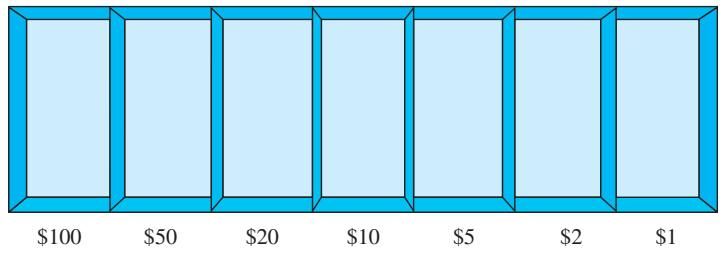  
FIGURE 1 Cash box with seven types of bills.

EXAMPLE 3 How many ways are there to select five bills from a cash box containing \$1 bills, \$2 bills, \$5 bills, \$10 bills, \$20 bills, \$50 bills, and \$100 bills? Assume that the order in which the bills are chosen does not matter, that the bills of each denomination are indistinguishable, and that there are at least five bills of each type.

Solution: Because the order in which the bills are selected does not matter and seven diferent types of bills can be selected as many as five times, this problem involves counting 5- combinations with repetition allowed from a set with seven elements. Listing all possibilities would be tedious, because there are a large number of solutions. Instead, we will illustrate the use of a technique for counting combinations with repetition allowed.

Suppose that a cash box has seven compartments, one to hold each type of bill, as illustrated in Figure 1. These compartments are separated by six dividers, as shown in the picture. The choice of five bills corresponds to placing five markers in the compartments holding diferent types of bills. Figure 2 illustrates this correspondence for three diferent ways to select five bills, where the six dividers are represented by bars and the five bills by stars.

The number of ways to select five bills corresponds to the number of ways to arrange six bars and five stars in a row with a total of 11 positions. Consequently, the number of ways to select the five bills is the number of ways to select the positions of the five stars from the 11 positions. This corresponds to the number of unordered selections of 5 objects from a set of 11 objects, which can be done in C(11, 5) ways. Consequently, there are

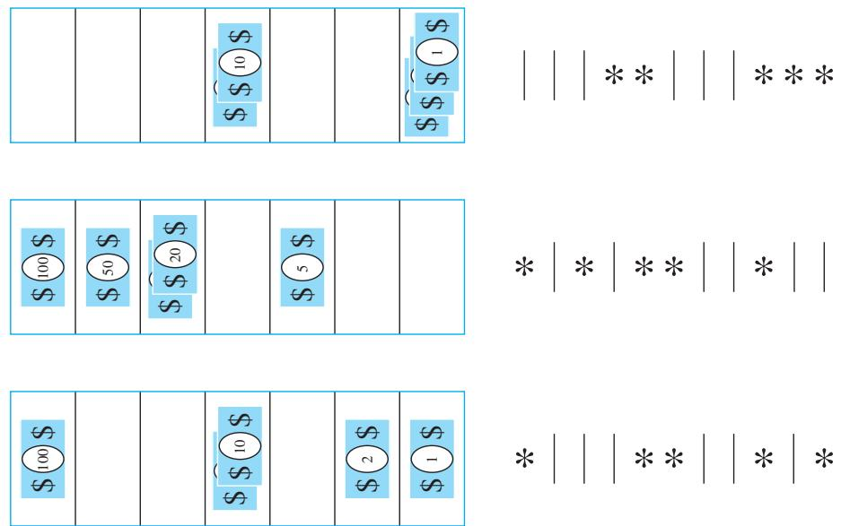  
FIGURE 2 Examples of ways to select five bills.

$$
C ( 1 1 , 5 ) = { \frac { 1 1 ! } { 5 ! 6 ! } } = 4 6 2
$$

ways to choose five bills from the cash box with seven types of bills.

Theorem 2 generalizes this discussion.

## THEOREM 2

There are $C ( n + r - 1 , r ) = C ( n + r - 1 , n - 1 )$ r-combinations from a set with n elements when repetition of elements is allowed.

Proof: Each r-combination of a set with n elements when repetition is allowed can be represented by a list of n − 1 bars and r stars. The n − 1 bars are used to mark of n diferent cells, with the ith cell containing a star for each time the ith element of the set occurs in the combination. For instance, a 6-combination of a set with four elements is represented with three bars and six stars. Here

∗∗∣∗∣ ∣∗∗∗

represents the combination containing exactly two of the first element, one of the second element, none of the third element, and three of the fourth element of the set.

As we have seen, each diferent list containing n − 1 bars and r stars corresponds to an rcombination of the set with n elements, when repetition is allowed. The number of such lists is $C ( n - 1 + r , r )$ , because each list corresponds to a choice of the r positions to place the r stars from the n − 1 + r positions that contain r stars and n − 1 bars. The number of such lists is also equal to $C ( n - 1 + r , n - 1 )$ , because each list corresponds to a choice of the n − 1 positions to place the n − 1 bars. A

Examples 4–6 show how Theorem 2 is applied.

Suppose that a cookie shop has four diferent kinds of cookies. How many diferent ways can six cookies be chosen? Assume that only the type of cookie, and not the individual cookies or the order in which they are chosen, matters.

Solution: The number of ways to choose six cookies is the number of 6-combinations of a set with four elements. From Theorem 2 this equals $C ( 4 + 6 - 1 , 6 ) = C ( 9 , 6 )$ . Because

$$
C ( 9 , 6 ) = C ( 9 , 3 ) = { \frac { 9 \cdot 8 \cdot 7 } { 1 \cdot 2 \cdot 3 } } = 8 4 ,
$$

there are 84 diferent ways to choose the six cookies.

Theorem 2 can also be used to find the number of solutions of certain linear equations where the variables are integers subject to constraints. This is illustrated by Example 5.

How many solutions does the equation

$$
x _ { 1 } + x _ { 2 } + x _ { 3 } = 1 1
$$

have, where $x _ { 1 } , x _ { 2 }$ , and $x _ { 3 }$ are nonnegative integers?

Solution: To count the number of solutions, we note that a solution corresponds to a way of selecting 11 items from a set with three elements so that $x _ { 1 }$ items of type one, $x _ { 2 }$ items of type two, and $x _ { 3 }$ items of type three are chosen. Hence, the number of solutions is equal to the number of 11-combinations with repetition allowed from a set with three elements. From Theorem 2 it follows that there are

$$
C ( 3 + 1 1 - 1 , 1 1 ) = C ( 1 3 , 1 1 ) = C ( 1 3 , 2 ) = { \frac { 1 3 \cdot 1 2 } { 1 \cdot 2 } } = 7 8
$$

solutions.

The number of solutions of this equation can also be found when the variables are subject to constraints. For instance, we can find the number of solutions where the variables are integers with $x _ { 1 } \geq 1 , x _ { 2 } \geq 2$ , and $x _ { 3 } \geq 3 . \mathrm { ~ A ~ }$ solution to the equation subject to these constraints corresponds to a selection of 11 items with $x _ { 1 }$ items of type one, $x _ { 2 }$ items of type two, and $x _ { 3 }$ items of type three, where, in addition, there is at least one item of type one, two items of type two, and three items of type three. So, a solution corresponds to a choice of one item of type one, two of type two, and three of type three, together with a choice of five additional items of any type. By Theorem 2 this can be done in

$$
C ( 3 + 5 - 1 , 5 ) = C ( 7 , 5 ) = C ( 7 , 2 ) = { \frac { 7 \cdot 6 } { 1 \cdot 2 } } = 2 1
$$

ways. Thus, there are 21 solutions of the equation subject to the given constraints.

Example 6 shows how counting the number of combinations with repetition allowed arises in determining the value of a variable that is incremented each time a certain type of nested loop is traversed.

EXAMPLE 6 What is the value of k after the following pseudocode has been executed?

k := 0   
for $i _ { 1 } : = 1$ to n   
for $i _ { 2 } : = 1$ to $i _ { 1 }$   
for $\begin{array} { c } { \cdot i _ { m } : = 1 \mathrm { ~ } \mathbf { t o } i _ { m - 1 } } \\ { k : = k + 1 } \end{array}$

Solution: Note that the initial value of k is 0 and that 1 is added to k each time the nested loop is traversed with a sequence of integers $i _ { 1 } , i _ { 2 } , \ldots , i _ { m }$ such that

$$
1 \leq i _ { m } \leq i _ { m - 1 } \leq \cdots \leq i _ { 1 } \leq n .
$$

The number of such sequences of integers is the number of ways to choose m integers from $\{ 1 , 2 , \ldots , n \}$ , with repetition allowed. (To see this, note that once such a sequence has been selected, if we order the integers in the sequence in nondecreasing order, this uniquely defines an assignment of $i _ { m } , i _ { m - 1 } , \ldots , i _ { 1 }$ . Conversely, every such assignment corresponds to a unique unordered set.) Hence, from Theorem 2, it follows that $k = C ( n + m - 1 , n$ ) after this code has been executed. ◂

The formulae for the numbers of ordered and unordered selections of r elements, chosen with and without repetition allowed from a set with n elements, are shown in Table 1.

TABLE 1 Combinations and Permutations With and Without Repetition.
<table><tr><td colspan="3">and Without Repetition.</td></tr><tr><td>Type</td><td>Repetition Allowed?</td><td>Formula</td></tr><tr><td>r-permutations</td><td>No</td><td> $\frac { n ! } { ( n - r ) ! }$ </td></tr><tr><td>r-combinations</td><td>No</td><td> $\frac { n ! } { r ! \ : ( n - r ) ! }$ </td></tr><tr><td>r-permutations</td><td>Yes</td><td> $n ^ { r }$ </td></tr><tr><td>r-combinations</td><td>Yes</td><td> $( n + r - 1 ) !$   $\overline { { r ! \ : ( n - 1 ) ! } }$ </td></tr></table>

## 6.5.4 Permutations with Indistinguishable Objects

Some elements may be indistinguishable in counting problems. When this is the case, care must be taken to avoid counting things more than once. Consider Example 7.

EXAMPLE 7 How many diferent strings can be made by reordering the letters of the word SUCCESS?

Solution: Because some of the letters of SUCCESS are the same, the answer is not given by the number of permutations of seven letters. This word contains three Ss, two Cs, one U, and one E. To determine the number of diferent strings that can be made by reordering the letters, first note that the three Ss can be placed among the seven positions in C(7, 3) diferent ways, leaving four positions free. Then the two Cs can be placed in C(4, 2) ways, leaving two free positions. The U can be placed in C(2, 1) ways, leaving just one position free. Hence E can be placed in C(1, 1) way. Consequently, from the product rule, the number of diferent strings that can be made is

$$
\begin{array} { l } { { C ( 7 , 3 ) C ( 4 , 2 ) C ( 2 , 1 ) C ( 1 , 1 ) = \displaystyle \frac { 7 ! } { 3 ! 4 ! } \cdot \displaystyle \frac { 4 ! } { 2 ! 2 ! } \cdot \displaystyle \frac { 2 ! } { 1 ! 1 ! } \cdot \displaystyle \frac { 1 ! } { 1 ! 0 ! } } } \\ { { \ ~ = \displaystyle \frac { 7 ! } { 3 ! 2 ! 1 ! 1 ! } } } \\ { { \ ~ } } \\ { { \displaystyle = 4 2 0 . } } \end{array}
$$

We can prove Theorem 3 using the same sort of reasoning as in Example 7.

## THEOREM 3

The number of diferent permutations of n objects, where there are $n _ { 1 }$ indistinguishable objects of type $1 , n _ { 2 }$ indistinguishable objects of type $2 , \ldots ,$ and $n _ { k }$ indistinguishable objects of type k, is

$$
{ \frac { n ! } { n _ { 1 } ! n _ { 2 } ! \cdots n _ { k } ! } } .
$$

Proof: To determine the number of permutations, first note that the $n _ { 1 }$ objects of type one can be placed among the n positions in $C ( n , n _ { 1 } )$ ways, leaving $n - n _ { 1 }$ positions free. Then the objects of type two can be placed in $C ( n - n _ { 1 } , n _ { 2 } )$ ways, leaving $n - n _ { 1 } - n _ { 2 }$ positions free. Continue placing the objects of type three, … , type k − 1, until at the last stage, $n _ { k }$ objects of type k can be placed in $C ( n - n _ { 1 } - n _ { 2 } - \cdots - n _ { k - 1 } , n _ { k } )$ ways. Hence, by the product rule, the total number of diferent permutations is

$$
\begin{array} { l } { { { \cal C } ( n , n _ { 1 } ) { \cal C } ( n - n _ { 1 } , n _ { 2 } ) \cdots { \cal C } ( n - n _ { 1 } - \cdots - n _ { k - 1 } , n _ { k } ) } } \\ { { \ \quad \ = { \displaystyle \frac { n ! } { n _ { 1 } ! ( n - n _ { 1 } ) ! } \frac { ( n - n _ { 1 } ) ! } { n _ { 2 } ! ( n - n _ { 1 } - n _ { 2 } ) ! } \cdots { \displaystyle \frac { ( n - n _ { 1 } - \cdots - n _ { k - 1 } ) ! } { n _ { k } ! 0 ! } } } } } \\ { { \ \ = { \displaystyle \frac { n ! } { n _ { 1 } ! n _ { 2 } ! \cdots n _ { k } ! } } . } } \end{array}
$$

## 6.5.5 Distributing Objects into Boxes

Many counting problems can be solved by enumerating the ways objects can be placed into boxes (where the order these objects are placed into the boxes does not matter). The objects can be either distinguishable, that is, diferent from each other, or indistinguishable, that is, considered identical. Distinguishable objects are sometimes said to be labeled, whereas indistinguishable objects are said to be unlabeled. Similarly, boxes can be distinguishable, that is, diferent, or indistinguishable, that is, identical. Distinguishable boxes are often said to be labeled, while indistinguishable boxes are said to be unlabeled. When you solve a counting problem using the model of distributing objects into boxes, you need to determine whether the objects are distinguishable and whether the boxes are distinguishable. Although the context of the counting problem makes these two decisions clear, counting problems are sometimes ambiguous and it may be unclear which model applies. In such a case it is best to state whatever assumptions you are making and explain why the particular model you choose conforms to your assumptions.

We will see that there are closed formulae for counting the ways to distribute objects, distinguishable or indistinguishable, into distinguishable boxes. We are not so lucky when we count the ways to distribute objects, distinguishable or indistinguishable, into indistinguishable boxes; there are no closed formulae to use in these cases.

Remark: A closed formula is an expression that can be evaluated using a finite number of operations and that includes numbers, variables, and values of functions, where the operations and functions belong to a generally accepted set that can depend on the context. In this book, we include the usual arithmetic operations, rational powers, exponential and logarithmic functions, trigonometric functions, and the factorial function. We do not allow infinite series to be included in closed formulae.

DISTINGUISHABLE OBJECTS AND DISTINGUISHABLE BOXES We first consider the case when distinguishable objects are placed into distinguishable boxes. Consider Example 8 in which the objects are cards and the boxes are hands of players.

How many ways are there to distribute hands of 5 cards to each of four players from the standard deck of 52 cards?

Solution: We will use the product rule to solve this problem. To begin, note that the first player can be dealt 5 cards in C(52, 5) ways. The second player can be dealt 5 cards in C(47, 5) ways, because only 47 cards are left. The third player can be dealt 5 cards in C(42, 5) ways. Finally, the fourth player can be dealt 5 cards in C(37, 5) ways. Hence, the total number of ways to deal four players 5 cards each is

$$
\begin{array} { l } { { C ( 5 2 , 5 ) C ( 4 7 , 5 ) C ( 4 2 , 5 ) C ( 3 7 , 5 ) = \displaystyle \frac { 5 2 ! } { 4 7 ! 5 ! } \cdot \frac { 4 7 ! } { 4 2 ! 5 ! } \cdot \frac { 4 2 ! } { 3 7 ! 5 ! } \cdot \frac { 3 7 ! } { 3 2 ! 5 ! } } } \\ { { \ } } \\ { { \displaystyle = \frac { 5 2 ! } { 5 ! 5 ! 5 ! 5 ! 3 2 ! } . } } \end{array}
$$

## THEOREM 4

Remark: The solution to Example 8 equals the number of permutations of 52 objects, with 5 indistinguishable objects of each of four diferent types, and 32 objects of a fifth type. This equality can be seen by defining a one-to-one correspondence between permutations of this type and distributions of cards to the players. To define this correspondence, first order the cards from 1 to 52. Then cards dealt to the first player correspond to the cards in the positions assigned to objects of the first type in the permutation. Similarly, cards dealt to the second, third, and fourth players, respectively, correspond to cards in the positions assigned to objects of the second, third, and fourth type, respectively. The cards not dealt to any player correspond to cards in the positions assigned to objects of the fifth type. The reader should verify that this is a one-to-one correspondence.

Example 8 is a typical problem that involves distributing distinguishable objects into distinguishable boxes. The distinguishable objects are the 52 cards, and the five distinguishable boxes are the hands of the four players and the rest of the deck. Counting problems that involve distributing distinguishable objects into boxes can be solved using Theorem 4.

The number of ways to distribute n distinguishable objects into k distinguishable boxes so that $n _ { i }$ objects are placed into box $i , i = 1 , 2 , \ldots , k ,$ equals

$$
{ \frac { n ! } { n _ { 1 } ! n _ { 2 } ! \cdots n _ { k } ! } } .
$$

Theorem 4 can be proved using the product rule. We leave the details as Exercise 49. It can also be proved (see Exercise 50) by setting up a one-to-one correspondence between the permutations counted by Theorem 3 and the ways to distribute objects counted by Theorem 4.

INDISTINGUISHABLE OBJECTS AND DISTINGUISHABLE BOXES Counting the number of ways of placing n indistinguishable objects into k distinguishable boxes turns out to be the same as counting the number of n-combinations for a set with k elements when repetitions are allowed. The reason behind this is that there is a one-to-one correspondence between ncombinations from a set with k elements when repetition is allowed and the ways to place n indistinguishable balls into k distinguishable boxes. To set up this correspondence, we put a ball in the ith bin each time the ith element of the set is included in the n-combination.

EXAMPLE 9 How many ways are there to place 10 indistinguishable balls into eight distinguishable bins?

Solution: The number of ways to place 10 indistinguishable balls into eight bins equals the number of 10-combinations from a set with eight elements when repetition is allowed. Consequently, there are

$$
C ( 8 + 1 0 - 1 , 1 0 ) = C ( 1 7 , 1 0 ) = { \frac { 1 7 ! } { 1 0 ! 7 ! } } = 1 9 , 4 4 8 .
$$

This means that there are $C ( n + r - 1 , n - 1 )$ ways to place r indistinguishable objects into n distinguishable boxes.


DISTINGUISHABLE OBJECTS AND INDISTINGUISHABLE BOXES Counting the ways to place n distinguishable objects into k indistinguishable boxes is more dificult than counting the ways to place objects, distinguishable or indistinguishable objects, into distinguishable boxes. We illustrate this with an example.

EXAMPLE 10 How many ways are there to put four diferent employees into three indistinguishable ofices, when each ofice can contain any number of employees?

Solution: We will solve this problem by enumerating all the ways these employees can be placed into the ofices. We represent the four employees by A, B, C, and D. First, we note that we can distribute employees so that all four are put into one ofice, three are put into one ofice and a fourth is put into a second ofice, two employees are put into one ofice and two put into a second ofice, and finally, two are put into one ofice, and one each put into the other two ofices. Each way to distribute these employees to these ofices can be represented by a way to partition the elements A, B, C, and D into disjoint subsets.

We can put all four employees into one ofice in exactly one way, represented by $\{ \{ A , B , C , D \} \}$ . We can put three employees into one ofice and the fourth employee into a diferent ofice in exactly four ways, represented by $\{ \{ A , B , C \} , \{ D \} \} , \ \{ \{ A , \bar { B , } D \} , \{ C \} \}$ $\{ \{ A , C , D \} , \{ B \} \}$ , and $\{ \{ B , C , D \} , \{ A \} \}$ . We can put two employees into one ofice and two into a second ofice in exactly three ways, represented by $\{ \{ A , \bar { B } \} , \{ C , D \} \} , \{ \{ A , C \} , \{ B , D \} \}$ , and $\{ \{ A , D \} , \{ B , C \} \}$ . Finally, we can put two employees into one ofice, and one each into each of the remaining two ofices in six ways, represented by $\{ \{ A , B \} , \{ C \} , \{ D \} \} , \{ \{ A , C \} , \{ B \} , \{ D \} \}$ , $\{ \{ A , D \} , \{ B \} , \{ C \} \} , \{ \{ B , C \} , \{ A \} , \{ D \} \} , \{ \{ B , D \} \} , \{ \{ A \} , \{ C \} \} , \mathrm { a n d } \{ \{ C , D \} , \{ A \} , \{ B \} \}$

Counting all the possibilities, we find that there are 14 ways to put four diferent employees into three indistinguishable ofices. Another way to look at this problem is to look at the number of ofices into which we put employees. Note that there are six ways to put four diferent employees into three indistinguishable ofices so that no ofice is empty, seven ways to put four diferent employees into two indistinguishable ofices so that no ofice is empty, and one way to put four employees into one ofice so that it is not empty. ◂

There is no simple closed formula for the number of ways to distribute n distinguishable objects into j indistinguishable boxes. However, there is a formula involving a summation, which we will now describe. Let $S ( n , j )$ denote the number of ways to distribute n distinguishable objects into j indistinguishable boxes so that no box is empty. The numbers $S ( n , j )$ are called Stirling numbers of the second kind. For instance, Example 10 shows that $S ( 4 , 3 ) = 6 , S ( 4 , 2 ) = 7 .$ and $S ( 4 , 1 ) = 1$ . We see that the number of ways to distribute n distinguishable objects into k indistinguishable boxes (where the number of boxes that are nonempty equals $\ell , k - 1 , \ldots , 2 ,$ or 1) equals $\textstyle \sum _ { j = 1 } ^ { k } S ( n , j )$ . For instance, following the reasoning in Example 10, the number of ways to distribute four distinguishable objects into three indistinguishable boxes equals $S ( 4 , 1 ) + S ( 4 , 2 ) + S ( 4 , 3 ) = 1 + 7 + 6 = 1 4$ . Using the inclusion–exclusion principle (see Section 8.6) it can be shown that

$$
S ( n , j ) = { \frac { 1 } { j ! } } \sum _ { i = 0 } ^ { j - 1 } ( - 1 ) ^ { i } { \binom { j } { i } } ( j - i ) ^ { n } .
$$

Consequently, the number of ways to distribute n distinguishable objects into k indistinguishable boxes equals

$$
\sum _ { j = 1 } ^ { k } S ( n , j ) = \sum _ { j = 1 } ^ { k } { \frac { 1 } { j ! } } \sum _ { i = 0 } ^ { j - 1 } ( - 1 ) ^ { i } { \binom { j } { i } } ( j - i ) ^ { n } .
$$

Remark: The reader may be curious about the Stirling numbers of the first kind. A combinatorial definition of the signless Stirling numbers of the first kind, the absolute values of the Stirling numbers of the first kind, can be found in the preamble to Exercise 47 in the Supplementary Exercises. For the definition of Stirling numbers of the first kind, for more information about Stirling numbers of the second kind, and to learn more about Stirling numbers of the first kind and the relationship between Stirling numbers of the first and second kind, see combinatorics textbooks such as [Bo07], [Br99], and [RoTe05], and Chapter 6 in [MiRo91].´

INDISTINGUISHABLE OBJECTS AND INDISTINGUISHABLE BOXES Some counting problems can be solved by determining the number of ways to distribute indistinguishable objects into indistinguishable boxes. We illustrate this principle with an example.

## EXAMPLE 11

How many ways are there to pack six copies of the same book into four identical boxes, where a box can contain as many as six books?

Solution: We will enumerate all ways to pack the books. For each way to pack the books, we will list the number of books in the box with the largest number of books, followed by the numbers of books in each box containing at least one book, in order of decreasing number of books in a box. The ways we can pack the books are

```csv
6 3, 2, 1
5, 1 3, 1, 1, 1
4, 2 2, 2, 2
4, 1, 1 2, 2, 1, 1.
3, 3
```

For example, 4, 1, 1 indicates that one box contains four books, a second box contains a single book, and a third box contains a single book (and the fourth box is empty). We conclude that there are nine allowable ways to pack the books, because we have listed them all. ◂

Observe that distributing n indistinguishable objects into k indistinguishable boxes is the same as writing n as the sum of at most k positive integers in nonincreasing order. If $a _ { 1 } +$ $a _ { 2 } + \cdots + a _ { 3 } = n .$ , where $a _ { 1 } , a _ { 2 } , \ldots , a _ { 5 }$ are positive integers with $a _ { 1 } \geq a _ { 2 } \geq \cdots \geq a _ { i } .$ we say that $a _ { 1 } , a _ { 2 } , \ldots , a _ { j }$ is a partition of the positive integer n into j positive integers. We see that if $p _ { k } ( n )$ is the number of partitions of n into at most k positive integers, then there are $p _ { k } ( n )$ ways to distribute n indistinguishable objects into k indistinguishable boxes. No simple closed formula exists for this number. For more information about partitions of positive integers, see [Ro11].

## Exercises

1. In how many diferent ways can five elements be selected in order from a set with three elements when repetition is allowed?

2. In how many diferent ways can five elements be selected in order from a set with five elements when repetition is allowed?

3. How many strings of six letters are there?

4. Every day a student randomly chooses a sandwich for lunch from a pile of wrapped sandwiches. If there are six kinds of sandwiches, how many diferent ways are there for the student to choose sandwiches for the seven days of a week if the order in which the sandwiches are chosen matters?

5. How many ways are there to assign three jobs to five employees if each employee can be given more than one job?

6. How many ways are there to select five unordered elements from a set with three elements when repetition is allowed?

7. How many ways are there to select three unordered elements from a set with five elements when repetition is allowed?

8. How many diferent ways are there to choose a dozen donuts from the 21 varieties at a donut shop?

9. A bagel shop has onion bagels, poppy seed bagels, egg bagels, salty bagels, pumpernickel bagels, sesame seed bagels, raisin bagels, and plain bagels. How many ways are there to choose

a) six bagels?

b) a dozen bagels?

c) two dozen bagels?

d) a dozen bagels with at least one of each kind?

e) a dozen bagels with at least three egg bagels and no more than two salty bagels?

10. A croissant shop has plain croissants, cherry croissants, chocolate croissants, almond croissants, apple croissants, and broccoli croissants. How many ways are there to choose

a) a dozen croissants?

b) three dozen croissants?

c) two dozen croissants with at least two of each kind?

d) two dozen croissants with no more than two broccoli croissants?

e) two dozen croissants with at least five chocolate croissants and at least three almond croissants?

f ) two dozen croissants with at least one plain croissant, at least two cherry croissants, at least three chocolate croissants, at least one almond croissant, at least two apple croissants, and no more than three broccoli croissants?

11. How many ways are there to choose eight coins from a piggy bank containing 100 identical pennies and 80 identical nickels?

12. How many diferent combinations of pennies, nickels, dimes, quarters, and half dollars can a piggy bank contain if it has 20 coins in it?

13. A book publisher has 3000 copies of a discrete mathematics book. How many ways are there to store these books in their three warehouses if the copies of the book are indistinguishable?

14. How many solutions are there to the equation

$$
x _ { 1 } + x _ { 2 } + x _ { 3 } + x _ { 4 } = 1 7 ,
$$

where $x _ { 1 } , x _ { 2 } , x _ { 3 }$ , and $x _ { 4 }$ are nonnegative integers?

15. How many solutions are there to the equation

$$
x _ { 1 } + x _ { 2 } + x _ { 3 } + x _ { 4 } + x _ { 5 } = 2 1 ,
$$

where $x _ { i } , i = 1 , 2 , 3 , 4 , 5 ,$ , is a nonnegative integer such that

a) $x _ { 1 } \geq 1 \mathrm { 2 }$

b) $x _ { i } \geq 2 \mathrm { f o r } i = 1 , 2 , 3 , 4 , 5 ?$

c) $0 \leq x _ { 1 } \leq 1 0 ?$

d) $0 \leq x _ { 1 } \leq 3 , 1 \leq x _ { 2 } < 4 , \mathrm { a n d } x _ { 3 } \geq 1 5 ?$

16. How many solutions are there to the equation

$$
x _ { 1 } + x _ { 2 } + x _ { 3 } + x _ { 4 } + x _ { 5 } + x _ { 6 } = 2 9 ,
$$

where $x _ { i } , i = 1 , 2 , 3 , 4 , 5 , 6 .$ , is a nonnegative integer such that

a) $x _ { i } > 1$ for i = 1, 2, 3, 4, 5, 6?

$$
x _ { 1 } \geq 1 , x _ { 2 } \geq 2 , x _ { 3 } \geq 3 , x _ { 4 } \geq 4 , x _ { 5 } > 5 , { \mathrm { a n d } } x _ { 6 } \geq 6 ?
$$

c) $x _ { 1 } \leq 5 \mathrm { ? }$

d) $x _ { 1 } < 8$ and $x _ { 2 } > 8 ?$

17. How many strings of 10 ternary digits (0, 1, or 2) are there that contain exactly two 0s, three 1s, and five 2s?

18. How many strings of 20-decimal digits are there that contain two 0s, four 1s, three 2s, one 3, two 4s, three 5s, two $^ { 7 \mathrm { s } , }$ and three 9s?

19. Suppose that a large family has 14 children, including two sets of identical triplets, three sets of identical twins, and two individual children. How many ways are there to seat these children in a row of chairs if the identical triplets or twins cannot be distinguished from one another?

20. How many solutions are there to the inequality

$$
x _ { 1 } + x _ { 2 } + x _ { 3 } \leq 1 1 ,
$$

where $x _ { 1 } , x _ { 2 } ,$ and $x _ { 3 }$ are nonnegative integers? [Hint: Introduce an auxiliary variable $x _ { 4 }$ such that $x _ { 1 } + x _ { 2 } + x _ { 3 }$ + $x _ { 4 } = 1 1 . ]$

21. A Swedish tour guide has devised a clever way for his clients to recognize him. He owns 13 pairs of shoes of the same style, customized so that each pair has a unique color. How many ways are there for him to choose a left shoe and a right shoe from these 13 pairs

a) without restrictions and which color is on which foot matters?

b) so that the colors of the left and right shoe are diferent and which color is on which foot matters?

c) so that the colors of the left and right shoe are diferent but which color is on which foot does not matter?

d) without restrictions, but which color is on which foot does not matter?

<sup>∗</sup>22. In how many ways can an airplane pilot be scheduled for five days of flying in October if he cannot work on consecutive days?

23. How many ways are there to distribute six indistinguishable balls into nine distinguishable bins?

24. How many ways are there to distribute 12 indistinguishable balls into six distinguishable bins?

25. How many ways are there to distribute 12 distinguishable objects into six distinguishable boxes so that two objects are placed in each box?

26. How many ways are there to distribute 15 distinguishable objects into five distinguishable boxes so that the boxes have one, two, three, four, and five objects in them, respectively.

27. How many positive integers less than 1,000,000 have the sum of their digits equal to 19?

28. How many positive integers less than 1,000,000 have exactly one digit equal to 9 and have a sum of digits equal to 13?

29. There are 10 questions on a discrete mathematics final exam. How many ways are there to assign scores to the problems if the sum of the scores is 100 and each question is worth at least 5 points?

30. Show that there are $C ( n + r - q _ { 1 } - q _ { 2 } - \cdots - q _ { r } - 1 , n -$ $q _ { 1 } - q _ { 2 } - \cdots - q _ { r } )$ diferent unordered selections of n objects of r diferent types that include at least $q _ { 1 }$ objects of type one, $q _ { 2 }$ objects of type two, … , and $q _ { r }$ objects of type r.

31. How many diferent bit strings can be transmitted if the string must begin with a 1 bit, must include three additional 1 bits (so that a total of four 1 bits is sent), must include a total of 12 0 bits, and must have at least two 0 bits following each 1 bit?

32. How many diferent strings can be made from the letters in MISSISSIPPI, using all the letters?

33. How many diferent strings can be made from the letters in ABRACADABRA, using all the letters?

34. How many diferent strings can be made from the letters in AARDVARK, using all the letters, if all three As must be consecutive?

35. How many diferent strings can be made from the letters in ORONO, using some or all of the letters?

36. How many strings with five or more characters can be formed from the letters in SEERESS?

37. How many strings with seven or more characters can be formed from the letters in EVERGREEN?

38. How many diferent bit strings can be formed using six 1s and eight 0s?

39. A student has three mangos, two papayas, and two kiwi fruits. If the student eats one piece of fruit each day, and only the type of fruit matters, in how many diferent ways can these fruits be consumed?

40. A professor packs her collection of 40 issues of a mathematics journal in four boxes with 10 issues per box. How many ways can she distribute the journals if

a) each box is numbered, so that they are distinguishable?

b) the boxes are identical, so that they cannot be distinguished?

41. How many ways are there to travel in xyz space from the origin (0, 0, 0) to the point (4, 3, 5) by taking steps one unit in the positive x direction, one unit in the positive y direction, or one unit in the positive z direction? (Moving in the negative x, y, or z direction is prohibited, so that no backtracking is allowed.)

42. How many ways are there to travel in xyzw space from the origin (0, 0, 0, 0) to the point (4, 3, 5, 4) by taking steps one unit in the positive x, positive y, positive z, or positive w direction?

43. How many ways are there to deal hands of seven cards to each of five players from a standard deck of 52 cards?

44. In bridge, the 52 cards of a standard deck are dealt to four players. How many diferent ways are there to deal bridge hands to four players?

45. How many ways are there to deal hands of five cards to each of six players from a deck containing 48 diferent cards?

46. In how many ways can a dozen books be placed on four distinguishable shelves

a) if the books are indistinguishable copies of the same title?

b) if no two books are the same, and the positions of the books on the shelves matter? [Hint: Break this into 12 tasks, placing each book separately. Start with the sequence 1, 2, 3, 4 to represent the shelves. Represent the books by $b _ { i } , i = 1 , 2 , \ldots , 1 2$ . Place $b _ { 1 }$ to the right of one of the terms in $1 , 2 , 3 , 4 .$ . Then successively place $b _ { 2 } , b _ { 3 } , \ldots ,$ , and $b _ { 1 2 } . ]$

47. How many ways can n books be placed on k distinguishable shelves

a) if the books are indistinguishable copies of the same title?

b) if no two books are the same, and the positions of the books on the shelves matter?

48. A shelf holds 12 books in a row. How many ways are there to choose five books so that no two adjacent books are chosen? [Hint: Represent the books that are chosen by bars and the books not chosen by stars. Count the number of sequences of five bars and seven stars so that no two bars are adjacent.]

<sup>∗</sup>49. Use the product rule to prove Theorem 4, by first placing objects in the first box, then placing objects in the second box, and so on.

<sup>∗</sup>50. Prove Theorem 4 by first setting up a one-to-one correspondence between permutations of n objects with $n _ { i }$ indistinguishable objects of type $i , i = 1 , 2 , 3 , \ldots , k ,$ and the distributions of n objects in k boxes such that $n _ { i }$ objects are placed in box $i , i = 1 , 2 , 3 , \ldots , k$ and then applying Theorem 3.

<sup>∗</sup>51. In this exercise we will prove Theorem 2 by setting up a one-to-one correspondence between the set of r-combinations with repetition allowed of $S =$ $\{ 1 , 2 , 3 , \dots , n \}$ and the set of r-combinations of the set $T = \{ 1 , 2 , 3 , \dots , n + r - 1 \}$

a) Arrange the elements in an r-combination, with repetition allowed, of S into an increasing sequence $x _ { 1 } \leq x _ { 2 } \leq \dots \leq x _ { r }$ . Show that the sequence formed by adding k − 1 to the kth term is strictly increasing. Conclude that this sequence is made up of r distinct elements from T.

b) Show that the procedure described in (a) defines a one-to-one correspondence between the set of rcombinations, with repetition allowed, of S and the rcombinations of T. [Hint: Show the correspondence can be reversed by associating to the r-combination $\{ x _ { 1 } , x _ { 2 } , \ldots , x _ { r } \}$ of $T ,$ with $1 \leq x _ { 1 } < x _ { 2 } < \cdots < x _ { r } \leq$ n + r − 1, the r-combination with repetition allowed from S, formed by subtracting k − 1 from the kth element.]

c) Conclude that the number of r-combinations with repetition allowed from a set with n elements is C(n + r − 1, r).

52. How many ways are there to distribute five distinguishable objects into three indistinguishable boxes?

53. How many ways are there to distribute six distinguishable objects into four indistinguishable boxes so that each of the boxes contains at least one object?

54. How many ways are there to put five temporary employees into four identical ofices?

55. How many ways are there to put six temporary employees into four identical ofices so that there is at least one temporary employee in each of these four ofices?

56. How many ways are there to distribute five indistinguishable objects into three indistinguishable boxes?

57. How many ways are there to distribute six indistinguishable objects into four indistinguishable boxes so that each of the boxes contains at least one object?

58. How many ways are there to pack eight identical DVDs into five indistinguishable boxes so that each box contains at least one DVD?

59. How many ways are there to pack nine identical DVDs into three indistinguishable boxes so that each box contains at least two DVDs?

60. How many ways are there to distribute five balls into seven boxes if each box must have at most one ball in it if

a) both the balls and boxes are labeled?

b) the balls are labeled, but the boxes are unlabeled?

c) the balls are unlabeled, but the boxes are labeled?

d) both the balls and boxes are unlabeled?

61. How many ways are there to distribute five balls into three boxes if each box must have at least one ball in it if

a) both the balls and boxes are labeled?

b) the balls are labeled, but the boxes are unlabeled?

c) the balls are unlabeled, but the boxes are labeled?

d) both the balls and boxes are unlabeled?

62. Suppose that a basketball league has 32 teams, split into two conferences of 16 teams each. Each conference is split into three divisions. Suppose that the North Central Division has five teams. Each of the teams in the North Central Division plays four games against each of the other teams in this division, three games against each of the 11 remaining teams in the conference, and two games against each of the 16 teams in the other conference. In how many diferent orders can the games of one of the teams in the North Central Division be scheduled?

<sup>∗</sup>63. Suppose that a weapons inspector must inspect each of five diferent sites twice, visiting one site per day. The inspector is free to select the order in which to visit these sites, but cannot visit site X, the most suspicious site, on two consecutive days. In how many diferent orders can the inspector visit these sites?

64. How many diferent terms are there in the expansion of $( x _ { 1 } + x _ { 2 } + \cdots + x _ { m } ) ^ { n }$ after all terms with identical sets of exponents are added?

<sup>∗</sup>65. Prove the Multinomial Theorem: If n is a positive integer, then

$$
\begin{array} { l } { ( x _ { 1 } + x _ { 2 } + \cdots + x _ { m } ) ^ { n } \qquad } \\ { = \displaystyle \sum _ { n _ { 1 } + n _ { 2 } + \cdots + n _ { m } = n } C ( n ; n _ { 1 } , n _ { 2 } , \ldots , n _ { m } ) x _ { 1 } ^ { n _ { 1 } } x _ { 2 } ^ { n _ { 2 } } \cdots x _ { m } ^ { n _ { m } } , } \end{array}
$$

where

$$
C ( n ; n _ { 1 } , n _ { 2 } , \ldots , n _ { m } ) = { \frac { n ! } { n _ { 1 } ! n _ { 2 } ! \cdots n _ { m } ! } }
$$

is a multinomial coeficient.

66. Find the expansion of $( x + y + z ) ^ { 4 }$

67. Find the coeficient of $x ^ { 3 } y ^ { 2 } z ^ { 5 } \sin { ( x + y + z ) } ^ { 1 0 }$

68. How many terms are there in the expansion of

$$
( x + y + z ) ^ { 1 0 0 } ?
$$


## 6.6 Generating Permutations and Combinations

## 6.6.1 Introduction

Methods for counting various types of permutations and combinations were described in the previous sections of this chapter, but sometimes permutations or combinations need to be generated, not just counted. Consider the following three problems. First, suppose that a salesperson must visit six diferent cities. In which order should these cities be visited to minimize total travel time? One way to determine the best order is to determine the travel time for each of the $6 ! = 7 2 0$ diferent orders in which the cities can be visited and choose the one with the smallest travel time. Second, suppose we are given a set of six positive integers and wish to find a subset of them that has 100 as their sum, if such a subset exists. One way to find these numbers is to generate all $2 ^ { 6 } = 6 4$ subsets and check the sum of their elements. Third, suppose a laboratory has 95 employees. A group of 12 of these employees with a particular set of 25 skills is needed for a project. (Each employee can have one or more of these skills.) One way to find such a set of employees is to generate all sets of 12 of these employees and check whether they have the desired skills. These examples show that it is often necessary to generate permutations and combinations to solve problems.

## 6.6.2 Generating Permutations


Any set with n elements can be placed in one-to-one correspondence with the set $\{ 1 , 2 , 3 , \dots , n \}$ We can list the permutations of any set of n elements by generating the permutations of the n smallest positive integers and then replacing these integers with the corresponding elements. Many diferent algorithms have been developed to generate the n! permutations of this set. We will describe one of these that is based on the lexicographic (or dictionary) ordering of the set of permutations of $\{ 1 , 2 , 3 , \dots , n \}$ . In this ordering, the permutation $a _ { 1 } a _ { 2 } \cdots a _ { n }$ precedes the permutation of $b _ { 1 } b _ { 2 } \cdots b _ { n }$ , if for some k, with $1 \leq k \leq n , a _ { 1 } = b _ { 1 } , a _ { 2 } = b _ { 2 } , \ldots , a _ { k - 1 } = b _ { k - 1 }$ , and $a _ { k } < b _ { k }$ . In other words, a permutation of the set of the n smallest positive integers precedes (in lexicographic order) a second permutation if the number in this permutation in the first position where the two permutations disagree is smaller than the number in that position in the second permutation.

The permutation 23415 of the set {1, 2, 3, 4, 5} precedes the permutation 23514, because these permutations agree in the first two positions, but the number in the third position in the first permutation, 4, is smaller than the number in the third position in the second permutation, 5. Similarly, the permutation 41532 precedes 52143. ◂

An algorithm for generating the permutations of $\{ 1 , 2 , \ldots , n \}$ can be based on a procedure that constructs the next permutation in lexicographic order following a given permutation $a _ { 1 } a _ { 2 } \cdots a _ { n }$ . We will show how this can be done. First, suppose that $a _ { n - 1 } < a _ { n }$ . Interchange $a _ { n - 1 }$ and $a _ { n }$ to obtain a larger permutation. No other permutation is both larger than the original permutation and smaller than the permutation obtained by interchanging $a _ { n - 1 }$ and $a _ { n }$ . For instance, the next larger permutation after 234156 is 234165. On the other hand, if $a _ { n - 1 } > a _ { n } .$ , then a larger permutation cannot be obtained by interchanging these last two terms in the permutation. Look at the last three integers in the permutation. If $a _ { n - 2 } < a _ { n - 1 }$ , then the last three integers in the permutation can be rearranged to obtain the next largest permutation. Put the smaller of the two integers $a _ { n - 1 }$ and $a _ { n }$ that is greater than $a _ { n - 2 }$ in position n − 2. Then, place the remaining integer and $a _ { n - 2 }$ into the last two positions in increasing order. For instance, the next larger permutation after 234165 is 234516.


On the other hand, if $a _ { n - 2 } > a _ { n - 1 }$ (and $a _ { n - 1 } > a _ { n } )$ , then a larger permutation cannot be obtained by permuting the last three terms in the permutation. Based on these observations, a general method can be described for producing the next larger permutation in increasing order following a given permutation $a _ { 1 } a _ { 2 } \cdots a _ { n }$ . First, find the integers a and $a _ { j + 1 }$ with $a _ { j } < a _ { j + }$ and

$$
a _ { j + 1 } > a _ { j + 2 } > \cdots > a _ { n } ,
$$

that is, the last pair of adjacent integers in the permutation where the first integer in the pair is smaller than the second. Then, the next larger permutation in lexicographic order is obtained by putting in the jth position the least integer among $a _ { 5 + 1 } , a _ { 5 + 2 } , \ldots ,$ and $a _ { n }$ that is greater than $a _ { j }$ and listing in increasing order the rest of the integers $a _ { j } , a _ { j + 1 } , \ldots , a _ { n }$ in positions j + 1 to n. It is easy to see that there is no other permutation larger than the permutation $a _ { 1 } a _ { 2 } \cdots a _ { n }$ but smaller than the new permutation produced. (The verification of this fact is left as an exercise for the reader.)

## EXAMPLE 2 What is the next permutation in lexicographic order after 362541?

Solution: The last pair of integers $a _ { j }$ and $a _ { j + 1 }$ where $a _ { j } < a _ { + 1 }$ is $a _ { 3 } = 2$ and $a _ { 4 } = 5$ . The least integer to the right of 2 that is greater than 2 in the permutation is $a _ { 5 } = 4 .$ . Hence, 4 is placed in the third position. Then the integers 2, 5, and 1 are placed in order in the last three positions, giving 125 as the last three positions of the permutation. Hence, the next permutation is 364125. ◂

To produce the n! permutations of the integers 1, 2, 3, … , n, begin with the smallest permutation in lexicographic order, namely, $1 2 3 \cdots n ,$ , and successively apply the procedure described for producing the next larger permutation of $n ! - 1$ times. This yields all the permutations of the n smallest integers in lexicographic order.

## EXAMPLE 3 Generate the permutations of the integers 1, 2, 3 in lexicographic order.

Solution: Begin with 123. The next permutation is obtained by interchanging 3 and 2 to obtain 132. Next, because $3 > 2$ and $1 < 3 .$ , permute the three integers in 132. Put the smaller of 3 and 2 in the first position, and then put 1 and 3 in increasing order in positions 2 and 3 to obtain 213. This is followed by 231, obtained by interchanging 1 and 3, because 1 < 3. The next larger permutation has 3 in the first position, followed by 1 and 2 in increasing order, namely, 312. Finally, interchange 1 and 2 to obtain the last permutation, 321. We have generated the permutations of 1, 2, 3 in lexicographic order. They are 123, 132, 213, 231, 312, and 321. ◂

Algorithm 1 displays the procedure for finding the next permutation in lexicographic order after a permutation that is not n $n - 1 \ n - 2 \ \dots \ 2 \ 1$ , which is the largest permutation.

ALGORITHM 1 Generating the Next Permutation in Lexicographic Order.   
procedure next permutation $( a _ { 1 } a _ { 2 } \ldots a _ { n } ;$ permutation of   
{1, 2, … , n} not equal to n n − 1 … 2 1)   
$j : = n - 1$   
while $a _ { j } > a _ { j + 1 }$   
$j : = \dot { j } - 1$   
{j is the largest subscript with $a _ { j } < a _ { j + 1 } \}$   
k := n   
while $a _ { j } > a _ { k }$   
$k : = \stackrel { \cdot } { k } - 1$   
$\{ a _ { k }$ is the smallest integer greater than $a _ { j }$ to the right of $a _ { j }  \}$   
interchange $a _ { j }$ and $a _ { k }$   
r := n   
s := j + 1   
while $r > s$   
interchange $a _ { r }$ and $a _ { s }$   
r := r − 1   
s := s + 1   
{this puts the tail end of the permutation after the jth position in increasing order}   
$\{ a _ { 1 } a _ { 2 } \dots a _ { n }$ is now the next permutation}

## 6.6.3 Generating Combinations


How can we generate all the combinations of the elements of a finite set? Because a combination is just a subset, we can use the correspondence between subsets of $\{ a _ { 1 } , a _ { 2 } , \ldots , a _ { n } \}$ and bit strings of length n.

Recall that the bit string corresponding to a subset has a 1 in position k if $a _ { k }$ is in the subset, and has a 0 in this position if $a _ { k }$ is not in the subset. If all the bit strings of length n can be listed, then by the correspondence between subsets and bit strings, a list of all the subsets is obtained.

Recall that a bit string of length n is also the binary expansion of an integer between 0 and $2 ^ { n } - 1$ . The $2 ^ { n }$ bit strings can be listed in order of their increasing size as integers in their binary expansions. To produce all binary expansions of length n, start with the bit string 000 … 00, with n zeros. Then, successively find the next expansion until the bit string 111 … 11 is obtained. At each stage the next binary expansion is found by locating the first position from the right that is not a 1, then changing all the 1s to the right of this position to 0s and making this first 0 (from the right) a 1.

## EXAMPLE 4 Find the next bit string after 10 0010 0111.

Solution: The first bit from the right that is not a 1 is the fourth bit from the right. Change this bit to a 1 and change all the following bits to 0s. This produces the next larger bit string, 10 0010 1000. ◂

The procedure for producing the next larger bit string after $b _ { n - 1 } b _ { n - 2 } . . . b _ { 1 } b _ { 0 }$ is given as Algorithm 2.

ALGORITHM 2 Generating the Next Larger Bit String.   
procedure next bit string $( b _ { n - 1 } b _ { n - 2 } . . . b _ { 1 } b _ { 0 } ;$ bit string not equal to 11…11)   
$i : = 0$   
while $b _ { i } = 1$   
$b _ { i } : = 0$   
$i : = i + 1$   
$b _ { i } : = 1$   
$\{ b _ { n - 1 } b _ { n - 2 } . . . b _ { 1 } b _ { 0 }$ is now the next bit string}

Next, an algorithm for generating the r-combinations of the set $\{ 1 , 2 , 3 , \dots , n \}$ will be given. An r-combination can be represented by a sequence containing the elements in the subset in increasing order. The r-combinations can be listed using lexicographic order on these sequences. In this lexicographic ordering, the first r-combination is $\{ 1 , 2 , \ldots , r - 1 , r \}$ and the last r-combination is $\{ n - r + 1 , n - r + 2 , \ldots , n - 1 , n \}$ . The next r-combination after $a _ { 1 } a _ { 2 } \cdots a _ { r }$ can be obtained in the following way: First, locate the last element $a _ { i }$ in the sequence such that $a _ { i } \neq n - r + i .$ Then, replace $a _ { i }$ with $a _ { i } + 1$ and $a _ { j }$ with $a _ { i } + j - i + 1$ for $j = i + 1 , i + 2 , \ldots , r .$ It is left for the reader to show that this produces the next larger r-combination in lexicographic order. This procedure is illustrated with Example 5.

EXAMPLE 5 Find the next larger 4-combination of the set {1, 2, 3, 4, 5, 6} after {1, 2, 5, 6}.

Solution: The last term among the terms $a _ { i }$ with $a _ { 1 } = 1 , a _ { 2 } = 2 , a _ { 3 } = 5 .$ , and ${ a _ { 4 } } = 6$ such that $a _ { i } \neq 6 - 4 + i { \mathrm { ~ i s ~ } } a _ { 2 } = 2$ . To obtain the next larger 4-combination, increment $a _ { 2 }$ by 1 to obtain $a _ { 2 } = 3 .$ . Then set $a _ { 3 } = 3 + 1 = 4$ and $a _ { 4 } = 3 + 2 = 5$ . Hence the next larger 4-combination is {1, 3, 4, 5}. ◂

Algorithm 3 displays pseudocode for this procedure.

ALGORITHM 3 Generating the Next r-Combination in Lexicographic Order.   
procedure next r-combination( $\{ a _ { 1 } , a _ { 2 } , \ldots , a _ { r }$ }: proper subset of   
$\{ 1 , 2 , \ldots , n \}$ not equal to $\{ n - r + 1 , \ldots , n \}$ with   
$a _ { 1 } < a _ { 2 } < \cdots < a _ { r } )$   
$i : = r$   
while $a _ { i } = n - r + i$   
$i : = i - 1$   
$a _ { i } : = a _ { i } + 1$   
for $j : = i + 1$ to r   
$a _ { j } : = a _ { i } + j - i$   
$\{ \{ a _ { 1 } , a _ { 2 } , \ldots , a _ { r } \}$ is now the next combination}

1. Place these permutations of {1, 2, 3, 4, 5} in lexicographic order: 43521, 15432, 45321, 23451, 23514, 14532, 21345, 45213, 31452, 31542.

2. Place these permutations of {1,2,3,4,5,6} in lexicographic order: 234561, 231456, 165432, 156423, 543216, 541236, 231465, 314562, 432561, 654321, 654312, 435612.

3. The name of a file in a computer directory consists of three uppercase letters followed by a digit, where each letter is either A, B, or C, and each digit is either 1 or 2. List the name of these files in lexicographic order, where we order letters using the usual alphabetic order of letters.

4. Suppose that the name of a file in a computer directory consists of three digits followed by two lowercase letters and each digit is 0, 1, or 2, and each letter is either a or b. List the name of these files in lexicographic order, where we order letters using the usual alphabetic order of letters.

5. Find the next larger permutation in lexicographic order after each of these permutations. a) 1432 b) 54123 c) 12453 d) 45231 e) 6714235 f ) 31528764

6. Find the next larger permutation in lexicographic order after each of these permutations. a) 1342 b) 45321 c) 13245 d) 612345 e) 1623547 f ) 23587416

7. Use Algorithm 1 to generate the 24 permutations of the first four positive integers in lexicographic order.

8. Use Algorithm 2 to list all the subsets of the set {1, 2, 3, 4}.

9. Use Algorithm 3 to list all the 3-combinations of {1, 2, 3, 4, 5}.

10. Show that Algorithm 1 produces the next larger permutation in lexicographic order.

11. Show that Algorithm 3 produces the next larger r-combination in lexicographic order after a given r-combination.

## Key Terms and Results

## TERMS

combinatorics: the study of arrangements of objects enumeration: the counting of arrangements of objects

tree diagram: a diagram made up of a root, branches leaving the root, and other branches leaving some of the endpoints of branches

permutation: an ordered arrangement of the elements of a set r-permutation: an ordered arrangement of r elements of a set $P ( n , r ) { \mathrm { : } }$ the number of r-permutations of a set with n elements r-combination: an unordered selection of r elements of a set $c ( n , r ) { \mathrm { : } }$ the number of r-combinations of a set with n elements

12. Develop an algorithm for generating the r-permutations of a set of n elements.

13. List all 3-permutations of {1, 2, 3, 4, 5}.

The remaining exercises in this section develop another algorithm for generating the permutations of $\{ 1 , 2 , 3 , \dots , n \}$ . This algorithm is based on Cantor expansions of integers. Every nonnegative integer less than n! has a unique Cantor expansion

$$
a _ { 1 } 1 ! + a _ { 2 } 2 ! + \cdots + a _ { n - 1 } ( n - 1 ) !
$$

where $a _ { i }$ is a nonnegative integer not exceeding i, for $i =$ $1 , 2 , \ldots , n - 1$ . The integers $a _ { 1 } , a _ { 2 } , \ldots , a _ { n - 1 }$ are called the Cantor digits of this integer.

Given a permutation of $\{ 1 , 2 , \ldots , n \}$ , let $a _ { k - 1 } , k =$ $2 , 3 , \ldots , n ,$ be the number of integers less than k that follow k in the permutation. For instance, in the permutation 43215, $a _ { 1 }$ is the number of integers less than 2 that follow 2, so $a _ { 1 } = 1$ . Similarly, for this example $a _ { 2 } = 2 , a _ { 3 } = 3$ and $a _ { 4 } = 0$ . Consider the function from the set of permutations of $\{ 1 , 2 , 3 , \dots , n \}$ to the set of nonnegative integers less than n! that sends a permutation to the integer that has $a _ { 1 } , a _ { 2 } , \ldots , a _ { n - 1 }$ , defined in this way, as its Cantor digits.

14. Find the Cantor digits $a _ { 1 } , a _ { 2 } , \ldots , a _ { n - 1 }$ that correspond to these permutations. a) 246531 b) 12345 c) 654321

<sup>∗</sup>15. Show that the correspondence described in the preamble is a bijection between the set of permutations of $\{ 1 , 2 , 3 , \dots , n \}$ and the nonnegative integers less than n!.

16. Find the permutations of {1, 2, 3, 4, 5} that correspond to these integers with respect to the correspondence between Cantor expansions and permutations as described in the preamble to Exercise 14. a) 3 b) 89 c) 111

17. Develop an algorithm for producing all permutations of a set of n elements based on the correspondence described in the preamble to Exercise 14.

binomial coeficient $\binom { n } { r }$ : also the number of r-combinations of a set with n elements

combinatorial proof: a proof that uses counting arguments rather than algebraic manipulation to prove a result

Pascal’s triangle: a representation of the binomial coeficients where the ith row of the triangle contains <sup>i</sup> for $j = 0 , 1 , 2 , \ldots , i$

$\begin{array} { r l } { S ( n , j ) { : \ } } \end{array}$ : the Stirling number of the second kind denoting the number of ways to distribute n distinguishable objects into j indistinguishable boxes so that no box is empty

## RESULTS

product rule for counting: The number of ways to do a procedure that consists of two tasks is the product of the number of ways to do the first task and the number of ways to do the second task after the first task has been done.

product rule for sets: The number of elements in the Cartesian product of finite sets is the product of the number of elements in each set.

sum rule for counting: The number of ways to do a task in one of two ways is the sum of the number of ways to do these tasks if they cannot be done simultaneously.

sum rule for sets: The number of elements in the union of pairwise disjoint finite sets is the sum of the numbers of elements in these sets.

subtraction rule for counting or inclusion–exclusion for sets: If a task can be done in either $n _ { 1 }$ ways or $n _ { 2 }$ ways, then the number of ways to do the task is $n _ { 1 } + n _ { 2 }$ minus the number of ways to do the task that are common to the two diferent ways.

subtraction rule or inclusion–exclusion for sets: The number of elements in the union of two sets is the sum of the number of elements in these sets minus the number of elements in their intersection.

division rule for counting: There are n∕d ways to do a task if it can be done using a procedure that can be carried out in n ways, and for every way w, exactly d of the n ways correspond to way w.

division rule for sets: Suppose that a finite set A is the union of n disjoint subsets each with d elements. Then $n = \left| A \right| / d .$

the pigeonhole principle: When more than k objects are placed in k boxes, there must be a box containing more than one object.

the generalized pigeonhole principle: When N objects are placed in k boxes, there must be a box containing at least <sup>⌈</sup>N∕k<sup>⌉</sup> objects.

$$
P ( n , r ) = \frac { n ! } { ( n - r ) ! }
$$

$$
C ( n , r ) = { \binom { n } { r } } = { \frac { n ! } { r ! ( n - r ) ! } }
$$

Pascal’s identity: $\textstyle { \binom { n + 1 } { k } } = { \binom { n } { k - 1 } } + { \binom { n } { k } }$

the binomial theorem: $\textstyle ( x + y ) ^ { n } = \sum _ { k = 0 } ^ { n } { \binom { n } { k } } x ^ { n - k } y ^ { k }$

There are n<sup>r</sup> r-permutations of a set with n elements when repetition is allowed.

There are $C ( n + r - 1 , r )$ r-combinations of a set with n elements when repetition is allowed.

There are $n ! / ( n _ { 1 } ! n _ { 2 } ! \cdots n _ { k } ! )$ permutations of n objects of k types where there are $n _ { i }$ indistinguishable objects of type $i \stackrel { \cdot } { \operatorname { f o r } } i = 1 , 2 , 3 , \ldots , k .$

the algorithm for generating the permutations of the set $\{ 1 , 2 , \ldots , n \}$

## Review Questions

1. Explain how the sum and product rules can be used to find the number of bit strings with a length not exceeding 10.

2. Explain how to find the number of bit strings of length not exceeding 10 that have at least one 0 bit.

3. a) How can the product rule be used to find the number of functions from a set with m elements to a set with n elements?

b) How many functions are there from a set with five elements to a set with 10 elements?

c) How can the product rule be used to find the number of one-to-one functions from a set with m elements to a set with n elements?

d) How many one-to-one functions are there from a set with five elements to a set with 10 elements?

e) How many onto functions are there from a set with five elements to a set with 10 elements?

4. How can you find the number of possible outcomes of a playof between two teams where the first team that wins four games wins the playof?

5. How can you find the number of bit strings of length ten that either begin with 101 or end with 010?

6. a) State the pigeonhole principle.

b) Explain how the pigeonhole principle can be used to show that among any 11 integers, at least two must have the same last digit.

7. a) State the generalized pigeonhole principle.

b) Explain how the generalized pigeonhole principle can be used to show that among any 91 integers, there are at least ten that end with the same digit.

8. a) What is the diference between an r-combination and an r-permutation of a set with n elements?

b) Derive an equation that relates the number of r-combinations and the number of r-permutations of a set with n elements.

c) How many ways are there to select six students from a class of 25 to serve on a committee?

d) How many ways are there to select six students from a class of 25 to hold six diferent executive positions on a committee?

9. a) What is Pascal’s triangle?

b) How can a row of Pascal’s triangle be produced from the one above it?

10. What is meant by a combinatorial proof of an identity? How is such a proof diferent from an algebraic one?

11. Explain how to prove Pascal’s identity using a combinatorial argument.

12. a) State the binomial theorem.

b) Explain how to prove the binomial theorem using a combinatorial argument.

c) Find the coeficient of $x ^ { 1 0 0 } y ^ { 1 0 1 }$ in the expansion of $( 2 x + 5 y ) ^ { 2 0 1 }$

13. a) Explain how to find a formula for the number of ways to select r objects from n objects when repetition is allowed and order does not matter.

b) How many ways are there to select a dozen objects from among objects of five diferent types if objects of the same type are indistinguishable?

c) How many ways are there to select a dozen objects from these five diferent types if there must be at least three objects of the first type?

d) How many ways are there to select a dozen objects from these five diferent types if there cannot be more than four objects of the first type?

e) How many ways are there to select a dozen objects from these five diferent types if there must be at least two objects of the first type, but no more than three objects of the second type?

14. a) Let n and r be positive integers. Explain why the number of solutions of the equation $x _ { 1 } + x _ { 2 } + \cdots + x _ { n } = r ,$

## Supplementary Exercises

1. How many ways are there to choose 6 items from 10 distinct items when

a) the items in the choices are ordered and repetition is not allowed?

b) the items in the choices are ordered and repetition is allowed?

c) the items in the choices are unordered and repetition is not allowed?

d) the items in the choices are unordered and repetition is allowed?

2. How many ways are there to choose 10 items from 6 distinct items when

a) the items in the choices are ordered and repetition is not allowed?

b) the items in the choices are ordered and repetition is allowed?

c) the items in the choices are unordered and repetition is not allowed?

d) the items in the choices are unordered and repetition is allowed?

3. A test contains 100 true/false questions. How many different ways can a student answer the questions on the test, if answers may be left blank?

4. How many strings of length 10 either start with 000 or end with 1111?

5. How many bit strings of length 10 over the alphabet $\{ a , b , c \}$ have either exactly three as or exactly four bs?

where x is a nonnegative integer for $i = 1 , 2 , 3 , \dots , n ,$ equals the number of r-combinations of a set with n elements.

b) How many solutions in nonnegative integers are there to the equation $x _ { 1 } + x _ { 2 } + x _ { 3 } + x _ { 4 } = 1 7 ?$

c) How many solutions in positive integers are there to the equation in part (b)?

15. a) Derive a formula for the number of permutations of n objects of k diferent types, where there are $n _ { 1 }$ indistinguishable objects of type one, $n _ { 2 }$ indistinguishable objects of type two, … , and $n _ { k }$ indistinguishable objects of type k.

b) How many ways are there to order the letters of the word INDISCREETNESS?

16. Describe an algorithm for generating all the permutations of the set of the n smallest positive integers.

17. a) How many ways are there to deal hands of five cards to six players from a standard 52-card deck?

b) How many ways are there to distribute n distinguishable objects into k distinguishable boxes so that $n _ { i }$ objects are placed in box i?

18. Describe an algorithm for generating all the combinations of the set of the n smallest positive integers.

6. The internal telephone numbers in the phone system on a campus consist of five digits, with the first digit not equal to zero. How many diferent numbers can be assigned in this system?

7. An ice cream parlor has 28 diferent flavors, 8 diferent kinds of sauce, and 12 toppings.

a) In how many diferent ways can a dish of three scoops of ice cream be made where each flavor can be used more than once and the order of the scoops does not matter?

b) How many diferent kinds of small sundaes are there if a small sundae contains one scoop of ice cream, a sauce, and a topping?

c) How many diferent kinds of large sundaes are there if a large sundae contains three scoops of ice cream, where each flavor can be used more than once and the order of the scoops does not matter; two kinds of sauce, where each sauce can be used only once and the order of the sauces does not matter; and three toppings, where each topping can be used only once and the order of the toppings does not matter?

8. How many positive integers less than 1000

a) have exactly three decimal digits?

b) have an odd number of decimal digits?

c) have at least one decimal digit equal to 9?

d) have no odd decimal digits?

e) have two consecutive decimal digits equal to 5?

f ) are palindromes (that is, read the same forward and backward)?

9. When the numbers from 1 to 1000 are written out in decimal notation, how many of each of these digits are used? a) 0 b) 1 c) 2 d) 9

10. There are 12 signs of the zodiac. How many people are needed to guarantee that at least six of these people have the same sign?

11. A fortune cookie company makes 213 diferent fortunes. A student eats at a restaurant that uses fortunes from this company and gives each customer one fortune cookie at the end of a meal. What is the largest possible number of times that the student can eat at the restaurant without getting the same fortune four times?

12. How many people are needed to guarantee that at least two were born on the same day of the week and in the same month (perhaps in diferent years)?

13. Show that given any set of 10 positive integers not exceeding 50 there exist at least two diferent five-element subsets of this set that have the same sum.

14. A package of baseball cards contains 20 cards. How many packages must be purchased to ensure that two cards in these packages are identical if there are a total of 550 different cards?

15. a) How many cards must be chosen from a standard deck of 52 cards to guarantee that at least two of the four aces are chosen?

b) How many cards must be chosen from a standard deck of 52 cards to guarantee that at least two of the four aces and at least two of the 13 kinds are chosen?

c) How many cards must be chosen from a standard deck of 52 cards to guarantee that there are at least two cards of the same kind?

d) How many cards must be chosen from a standard deck of 52 cards to guarantee that there are at least two cards of each of two diferent kinds?

<sup>∗</sup>16. Show that in any set of n + 1 positive integers not exceeding 2n there must be two that are relatively prime.

<sup>∗</sup>17. Show that in a sequence of m integers there exists one or more consecutive terms with a sum divisible by m.

18. Show that if five points are picked in the interior of a square with a side length of 2, then at least two of these points are no farther than $\sqrt { 2 }$ apart.

19. Show that the decimal expansion of a rational number must repeat itself from some point onward.

20. Once a computer worm infects a personal computer via an infected e-mail message, it sends a copy of itself to 100 email addresses it finds in the electronic message mailbox on this personal computer. What is the maximum number of diferent computers this one computer can infect in the time it takes for the infected message to be forwarded five times?

21. How many ways are there to choose a dozen donuts from 20 varieties

a) if there are no two donuts of the same variety?

b) if all donuts are of the same variety?

c) if there are no restrictions?

d) if there are at least two varieties among the dozen donuts chosen?

e) if there must be at least six blueberry-filled donuts?

f ) if there can be no more than six blueberry-filled donuts?

22. Find n if a) $P ( n , 2 ) = 1 1 0 .$ b) P(n, n) = 5040. c) $P ( n , 4 ) = 1 2 P ( n , 2 ) .$

23. Find n if a) C(n, 2) = 45. b) C(n, 3) = P(n, 2). c) C(n, 5) = C(n, 2).

24. Show that if n and r are nonnegative integers and n $\therefore r ,$ then

$$
P ( n + 1 , r ) = P ( n , r ) ( n + 1 ) / ( n + 1 - r ) .
$$

<sup>∗</sup>25. Suppose that S is a set with n elements. How many ordered pairs (A, B) are there such that A and B are subsets of S with A ⊆ B? [Hint: Show that each element of S belongs to A, B − A, or S − B.]

26. Give a combinatorial proof of Corollary 2 of Section 6.4 by setting up a correspondence between the subsets of a set with an even number of elements and the subsets of this set with an odd number of elements. [Hint: Take an element a in the set. Set up the correspondence by putting a in the subset if it is not already in it and taking it out if it is in the subset.]

27. Let n and r be integers with $1 \leq r < n .$ . Show that

$$
\begin{array} { c } { C ( n , r - 1 ) = C ( n + 2 , r + 1 ) \qquad } \\ { - 2 C ( n + 1 , r + 1 ) + C ( n , r + 1 ) . } \end{array}
$$

28. Prove using mathematical induction that $\textstyle \sum _ { j = 2 } ^ { n } C ( j , 2 ) =$ C(n + 1, 3) whenever n is an integer greater than 1.

29. Show that if n is an integer then

$$
\sum _ { k = 0 } ^ { n } 3 ^ { k } { \binom { n } { k } } = 4 ^ { n } .
$$

30. Show that $\begin{array} { r } { \sum _ { i = 1 } ^ { n - 1 } \sum _ { j = i + 1 } ^ { n } 1 = { \binom { n } { 2 } } } \end{array}$ if n is an integer with $n \geq 2 .$

31. Show that $\begin{array} { r } { \sum _ { i = 1 } ^ { n - 2 } \sum _ { j = i + 1 } ^ { n - 1 } \sum _ { k = j + 1 } ^ { n } 1 = { \binom { n } { 3 } } } \end{array}$ if n is an integer with $n \geq 3 .$

32. In this exercise we will derive a formula for the sum of the squares of the n smallest positive integers. We will count the number of triples $( i , j , k )$ where $i , j ,$ and k are integers such that $0 \leq i < k , 0 \leq j < k$ , and $1 \leq k \leq n$ in two ways.

a) Show that there are $k ^ { 2 }$ such triples with a fixed k. Deduce that there are $\textstyle \sum _ { k = 1 } ^ { n } k ^ { 2 }$ such triples.

b) Show that the number of such triples with $0 \leq i < j < k$ and the number of such triples with $0 \leq j < i < k$ both equal C(n + 1, 3).

c) Show that the number of such triples with $0 \leq i = j <$ k equals C(n + 1, 2).

d) Combining part (a) with parts (b) and (c), conclude that

$$
\begin{array} { l } { \displaystyle \sum _ { k = 1 } ^ { n } k ^ { 2 } = 2 C ( n + 1 , 3 ) + C ( n + 1 , 2 ) } \\ { \displaystyle \qquad = n ( n + 1 ) ( 2 n + 1 ) / 6 . } \end{array}
$$

<sup>∗</sup>33. How many bit strings of length n, where $n \geq 4 .$ , contain exactly two occurrences of 01?

34. Let S be a set. We say that a collection of subsets $A _ { 1 } , A _ { 2 } , \ldots , A _ { n }$ each containing d elements, where $d \geq 2 ,$ is 2-colorable if it is possible to assign to each element of S one of two diferent colors so that in every subset A there are elements that have been assigned each color. Let m(d) be the largest integer such that every collection of fewer than m(d) sets each containing d elements is 2-colorable.

a) Show that the collection of all subsets with d elements of a set S with 2d − 1 elements is not 2-colorable.

b) Show that m(2) = 3.

<sup>∗∗</sup>c) Show that m(3) = 7. [Hint: Show that the collection {1, 3, 5}, {1, 2, 6}, {1, 4, 7}, {2, 3, 4}, {2, 5, 7}, {3, 6, 7}, {4, 5, 6} is not 2-colorable. Then show that all collections of six sets with three elements each are 2-colorable.]

35. A professor writes 20 multiple-choice questions, each with the possible answer a, b, c, or d, for a discrete mathematics test. If the number of questions with $a , b , c ,$ and d as their answer is 8, 3, 4, and 5, respectively, how many diferent answer keys are possible, if the questions can be placed in any order?

36. How many diferent arrangements are there of eight people seated at a round table, where two arrangements are considered the same if one can be obtained from the other by a rotation?

37. How many ways are there to assign 24 students to five faculty advisors?

38. How many ways are there to choose a dozen apples from a bushel containing 20 indistinguishable Delicious apples, 20 indistinguishable Macintosh apples, and 20 indistinguishable Granny Smith apples, if at least three of each kind must be chosen?

39. How many solutions are there to the equation $x _ { 1 } + x _ { 2 } +$ $x _ { 3 } = 1 7$ , where $x _ { 1 } , x _ { 2 } ,$ , and x are nonnegative integers with

a) $x _ { 1 } > 1 , x _ { 2 } > 2 , { \mathrm { a n d } } x _ { 3 } > 3 ?$

b) $x _ { 1 } < 6 \mathrm { a n d } x _ { 3 } > 5 ?$

c) $x _ { 1 } < 4 , x _ { 2 } < 3 , \mathrm { a n d } x _ { 3 } > 5 ?$

40. a) How many diferent strings can be made from the word PEPPERCORN when all the letters are used?

b) How many of these strings start and end with the letter P?

c) In how many of these strings are the three letter Ps consecutive?

41. How many subsets of a set with ten elements

a) have fewer than five elements?

b) have more than seven elements?

c) have an odd number of elements?

42. A witness to a hit-and-run accident tells the police that the license plate of the car in the accident, which contains three letters followed by three digits, starts with the letters AS and contains both the digits 1 and 2. How many diferent license plates can fit this description?

43. How many ways are there to put n identical objects into m distinct containers so that no container is empty?

44. How many ways are there to seat six boys and eight girls in a row of chairs so that no two boys are seated next to each other?

45. How many ways are there to distribute six objects to five boxes if

a) both the objects and boxes are labeled? b) the objects are labeled, but the boxes are unlabeled? c) the objects are unlabeled, but the boxes are labeled? d) both the objects and the boxes are unlabeled?

46. How many ways are there to distribute five objects into six boxes if a) both the objects and boxes are labeled? b) the objects are labeled, but the boxes are unlabeled? c) the objects are unlabeled, but the boxes are labeled? d) both the objects and the boxes are unlabeled?

The signless Stirling number of the first kind c(n, k), where k and n are integers with $1 \leq k \leq n ,$ , equals the number of ways to arrange n people around k circular tables with at least one person seated at each table, where two seatings of m people around a circular table are considered the same if everyone has the same left neighbor and the same right neighbor.

47. Find these signless Stirling numbers of the first kind. a) c(3, 2) b) c(4, 2) c) c(4, 3) d) c(5, 4)

48. Show that if n is a positive integer, then $\textstyle \sum _ { j = 1 } ^ { n } c ( n , j ) = n !$

49. Show that if n is a positive integer with $n \geq 3 .$ , then $c ( n , n - 2 ) = ( 3 n - 1 ) C ( n , 3 ) / 4 .$

<sup>∗</sup>50. Show that if n and k are integers with $1 \leq k < n ,$ then $c ( n + 1 , k ) = c ( n , k - 1 ) + n c ( n , k ) .$

51. Give a combinatorial proof that 2<sup>n</sup> divides n! whenever n is an even positive integer. [Hint: Use Theorem 3 in Section 6.5 to count the number of permutations of 2n objects where there are two indistinguishable objects of n diferent types.]

52. How many 11-element RNA sequences consist of 4 As, 3 $\mathrm { C s } , 2 \mathrm { U s } ,$ , and $2 \ : \mathrm { G s } ,$ and end with CAA?

Exercises 53 and 54 are based on a discussion in [RoTe09]. A method used in the 1960s for sequencing RNA chains used enzymes to break chains after certain links. Some enzymes break RNA chains after each G link, while others break them after each C or U link. Using these enzymes it is sometimes possible to correctly sequence all the bases in an RNA chain.

<sup>∗</sup>53. Suppose that when an enzyme that breaks RNA chains after each G link is applied to a 12-link chain, the fragments obtained are G, CCG, AAAG, and UCCG, and when an enzyme that breaks RNA chains after each C or U link is applied, the fragments obtained are C, C, C, C, GGU, and GAAAG. Can you determine the entire 12-link RNA chain from these two sets of fragments? If so, what is this RNA chain?

<sup>∗</sup>54. Suppose that when an enzyme that breaks RNA chains after each G link is applied to a 12-link chain, the fragments obtained are AC, UG, and ACG and when an enzyme that breaks RNA chains after each C or U link is applied, the fragments obtained are U, GAC, and GAC. Can you determine the entire RNA chain from these two sets of fragments? If so, what is this RNA chain?

55. Devise an algorithm for generating all the r-permutations of a finite set when repetition is allowed.

56. Devise an algorithm for generating all the r-combinations of a finite set when repetition is allowed.

<sup>∗</sup>57. Show that if m and n are integers with $m \geq 3$ and $n \geq 3 .$ then $R ( m , n ) \leq R ( m , n - 1 ) + R ( m - 1 , n )$

<sup>∗</sup>58. Show that $R ( 3 , 4 ) \geq 7$ by showing that in a group of six people, where any two people are friends or enemies, there are not necessarily three mutual friends or four mutual enemies.

## Computer Projects

## Write programs with these input and output.

1. Given a positive integer n and a nonnegative integer not exceeding n, find the number of r-permutations and rcombinations of a set with n elements.

2. Given positive integers n and r, find the number of r-permutations when repetition is allowed and r-combinations when repetition is allowed of a set with n elements.

3. Given a sequence of positive integers, find the longest increasing and the longest decreasing subsequence of the sequence.

<sup>∗</sup>4. Given an equation $x _ { 1 } + x _ { 2 } + \cdots + x _ { n } = C ,$ , where C is a constant, and $x _ { 1 } , x _ { 2 } , \ldots , x _ { n }$ are nonnegative integers, list all the solutions.

5. Given a positive integer n, list all the permutations of the set $\{ 1 , 2 , 3 , \dots , n \}$ in lexicographic order.

6. Given a positive integer n and a nonnegative integer r not exceeding n, list all the r-combinations of the set $\{ 1 , 2 , 3 , \dots , n \}$ in lexicographic order.

7. Given a positive integer n and a nonnegative integer r not exceeding n, list all the r-permutations of the set $\{ 1 , 2 , 3 , \dots , n \}$ in lexicographic order.

8. Given a positive integer n, list all the combinations of the set $\{ 1 , 2 , 3 , \dots , n \}$

9. Given positive integers n and r, list all the r-permutations, with repetition allowed, of the set {1, 2, 3, … , n}.

10. Given positive integers n and r, list all the rcombinations, with repetition allowed, of the set $\{ 1 , 2 , 3 , \dots , n \}$

## Computations and Explorations

## Use a computational program or programs you have written to do these exercises.

1. Find the number of possible outcomes in a two-team playof when the winner is the first team to win 5 out of 9, 6 out of 11, 7 out of 13, and 8 out of 15.

2. Which binomial coeficients are odd? Can you formulate a conjecture based on numerical evidence?

3. Verify that $C ( 2 n , n )$ is divisible by the square of a prime, when $n \neq 1 , 2 ,$ or 4, for as many positive integers n as you can. [That $C ( 2 n , n )$ is divisible by the square of a prime with $n \neq 1 , 2 ,$ or 4 was proved in 1996 by Andrew Granville and Olivier Ramare, settling a conjecture made´ in 1980 by Paul Erdos and Ron Graham.]˝

4. Find as many odd integers n less than 200 as you can for which $C ( n , \lfloor \bar { n } / 2 \rfloor )$ is not divisible by the square of a prime. Formulate a conjecture based on your evidence.

<sup>∗</sup>5. For each integer less than 100 determine whether $C ( 2 n , n )$ is divisible by 3. Can you formulate a conjecture that tells us for which integers n the binomial coeficient $C ( 2 n , n )$ is divisible by 3 based on the digits in the base three expansion of n?

6. Generate all the permutations of a set with eight elements.

7. Generate all the 6-permutations of a set with nine elements.

8. Generate all combinations of a set with eight elements.

9. Generate all 5-combinations with repetition allowed of a set with seven elements.

## Writing Projects

## Respond to these with essays using outside sources.

1. Describe some of the earliest uses of the pigeonhole principle by Dirichlet and other mathematicians.

2. Discuss ways in which the current telephone numbering plan can be extended to accommodate the rapid demand for more telephone numbers. (See if you can find some of the proposals coming from the telecommunications industry.) For each new numbering plan you discuss, show how to find the number of diferent telephone numbers it supports.

3. Discuss the importance of combinatorial reasoning in gene sequencing and related problems involving genomes.

4. Many combinatorial identities are described in this book. Find some sources of such identities and describe important combinatorial identities besides those already introduced in this book. Give some representative proofs, including combinatorial ones, of some of these identities.

5. Describe the diferent models used to model the distribution of particles in statistical mechanics, including

Maxwell–Boltzmann, Bose–Einstein, and Fermi–Dirac statistics. In each case, describe the counting techniques used in the model.

6. Define the Stirling numbers of the first kind and describe some of their properties and the identities they satisfy.

7. Describe some of the properties and the identities that Stirling numbers of the second kind satisfy, including the connection between Stirling numbers of the first and second kinds.

8. Describe the latest discoveries of values and bounds for Ramsey numbers.

9. Describe additional ways to generate all the permutations of a set with n elements besides those found in Section 6.6. Compare these algorithms and the algorithms described in the text and exercises of Section 6.6 in terms of their computational complexity.

10. Describe at least one way to generate all the partitions of a positive integer n. (See Exercise 49 in Section 5.3.)